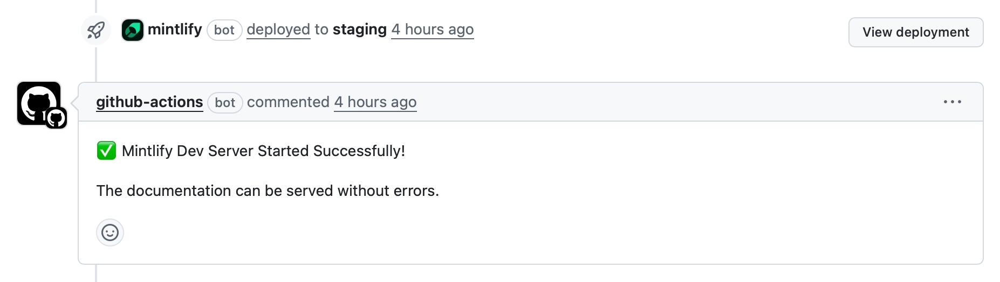

# Welcome to the Galileo docs contributing guide

Thank you for wanting to contribute to the Galileo documentation!

This guide is to help you get started making contributions to our documentation. It covers some basic process, as well as our documentation structure and best practices.

All contributions should make our documentation better for our users. Please do not contribute frivolous or meaningless changes.

## Process

For small changes, such as spelling mistakes, minor formatting issues etc., please raise a [PR](https://github.com/rungalileo/docs-official/pulls). There is no need to create an issue

For larger changes, including re-writing parts of a page, adding new pages, contributing cookbooks etc. please do the following:

- If you are a Galileo employee, raise a ticket in shortcut. Reach out on the #documentation channel in Slack if you need help
- For everyone else, raise an [issue](https://github.com/rungalileo/docs-official/issues). This way we can work with you to discuss the change before you submit a PR.

> If you raise a large PR without a corresponding ticket, it will be closed.

## Pull request template

When you raise a pull request, there is a template to fill in. Add the following:

- Add a description of the change, including what was changed and why.
- Add a link to the relevant ticket.

  - For Galileo employees, add a link to the Shortcut ticked in the form `[SC-xxx]()`, where the test is `SC-` followed by the ticket number, linking to the ticket. For example, `[SC-27352](https://app.shortcut.com/galileo/story/27352)`. This is the correct format for Shortcut to pick up and attach the PR to the ticket
  - For everyone else, add a link to the issue number using `#number`, and GitHub will create the link
  - If this is a small change such as a spelling mistake without a ticket, add a note about this

- Work through the checklist, and tick off every step as you verify it. This is not a box ticking exercise, it is meant to ensure everyone methodically verifies their PR and reduces time spent by the reviewers catching silly errors that should have been caught by the submitter.

  - **Is this ready for review? If not, raise as a draft PR**
    If this PR is ready to be reviewed, check this box. If no, please mark the PR as draft until it is ready for review.

  - **This deployed to a staging environment correctly**
    Mintlify will deploy all PRs to a staging environment. Once done, the PR will be updated to show this, including a button to view the deployment. Check this box when your final changes have been deployed successfully.

    

  - **I have reviewed my changes**
    Please review all your changes thoroughly, and check this when you are happy with them.

  - **I have reviewed the deployed version of my changes**
    Once the deploy is finished, review the final deployed version, checking things like:
    - If this is a new page, it is in the navigation bar and loads correctly
    - Code is readable
    - Images are showing

  - **I have tested any code that is added or updated**
    If you are adding any code snippets, ensure that the code works and you have tested it in the context of the page it is on.

  - **I have verified all images and videos are clear, with appropriate zoom**
    Images and videos need to be clear with readable text for all users. Make sure that on the deployed site with the available page width all text is readable and the image or video shows the correct amount of detail.

  - **I have reviewed any spelling mistakes highlighted by the checks**
    There is a mintlify spell checker. It can be very overzealous with technical terms, but it is helpful to catch spelling mistakes in your changes. You can see these highlighted against your changes in the **Files Changed** tab of the PR

  - **I have reviewed broken links either from the checks, or by running `mint broken-links` and I haven't introduced any new broken links**
    Ensure there are no broken links by either running `mint broken-links` on your PR, or checking the output of the checks run by mintlify. Note that there will always be a few with links to API docs that are generated on deploy, so validate you haven't added any new broken links.

  - **This references a feature that is public. If not, add a note and we can schedule the merge for after the feature release**
    For Galileo employees, if you are documenting an upcoming feature, add a note on this with the release information. That way we can hold off on merging the docs until the feature is released.

If this template is not completed, the PR will not be reviewed. If a PR stays open for too long with an incomplete template, it will be closed.

