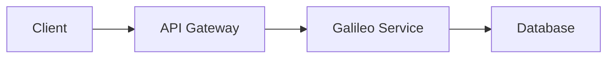

# Documentation Style Guide

This guide defines the standards and best practices for writing documentation for Galileo AI. Following these guidelines ensures consistency, clarity, and maintainability across all documentation.

## Table of Contents

1. [Writing Style](#writing-style)
2. [Markdown Formatting](#markdown-formatting)
3. [Code Examples](#code-examples)
4. [File Naming Conventions](#file-naming-conventions)
5. [Document Structure](#document-structure)
6. [Links and References](#links-and-references)
7. [Images and Media](#images-and-media)
8. [Mintlify-Specific Guidelines](#mintlify-specific-guidelines)

---

## Writing Style

### Voice and Tone

- **Active voice**: Prefer "Click the button" over "The button should be clicked"
- **Direct and clear**: Use simple, straightforward language
- **Technical but accessible**: Balance technical accuracy with readability
- **Present tense**: Use present tense for describing features and functionality
- **Second person**: Address the reader as "you" rather than "the user"

### Language Guidelines

- **Be concise**: Remove unnecessary words and redundant phrases
- **One idea per sentence**: Keep sentences focused and clear
- **Short paragraphs**: Aim for 3-5 sentences per paragraph
- **Avoid jargon**: Define technical terms on first use
- **Consistent terminology**: Use the same terms throughout documentation

### Technical Writing Principles

1. **Start with the goal**: Lead with what the user will accomplish
2. **Context before details**: Provide overview before diving into specifics
3. **Step-by-step instructions**: Break complex processes into numbered steps
4. **Prerequisites**: List requirements before starting instructions
5. **Expected outcomes**: Describe what success looks like

---

## Markdown Formatting

### Headings

- Use ATX-style headings (`#`, `##`, `###`)
- Only one H1 (`#`) per document (the page title)
- Maintain hierarchical structure (don't skip levels)
- Use sentence case for headings (capitalize only first word and proper nouns)
- Add blank lines before and after headings

```markdown
# Page title

## Section heading

### Subsection heading

Regular paragraph text.
```

### Lists

**Unordered Lists**:
- Use `-` (hyphen) for consistency
- Add blank lines before and after lists
- Indent nested items with 2 spaces

```markdown
- First item
- Second item
  - Nested item
  - Another nested item
- Third item
```

**Ordered Lists**:
- Use actual numbers (not all `1.`)
- Use for sequential steps or ranked information
- Add context before the list

```markdown
To deploy Galileo:

1. Set up your Kubernetes cluster
2. Configure your values.yaml file
3. Run the Helm installation command
4. Verify the deployment
```

### Code Blocks

**Inline Code**:
- Use backticks for file names, commands, variables, and short code snippets
- Examples: `package.json`, `npm install`, `API_KEY`

**Fenced Code Blocks**:
- Always specify the language for syntax highlighting
- Include comments for complex code
- Keep examples focused and minimal

````markdown
```python
import galileo as gal

# Initialize Galileo
gal.init(project_name="my-project")

# Start logging
gal.log(...)
```
````

**Supported Languages**:
```
python, typescript, javascript, bash, yaml, json, 
shell, jsx, tsx, dockerfile, sql, terraform
```

### Emphasis

- **Bold** (`**text**`): For UI elements, important terms, strong emphasis
- *Italic* (`*text*`): For introducing new terms, slight emphasis
- `Code` (`` `text` ``): For code, file names, commands, technical terms

### Links

**Internal Links** (within docs):
```markdown
[Link text](/path/to/page)
```

**External Links**:
```markdown
[Link text](https://external-site.com)
```

**Reference-style Links** (for frequently referenced URLs):
```markdown
See the [Python SDK][sdk-ref] for more details.

[sdk-ref]: /sdk-api/python/sdk-reference
```

### Tables

- Use tables for structured comparison data
- Keep tables simple (max 4-5 columns)
- Align columns consistently
- Include header row

```markdown
| Feature | Basic | Enterprise |
| ------- | ----- | ---------- |
| Users   | 5     | Unlimited  |
| Storage | 10 GB | 1 TB       |
```

### Blockquotes and Callouts

Use Mintlify callout components for important information:

```markdown
<Note>
General information or tips
</Note>

<Warning>
Important warnings or caveats
</Warning>

<Info>
Additional context or background
</Info>

<Tip>
Helpful suggestions or best practices
</Tip>
```

---

## Code Examples

### General Principles

1. **Working examples**: All code must be tested and functional
2. **Complete but minimal**: Include all necessary imports and setup
3. **Explanatory comments**: Add comments to clarify complex logic
4. **Error handling**: Show proper error handling patterns
5. **Realistic use cases**: Use practical, real-world examples

### Structure

```python
# 1. Imports
import galileo as gal
from openai import OpenAI

# 2. Configuration
gal.init(
    project_name="example-project",
    api_key="your-api-key"
)

# 3. Main code
client = OpenAI()

# 4. Example usage with clear purpose
response = client.chat.completions.create(
    model="gpt-4",
    messages=[{"role": "user", "content": "Hello!"}]
)

# 5. Output or result
print(response.choices[0].message.content)
```

### Code Example Metadata

Include the following when helpful:
- **Time estimate**: How long the example takes to run
- **Prerequisites**: Required setup or dependencies
- **Output**: Expected results

---

## File Naming Conventions

### Guidelines

- **Lowercase**: Use all lowercase letters
- **Hyphens**: Use hyphens (`-`) to separate words, not underscores
- **Descriptive**: Names should clearly indicate content
- **Concise**: Keep names reasonably short (2-4 words ideal)
- **Extensions**: Use `.mdx` for pages with React components, `.md` for pure Markdown

### Examples

```
✅ Good:
- getting-started.mdx
- deployment-guide.md
- api-authentication.mdx
- troubleshooting-common-issues.md

❌ Avoid:
- GettingStarted.mdx
- deployment_guide.md
- APIAuthentication.mdx
- troubleshooting.md (too vague)
```

---

## Document Structure

### Page Template

Every documentation page should follow this structure:

```markdown
---
title: "Page Title"
description: "Brief description (160 chars max)"
---

# Page Title

Brief introduction paragraph (1-2 sentences explaining what this page covers).

## Prerequisites

- Required knowledge or setup
- Links to relevant background pages

## Section 1: Main Content

Content here...

### Subsection 1.1

More detailed content...

## Next Steps

- [Related page 1](/link/to/page)
- [Related page 2](/link/to/page)

## Additional Resources

- [External resource](https://example.com)
- [Related concept](/path/to/concept)
```

### Content Types

**Quickstart Guides**:
- Goal-oriented (get user to success quickly)
- Step-by-step instructions
- Minimal explanation, maximum action
- 5-10 minutes to complete

**How-To Guides**:
- Task-focused documentation
- Assumes basic knowledge
- Problem → Solution format
- Includes troubleshooting

**Concept Pages**:
- Explain "what" and "why"
- Provide context and background
- Fewer step-by-step instructions
- Link to related how-to guides

**Reference Documentation**:
- Comprehensive and systematic
- Technical specifications
- API parameters and return values
- Alphabetically or logically organized

---

## Links and References

### Internal Links

- Use relative paths from the docs root
- Omit `.mdx` extension
- Always verify links work

```markdown
[Getting Started](/getting-started/quickstart)
[Python SDK](/sdk-api/python/sdk-reference)
```

### External Links

- Open in new tab for external sites (handled by Mintlify)
- Provide context about where link goes
- Use HTTPS when available

```markdown
[OpenAI API Documentation](https://platform.openai.com/docs)
```

### Link Text

- Be descriptive (avoid "click here" or "this link")
- Use the destination page's title or a clear description

```markdown
✅ Good:
See [Installing the Python SDK](/getting-started/installation)

❌ Avoid:
For installation instructions, click [here](/getting-started/installation)
```

---

## Images and Media

### Image Guidelines

1. **File format**: Use WebP (preferred), PNG, or JPEG
2. **File size**: Optimize images (< 200KB ideal)
3. **Location**: Store in `/images/` directory
4. **Naming**: Use descriptive, hyphenated names
5. **Alt text**: Always include meaningful alt text

```markdown

```

### Screenshot Standards

- Use consistent browser/UI theme
- Hide sensitive information
- Crop to relevant area
- Add annotations if helpful
- Update screenshots when UI changes

### Diagrams

- Use Mermaid.js for architecture and flow diagrams
- Keep diagrams simple and focused
- Include text alternative for accessibility

````markdown

````

---

## Mintlify-Specific Guidelines

### Front Matter

All pages must include front matter:

```yaml
---
title: "Page Title"
description: "Brief description for SEO and previews"
---
```

Optional front matter:
```yaml
---
title: "Page Title"
description: "Brief description"
icon: "book-open"
---
```

### Navigation Structure

- Organize pages logically in `docs.json`
- Group related pages together
- Use descriptive group names
- Maintain hierarchy (3 levels max)

### Components

**Accordion** (for collapsible content):
```markdown
<Accordion title="Click to expand">
  Content inside the accordion
</Accordion>
```

**Card Group** (for visual navigation):
```markdown
<CardGroup cols={2}>
  <Card title="Guide 1" icon="book" href="/path/to/guide1">
    Description
  </Card>
  <Card title="Guide 2" icon="code" href="/path/to/guide2">
    Description
  </Card>
</CardGroup>
```

**Tabs** (for language-specific examples):
```markdown
<Tabs>
  <Tab title="Python">
    ```python
    import galileo
    ```
  </Tab>
  <Tab title="TypeScript">
    ```typescript
    import galileo from 'galileo-sdk';
    ```
  </Tab>
</Tabs>
```

---

## Checklist for New Documentation

Before submitting a new page, verify:

- [ ] Front matter is complete and accurate
- [ ] Headings follow hierarchical structure (no skipped levels)
- [ ] All code examples are tested and working
- [ ] Links are valid (both internal and external)
- [ ] Images have alt text and are optimized
- [ ] Markdown passes linting (run `npm run lint:markdown`)
- [ ] Page is added to `docs.json` navigation
- [ ] Related pages are cross-referenced
- [ ] No grammar or spelling errors
- [ ] Callouts used appropriately for important information

---

## Common Mistakes to Avoid

1. ❌ **Skipping heading levels**: Don't jump from H2 to H4
2. ❌ **Missing alt text**: All images need descriptive alt text
3. ❌ **Broken links**: Test all links before submitting
4. ❌ **Inconsistent terminology**: Use the same terms throughout
5. ❌ **Untested code**: All examples must be verified working
6. ❌ **Overly long paragraphs**: Break up walls of text
7. ❌ **Missing code language**: Always specify language in code blocks
8. ❌ **Vague link text**: "Click here" doesn't describe destination
9. ❌ **Missing front matter**: All pages need title and description
10. ❌ **Inconsistent formatting**: Follow the style guide consistently

---

## Getting Help

- Review existing documentation for examples
- See [Mintlify documentation](https://mintlify.com/docs) for component usage
- Check [markdownlint rules](https://github.com/DavidAnson/markdownlint/blob/main/doc/Rules.md)
- Ask in the team documentation channel

---

**Last Updated**: November 2025  
**Version**: 1.0
