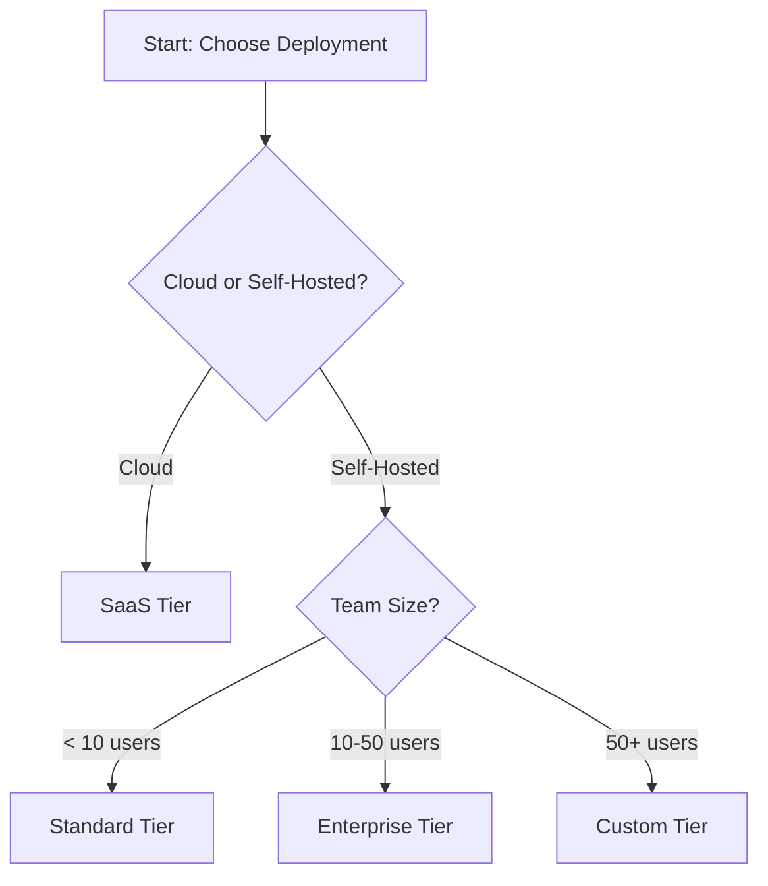

# Phase 2 Kickoff Plan - AI-Powered Search & Navigation

**Phase:** AI-Powered Search & Navigation (Weeks 5-8)  
**Start Date:** Week 5 (Following Phase 1 completion)  
**Duration:** 4 weeks  
**Status:** 🚀 READY TO START

---

## Executive Summary

Phase 2 builds on the foundation established in Phase 1 to transform content discovery and navigation. The focus is on implementing AI-powered search capabilities and creating intuitive navigation structures that help users find information faster and understand complex topics more easily.

**Key Goals:**
1. Implement advanced search with AI/semantic capabilities
2. Create role-based navigation paths for different user personas
3. Build interactive decision trees for complex choices
4. Enhance contextual navigation and wayfinding

---

## Phase 2 Overview

### Timeline

```
Week 5-6: Advanced Search Implementation
├── Week 5: Search provider integration + AI features
└── Week 6: Search analytics + history features

Week 7-8: Navigation Architecture
├── Week 7: Role-based paths + decision trees
└── Week 8: Quick action cards + smart breadcrumbs
```

### Prerequisites Status

✅ All Phase 1 requirements met:
- Enhanced CI/CD pipeline operational
- Custom asset integration working (`custom-enhancements.js` can be extended)
- Documentation style guide established
- Baseline UX enhancements deployed
- Technical foundation solid

---

## Section 1: Advanced Search Implementation (Weeks 5-6)

### 1.1 Search Provider Evaluation (Week 5, Day 1-2)

**Objective:** Select and integrate the best search solution for Galileo docs.

**Options to Evaluate:**

#### Option A: Algolia DocSearch (Recommended)
- ✅ **Pros:**
  - Free for open-source projects
  - Purpose-built for documentation
  - Excellent developer experience
  - Built-in analytics
  - Fast indexing and search
  - Mobile-optimized UI

- ❌ **Cons:**
  - External dependency
  - Limited customization of search algorithm
  - Data stored externally

- **Integration Effort:** LOW (1-2 days)
- **Cost:** Free for documentation sites
- **Setup:**
  ```json
  // docs.json
  {
    "search": {
      "provider": "algolia",
      "apiKey": "...",
      "applicationId": "...",
      "indexName": "galileo-docs"
    }
  }
  ```

#### Option B: Mintlify Built-in Search
- ✅ **Pros:**
  - Native integration
  - No setup required
  - Included with Mintlify

- ❌ **Cons:**
  - Limited AI/semantic capabilities
  - Less customizable
  - May not support all advanced features

- **Integration Effort:** NONE (already active)
- **Cost:** Included

#### Option C: Custom AI Search (e.g., Pinecone + OpenAI)
- ✅ **Pros:**
  - Full control
  - Advanced AI capabilities
  - Semantic search
  - Custom ranking

- ❌ **Cons:**
  - High implementation effort
  - Ongoing maintenance
  - Infrastructure costs
  - Requires backend services

- **Integration Effort:** HIGH (2-3 weeks)
- **Cost:** Variable ($50-500/month estimated)

**Recommendation:** Start with **Algolia DocSearch** for Phase 2.
- Provides best balance of features, effort, and cost
- Can add custom AI layer later if needed
- Industry-standard solution

**Decision Criteria:**
1. Does it support semantic/AI search? ✓ (Algolia AI Search)
2. Can we track analytics? ✓
3. Is it mobile-friendly? ✓
4. What's the implementation time? ✓ (1-2 days)
5. Is it cost-effective? ✓ (Free)

---

### 1.2 Core Search Features (Week 5, Day 3-5)

**Tasks:**

#### T2.1.1: Implement AI-Powered Search Assistant
**Effort:** 2-3 days

**Steps:**
1. Sign up for Algolia DocSearch
2. Configure crawler settings
3. Add Algolia to `docs.json`
4. Customize search UI in `custom-enhancements.js`
5. Test search functionality

**Deliverables:**
- [ ] Algolia account configured
- [ ] Search integrated into documentation
- [ ] Custom styling applied
- [ ] Mobile search tested
- [ ] Analytics tracking enabled

**Files to Modify:**
- `docs.json` - Add search configuration
- `custom-enhancements.js` - Enhance search UI/UX
- `custom-styles.css` - Style search results

**Example Implementation:**
```javascript
// custom-enhancements.js - Search enhancement
function enhanceSearch() {
  // Customize Algolia search UI
  document.addEventListener('DOMContentLoaded', () => {
    const searchInput = document.querySelector('.DocSearch-Input');
    
    // Add search shortcuts
    document.addEventListener('keydown', (e) => {
      if ((e.metaKey || e.ctrlKey) && e.key === 'k') {
        e.preventDefault();
        searchInput?.focus();
        // Trigger Algolia search
      }
    });
  });
}
```

#### T2.1.2: Add Advanced Search Suggestions
**Effort:** 1 day

**Features:**
- Auto-complete with categorization (by section)
- Recent searches (localStorage)
- Popular searches widget

**Implementation:**
```javascript
// Store recent searches
const recentSearches = {
  save: (query) => {
    const searches = JSON.parse(localStorage.getItem('recentSearches') || '[]');
    searches.unshift(query);
    localStorage.setItem('recent Searches', JSON.stringify(searches.slice(0, 5)));
  },
  
  get: () => JSON.parse(localStorage.getItem('recentSearches') || '[]')
};
```

#### T2.1.3: Implement "Did You Mean?" Feature
**Effort:** 1 day

**Approach:**
- Leverage Algolia's built-in typo tolerance
- Add custom fuzzy matching for product-specific terms
- Surface suggested corrections

**Note:** Algolia provides this out-of-the-box, may just need UI customization.

---

### 1.3 Search Analytics (Week 6, Day 1-2)

#### T2.1.4: Build Search Analytics System
**Effort:** 2 days

**Goals:**
1. Track all search queries
2. Identify zero-result searches (content gaps)
3. Create internal analytics dashboard

**Implementation Options:**

**Option A: Use Algolia Analytics (Recommended)**
- Built into Algolia
- No additional setup
- Dashboard already available

**Option B: Custom Analytics**
- Send search events to Google Analytics / Plausible
- Create custom dashboard

**Deliverables:**
- [ ] Search query tracking enabled
- [ ] Zero-result search alerts configured
- [ ] Monthly analytics report template
- [ ] Dashboard access for team

**Metrics to Track:**
- Total searches
- Top 10 queries
- Zero-result searches
- Click-through rate
- Time to first click

#### T2.1.5: Implement Search History
**Effort:** 1 day

**Features:**
- Per-session history
- Clear history button
- History-based quick suggestions

**Storage:** localStorage (no server needed)

---

### 1.4 Testing & Optimization (Week 6, Day 3-5)

**Test Scenarios:**
1. Mobile search experience
2. Search from different page types
3. Special character handling
4. Long query performance
5. Zero-result experience
6. Keyboard navigation

**Optimization:**
- Response time < 100ms
- Mobile-friendly UI
- Accessible (WCAG 2.1 AA)
- Works offline (cached results)

---

## Section 2: Navigation Architecture (Weeks 7-8)

### 2.1 Role-Based Documentation Paths (Week 7)

#### T2.2.1: Create Role-Based Paths
**Effort:** 3-4 days

**User Personas:**
1. **ML Engineers** - Focus on model evaluation, metrics, experiments
2. **Platform Engineers** - Focus on deployment, infrastructure, monitoring
3. **Data Scientists** - Focus on data quality, insights, analysis
4. **Product Managers** - Focus on features, use cases, business value

**Implementation:**

**Step 1: Create Role Selector (Homepage)**
```mdx
// what-is-galileo.mdx
<CardGroup cols={2}>
  <Card title="For ML Engineers" icon="brain" href="/paths/ml-engineer">
    Build, evaluate, and improve ML models
  </Card>
  <Card title="For Platform Engineers" icon="server" href="/paths/platform-engineer">
    Deploy and scale Galileo infrastructure
  </Card>
  <Card title="For Data Scientists" icon="chart-line" href="/paths/data-scientist">
    Analyze data quality and model performance
  </Card>
  <Card title="For Product Managers" icon="lightbulb" href="/paths/product-manager">
    Understand features and business value
  </Card>
</CardGroup>
```

**Step 2: Create Landing Pages**
```
paths/
├── ml-engineer.mdx
├── platform-engineer.mdx
├── data-scientist.mdx
└── product-manager.mdx
```

**Step 3: Define Learning Paths**
Each role page includes:
- "Start Here" section (3-5 minute quickstart)
- "Common Tasks" (most relevant how-to guides)
- "Key Concepts" (essential reading)
- "Advanced Topics" (deep dives)

**Deliverables:**
- [ ] Role selector on homepage
- [ ] 4 role-specific landing pages
- [ ] Curated content paths for each role
- [ ] Updated docs.json navigation

---

### 2.2 Interactive Decision Trees (Week 7)

#### T2.2.2: Build Decision Tree Components
**Effort:** 3 days

**Decision Trees to Create:**
1. "Which deployment tier is right for me?"
2. "Which metrics should I use?"
3. "How do I troubleshoot this issue?"

**Technical Approach:**

**Option A: Mermaid.js** (Simpler, static)
```markdown

```

**Option B: Custom React Component** (Interactive, dynamic)
- Clickable nodes
- Saves progress
- Can collect user selections

**Recommendation:** Start with Mermaid.js for simplicity, upgrade to React if needed.

**Deliverables:**
- [ ] 3 decision tree diagrams created
- [ ] Decision tree pages added to navigation
- [ ] Mobile-responsive design
- [ ] Print-friendly formatting

**Files to Create:**
```
guides/
├── decision-trees/
│   ├── deployment-tier-selector.mdx
│   ├── metrics-guide.mdx
│   └── troubleshooting-decision-tree.mdx
```

---

### 2.3 Quick Action Cards (Week 8)

#### T2.2.3: Design Quick Action Cards
**Effort:** 2 days

**Homepage Quick Actions:**
```mdx
<CardGroup cols={3}>
  <Card 
    title="Deploy in 5 Minutes" 
    icon="rocket"
    href="/getting-started/quickstart"
  >
    Get Galileo running with our fastest quickstart
  </Card>
  
  <Card 
    title="Evaluate First Model" 
    icon="flask"
    href="/getting-started/evaluate-and-improve"
  >
    Run your first evaluation in < 10 minutes
  </Card>
  
  <Card 
    title="Set Up Monitoring" 
    icon="chart-line"
    href="/how-to-guides/basics/logging-basics"
  >
    Start logging and monitoring your models
  </Card>
</CardGroup>
```

**Features:**
- Dynamic ordering based on user progress (future enhancement)
- Progress indicators
- Estimated time to complete

**Deliverables:**
- [ ] 6-9 quick action cards designed
- [ ] Cards added to homepage
- [ ] Mobile-responsive layout
- [ ] Analytics tracking for card clicks

---

### 2.4 Enhanced Breadcrumbs (Week 8)

#### T2.2.4: Enhance Contextual Breadcrumbs
**Effort:** 2 days

**Current State:** Basic breadcrumbs exist (from Phase 1)

**Enhancements:**
1. Add "Next recommended steps" after content
2. Implement smart suggestions based on current page
3. Add completion indicators for multi-part guides

**Implementation:**
```javascript
// custom-enhancements.js
function addNextSteps() {
  const pageMapping = {
    '/getting-started/quickstart': [
      { title: 'Run Your First Experiment', url: '/getting-started/experiments' },
      { title: 'Explore Sample Projects', url: '/getting-started/sample-projects' }
    ],
    // ... more mappings
  };
  
  const currentPath = window.location.pathname;
  const nextSteps = pageMapping[currentPath];
  
  if (nextSteps) {
    // Inject next steps UI
    const container = document.querySelector('.content-container');
    const nextStepsHTML = `
      <div class="next-steps">
        <h3>📚 Next Steps</h3>
        ${nextSteps.map(step => `
          <a href="${step.url}" class="next-step-card">
            ${step.title}
          </a>
        `).join('')}
      </div>
    `;
    container?.insertAdjacentHTML('beforeend', nextStepsHTML);
  }
}
```

**Deliverables:**
- [ ] Next steps logic implemented
- [ ] 20+ pages with next step recommendations
- [ ] Styled next steps component
- [ ] Analytics on next step clicks

---

## Implementation Strategy

### Week-by-Week Breakdown

**Week 5: Search Foundation**
- Day 1-2: Algolia setup and integration
- Day 3-4: Custom search enhancements
- Day 5: Testing and optimization

**Week 6: Search Features**
- Day 1-2: Search analytics implementation
- Day 3: Search history feature
- Day 4-5: Advanced suggestions and optimization

**Week 7: Navigation**
- Day 1-3: Role-based paths and landing pages
- Day 4-5: Decision tree creation

**Week 8: Enhancement & Polish**
- Day 1-2: Quick action cards
- Day 3-4: Enhanced breadcrumbs
- Day 5: Testing, documentation, handoff

---

## Success Metrics

### Quantitative Metrics

**Search Performance:**
- [ ] Search response time < 100ms (p95)
- [ ] Search click-through rate > 60%
- [ ] Zero-result search rate < 5%
- [ ] Mobile search usage > 30% of total

**Navigation Effectiveness:**
- [ ] Role path completion rate >50%
- [ ] Decision tree usage > 100 views/week
- [ ] Quick action card clicks > 40% of homepage visitors
- [ ] Next steps click-through > 20%

###Qualitative Metrics

- [ ] User feedback on search quality (survey)
- [ ] Reduction in support tickets about "where to find X"
- [ ] Increased time on site (indicates finding content)
- [ ] Positive feedback on navigation improvements

---

## Risk Management

### Potential Risks

1. **Search Provider Limitations**
   - Risk: Algolia may not support all desired features
   - Mitigation: Evaluate alternatives if needed, custom layer possible

2. **Content Gaps Revealed**
   - Risk: Analytics may show many zero-result searches for missing content
   - Mitigation: Create content roadmap based on search data

3. **Role Path Maintenance**
   - Risk: Role-based paths may become outdated
   - Mitigation: Quarterly review process, automated link checking

4. **Performance Impact**
   - Risk: Additional features may slow page load
   - Mitigation: Lazy loading, performance monitoring

### Dependencies

- Algolia DocSearch account approval (usually 1-2 days)
- Access to analytics platforms
- Content review for role-based paths

---

## Handoff to Phase 3

Phase 3 will build on Phase 2's search and navigation with:
- Interactive API playground
- Live code examples
- Tutorial videos
- Chatbot assistance

**Preparation:**
- Document search integration patterns
- Capture user behavior insights
- Identify most-used content paths

---

## Getting Started

### Immediate Next Steps

1. **Create Phase 2 branch:**
   ```bash
   git checkout main
   git pull origin main
   git checkout -b feature/phase2-search-navigation
   ```

2. **Sign up for Algolia DocSearch:**
   - Visit: https://docsearch.algolia.com/apply/
   - Provide docs URL and email
   - Wait for approval (1-2 business days)

3. **Review current search behavior:**
   - Audit existing Mintlify search
   - Document current limitations
   - List desired improvements

4. **Create role persona documents:**
   - Interview stakeholders about each persona
   - Define typical user journeys
   - Map existing content to roles

### Team Assignments (if applicable)

- **Search Implementation:** Technical lead
- **Content Curation:** Documentation specialist  
- **Decision Trees:** Technical writer + engineer
- **UX Design:** Designer for quick action cards

---

## Appendices

### A. Algolia Configuration Template

```json
{
  "appId": "YOUR_APP_ID",
  "apiKey": "YOUR_SEARCH_API_KEY",
  "indexName": "galileo-docs",
  "container": "#docsearch",
  "searchParameters": {
    "facetFilters": ["version:v1"]
  }
}
```

### B. Role Path Content Matrix

| Role | Key Topics | Entry Points | Success Metric |
|------|-----------|--------------|----------------|
| ML Engineer | Experiments, Metrics, Evaluation | Quickstart, Experiments | Model eval completion |
| Platform Engineer | Deployment, Monitoring, Scaling | Deployment Guide | Deployment success |
| Data Scientist | Data Quality, Analysis, Insights | Data concepts | Dataset creation |
| Product Manager | Features, Use Cases, ROI | Overview, Sample Projects | Feature understanding |

### C. Decision Tree Complexity Guide

- **Simple (Mermaid.js):** 5-10 nodes, 2-3 levels deep
- **Medium:** 10-20 nodes, 3-4 levels deep
- **Complex (React):** 20+ nodes, 4+ levels, needs interactivity

---

**Document Prepared By:** Cline AI Assistant  
**Document Date:** November 13, 2025  
**Project:** Galileo AI Documentation Enhancement  
**Phase:** 2 of 8 (AI-Powered Search & Navigation)  
**Status:** Ready for Implementation 🚀
