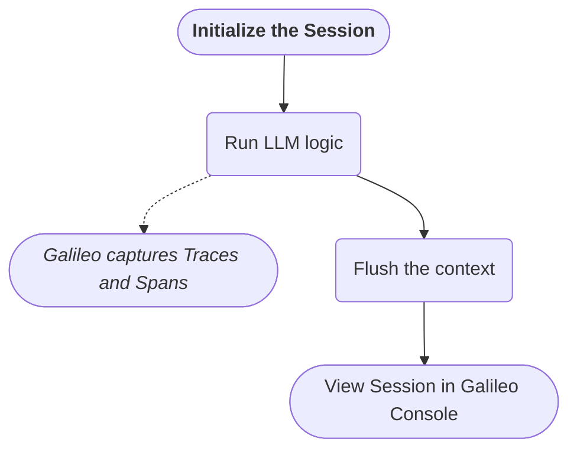

import { InfoNote } from "/snippets/components/info-note.mdx";
import EnvironmentSnippet from "/snippets/code/python/sdk/env-setup.mdx"
import SimpleAgentSnippet from "/snippets/code/python/concepts/logging/sessions/simple-agent-snippet.mdx"
import SimpleAgentFull from "/snippets/code/python/concepts/logging/sessions/simple-agent-full.mdx"
import WithGalileoSnippet from "/snippets/code/python/concepts/logging/sessions/galileo-context-snippet.mdx"
import NamedSessionSnippet from "/snippets/code/python/concepts/logging/sessions/named-session-snippet.mdx"
import NamedSessionMain from "/snippets/code/python/concepts/logging/sessions/named-session-main.mdx"
import NamedSessionFull from "/snippets/code/python/concepts/logging/sessions/named-session-full.mdx"


## Overview

This document will guide you through creating and using [Sessions](/concepts/logging/sessions/sessions-overview) in Galileo, starting from a simple LLM-driven example and progressively adding more complexity with multiple agents and data sources.

This tutorial assumes you are familiar with:

- Python 
- [Setting up a project in Galileo](/getting-started/quickstart)
- [Sessions](/concepts/logging/sessions/sessions-overview) in Galileo
- Simple LLM Apps, and making simple OpenAI completion calls

## Prerequisites

- **Galileo Account & API Key**: Ensure you have a Galileo account with a `GALILEO_API_KEY`.  
- **OpenAI API Key**: This example will use OpenAI as the underlying LLM.
- **Python Environment**: Python 3.8+ installed.  
- **Galileo Python SDK**
- **Environment Variables**: A `.env` file containing your `OPENAI_API_KEY`, as well as:
    <EnvironmentSnippet />


## What we will do

Before diving into code, here's the high-level flow common to all scenarios:

1. Initialize the [`Galileo Context`](/sdk-api/python/logging/galileo-context)
2. Run your LLM logic, logging one or more Traces (and their Spans) within a Session.
3. Flush the context so that Galileo captures and uploads the Session data.
4. Inspect the Session in the Galileo Console to see all related Traces and Spans.



There will be minor differences around starting and flushing the session context, depending on whether you're using the automatic or manual way. We'll cover both below.


## Project setup

Let's take a moment to prepare the development environment. If you already have a project setup with `Galileo`, `LangChain`, and `LangGraph`, you can skip right to [Automatic Sessions](#automatic-sessions). If not, here's an abbreviated quickstart:

<Steps>
    <Step title="Install dependences">
        Add the [Galileo Python SDK](/sdk-api/python/overview), LangChain, and LangGraph, as well as `python-dotenv` to pull in variables from your `.env` file:

        ```bash
        pip install "galileo[openai]" langchain langgraph python-dotenv 
        ```
    </Step>

    <Step title="Create a .env file">
        Next, add a `.env` file with the following variables:

        ```bash .env
        GALILEO_API_KEY=your-galileo-api-key
        GALILEO_PROJECT=your-project-name
        GALILEO_LOG_STREAM=your-log-stream-name
        OPENAI_API_KEY=your-openai-api-key
        ```
    </Step>

    <Step title="Create your application logic file">
        Finally, create a main script file (e.g. `main.py` or `app.py`) where you'll add your application logic.
    </Step>
</Steps>

Now we can dive in, starting with the simplest way to log a session.

## Automatic Sessions

Let's start with a minimal chat-like application where Galileo automatically creates a Session for your Traces, and also flushes the context for you after your code has run. 

### Use galileo_context

This example is a quick way to introduce you to session logging. If you're in a hurry, you can see the [full code sample here](#automatic-sessions-code-sample).

<Steps>
    <Step title="Create a simple agent">
        In your main script, import the following dependencies. We'll see `galileo_context` and `GalileoCallback` in action soon; for now, let's create a very simple agent:

        <SimpleAgentSnippet />
    </Step>

    <Step title="Use Galileo Context Manager">
        Our very simple application will hard-code a question for the LLM, and then conclude. We will give the invocation a callback handler, which will run after the LLM has been invoked. Galileo SDK will do all the heavy lifting:

        <WithGalileoSnippet />

        The important thing to note here is that **wrapping your chat app logic in `with galileo_context()` will generate a session for you, and flush it when the code block has concluded**.

        <Accordion title="Optional arguments for Galileo Context">
            - `project`: The Galileo Project in which to log this session.\
            Defaults to `GALILEO_PROJECT` from your .env

            - `log_stream`: The parent log-stream for your session. Supply a unique name to automatically 
            create a new Log Stream in the Galileo Console.\
            Defaults to `GALILEO_LOG_STREAM`

            - `experiment_id`: 'experiment_id' can be the id of a previous experiment you want to link to this session. This does not have a default value.
        </Accordion>
    </Step>

    <Step title="Run the script">
        Now run your script: 

        ```bash
        python3 main.py 
        ```

        You should see the LLM's response in your terminal! You can also head to the [Galileo Console](https://app.galileo.ai) to view the newly-created session. (Shown below)
    </Step>
</Steps>

#### Automatic Sessions Code Sample
<Accordion title="Full code sample (click to expand)">
    <SimpleAgentFull />
</Accordion>


## Manage your own Sessions

What if you want to control _when_ a session starts and ends, or set a custom name and unique identifier for the session? 

### Use galileo_context.start_session

Let's make a few small changes to the script from [Automatic Sessions](#use-galileo-context). You can see the [full code sample here](#manual-sessions-code-sample).

<Steps>
    <Steps title="Create a named session">
        You can create a session by calling `galileo_context.start_session`. This replaces the `with galileo_context()` call from above.

        <NamedSessionSnippet />

        <Accordion title="Optional arguments for start_session">
            - `name`: a unique name for the session, so you can identify it more easily in the Galileo Console.
            - `external_id`: a unique id to identify this run. This is especially useful for linking multiple sessions together with the third optional parameter below.
            - `previous_session_id`: The unique id of a previous session to which you will link the current one.
        </Accordion>
    </Steps>

    <Step title="Add your LLM logic">
        For simplicity, we'll re-use the same app logic as in [Automatic Sessions](#use-galileo-context). You can expand this as needed: for example, using a `while True` loop to chat with the app in your CLI, or even adding a supervisor agent that runs a team of agents. 

        Regardless of what you choose, `start_session()` will begin logging Traces for any code that runs after it. Note that your code should be in the same scope as `start_session` (i.e. not indented):

        <NamedSessionMain />
    </Step>

    <Step title="Flush the context">
        In Scenario 1, using `with galileo_context` gave us a scope that automatically flushed the context after it ran. This time, since we started the session, we can decide when it ends.

        For our simple app, we will flush the context after printing the Model response. For your app, you can call this whenever you are done capturing logs (e.g. in a lifecycle shutdown).

        ```python main.py 
        # Flush the session context at the end of your logic:
        galileo_context.flush()
        ```

        <Accordion title="Optional arguments for galileo_context">
            - `project`: The Galileo Project in which to log this session.\
            Defaults to `GALILEO_PROJECT` from your .env file

            - `log_stream`: The parent log-stream for your session.\
            Defaults to `GALILEO_LOG_STREAM` from your .env file 

            - `experiment_id`: 'experiment_id' can be the id of a previous experiment you want to link to this session. This does not have a default value.
        </Accordion>
    </Step>

    <Step title="Run the script">
        Now run your script like before to see the LLM's response in your terminal: 

        ```bash
        python3 main.py 
        ```

        And that's it! You can now head to the [Galileo Console](https://app.galileo.ai) to view the newly-created session. (See below)
    </Step>
</Steps>


#### Manual Sessions Code Sample
<Accordion title="Full code sample (click to expand)">
    <NamedSessionFull />
</Accordion>


## View your session

Now that you've logged some sessions, it's time to view results. 

<Steps>

    <Step title="Log in to the Galileo Console and select your Log Stream">
        Head over to the [Galileo Console](https://app.galileo.ai) and log in.

        On your dashboard, select the Log Stream where you were sending your session logs. If you didn't specify a unique or new log stream name, you will find the logs in your **default** Log Stream.

        <Frame>
        
        </Frame>
    </Step>

    <Step title="Select your session">
        Selecting the log stream will bring you to its event records. All logs will be grouped by *Session*, though you can use the control near the top-left of your screen to change the log stream's event grouping:

        <Frame>
        
        </Frame>

        Your session should be visible in the table below the controls, especially if you gave it a recognizable name. Select it to view the traces.
    </Step>

    <Step title="View your session">
        Once you select your session, you can see the Traces you captured from your test run as a flowchart. Any tools that were used will also show up as individual Spans. 

        Select the nodes of the flowchart to see their inputs and outputs. 

        <Frame>
        
        </Frame>
    </Step>
</Steps>

## Conclusion

In this tutorial, you learned how to:

1. Automatically create a session by using the `galileo_context()` function 
2. Manually start and end your own session with `galileo_context.start_session()` and `galileo_context.flush()`
3. View your sessions in the Galileo Console.

## Next Steps 

For a more detailed walkthrough of a multi-agent application, take a look at [Monitoring LangChain Agents with Galileo](/cookbooks/use-cases/agent-langchain). You can also learn more about using [Galileo's metrics](/concepts/metrics/overview) to gain more insight about your AI application. 


## Related Resources 

- [Sessions](/concepts/logging/sessions/sessions-overview.mdx) - An overview of sessions
- [`galileo_context`](/sdk-api/python/logging/galileo-context) - Learn about the Galileo Context Manager
- [Monitoring LangChain Agents with Galileo](/cookbooks/use-cases/agent-langchain) - Follow this cookbook recipe to create and evaluate a multi-agent application.