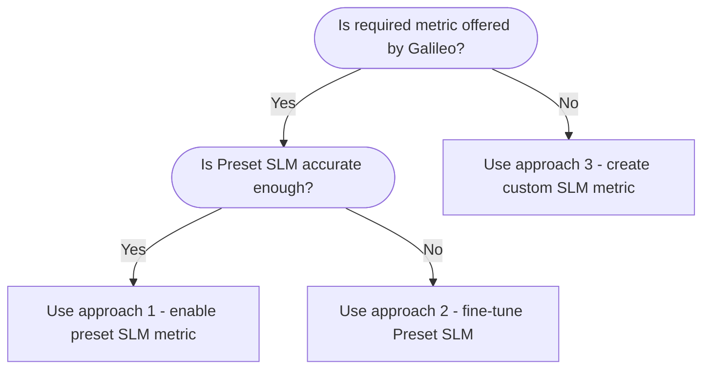

One big advantage of the Luna-2 model is the ability to fine-tune the model for your specific use case, either for out-of-the-box metrics or custom metrics.

Most teams should start with [Luna Studio](/luna-studio), which provides a self-service workflow for creating, validating, fine-tuning, and registering Luna metrics. If you want Galileo to run the fine-tuning process with you, contact us.

<CardGroup cols={2}>
  <Card title="Use Luna Studio" icon="wand-magic-sparkles" horizontal href="/luna-studio">
    Fine-tune and register Luna metrics with a self-service workflow.
  </Card>
  <Card title="Contact us" icon="comment" horizontal href="https://galileo.ai/contact-sales">
    Work with Galileo if you need support for a managed fine-tuning process.
  </Card>
</CardGroup>

<Tip>
  Use **Luna Studio** for self-service fine-tuning of out-of-the-box and custom evaluation metrics. Bring your own labelled test set, run a fine-tune in a wizard, and register the result without involving the Galileo team.
</Tip>

## Recommended adoption process

Fine-tuning works best after you have validated that the metric objective, dataset, and judge prompt match your real-world use case. We recommend the following process after signing with Galileo:

1. **Start using Galileo**

   Instrument your application or evaluation workflow in Galileo so you can observe real traces, model outputs, and evaluation results.

1. **Log metrics**

   Capture the metrics that are already available to you, along with the inputs, outputs, context, and metadata needed to understand each result.

1. **Define the objectives you want to track**

   Decide what you need to measure, such as answer correctness, context adherence, safety, response style, retrieval quality, or another business-specific outcome.

1. **Identify the metrics that support each objective**

   Map each objective to the most relevant Galileo metric. The right metric may be an out-of-the-box LLM-as-a-judge metric, or it may require a custom LLM-as-a-judge prompt.

1. **Create a labelled test dataset**

   Label your logs or create a dedicated test dataset to measure how well the out-of-the-box or custom metric performs. This dataset becomes the benchmark for prompt iteration and later Luna fine-tuning.

1. **Iterate on the LLM-as-a-judge prompt**

   Review metric performance on your dataset and update the judge prompt until it reliably captures the objective you care about.

1. **Validate on real logs**

   After the metric performs well on the test dataset, run it on actual logs and inspect the results in production-like conditions.

1. **Identify candidates for Lunafication**

   Once the metric is validated on real logs, choose the strongest candidates for Luna fine-tuning based on usage volume, latency requirements, and LLM-as-a-judge cost.

1. **Proceed to Lunafication**

   Fine-tune the validated prompt with Luna Studio, or work with Galileo if you need a managed fine-tuning process.

<Note>
  This is a time-consuming, iterative process. Invest heavily in objective definition, dataset quality, prompt iteration, and real-log validation before fine-tuning; these steps determine the quality of the resulting Luna metric.
</Note>

## Requirements for fine-tuning process

After you have defined the metric, validated the objective, and finalized the LLM-as-a-judge prompt, gather the inputs needed for fine-tuning:

1. **A labelled test dataset**

   The test dataset is the most crucial piece for any fine-tuning work. 300-500 samples is a strong target for a diverse test set, with at least 100 samples of each class. More data leads to more reliable evaluation and better fine-tuning outcomes.

   The test set **must be manually labelled** to ensure high quality. The format can be a spreadsheet/csv with input, output, label and explanations on the label if possible. If you are already using a Galileo metric on the data, these numbers will also help.

1. **Latency and load requirements**

   Specify the maximum acceptable latency for the given metric and its use case (online observability, run time protection etc.). The latency requirements should include QPS and expected input token size. Both these numbers should be provided for average and peak loads.

   This requirement will influence the choice of flow and may necessitate trade-offs with other factors.

1. **Constraints**

   Identify any limitations or restrictions that may impact the design or implementation of the flow. These constraints could include technical, resource, or regulatory limitations.

## Approaches

There are 3 different approaches to Luna fine-tuning, depending on the metric you are interested in and your dataset.

| Approach                           | When to use                                                                                                                                                                                |
| :--------------------------------- | :----------------------------------------------------------------------------------------------------------------------------------------------------------------------------------------- |
| Use a preset SLM metric            | The required metric aligns in definition with a metric offered by Galileo. Accuracy on your dataset is good enough.                                                                        |
| Fine-tune preset SLM metric        | The required metric aligns in definition with a metric offered by Galileo. LLM-as-a-judge variant of the metric works well (with or without CLHF). Preset SLM variant performance is poor. |
| Create a new customized SLM metric | The required metric is not offered by Galileo out-of-the-box.                                                                                                                              |

{/* <!-- markdownlint-disable MD013 MD037--> */}

{/* <!-- markdownlint-enable MD013--> */}

## Fine-tuning requirements

After working through the above approaches, if fine-tuning is the best approach, you will need a training dataset.

- For managed fine-tuning, plan for around 4,000 total labeled samples, with a 50/50 split amongst the classes (e.g. 2,000 context adherent samples, 2,000 non-context adherent samples).
- If you are unable to procure this many labeled samples, Galileo can synthetically extrapolate from the limited test set you share using LLMs approved by you. More source data is better: a larger, more diverse test set gives the synthetic generation process stronger examples to learn from. Description of model(s) used for synthetic data generation would then be explained in a generalized model card.

## Turnaround time

Turnaround time depends on whether you use Luna Studio yourself or ask Galileo to manage the fine-tuning process.

### Luna Studio

With Luna Studio, the pace is controlled by your team. You can iterate as quickly as you can prepare data, evaluate the LLM-as-a-judge prompt, run fine-tuning, and validate the resulting Luna metric.

### Galileo-managed fine-tuning

If Galileo performs the fine-tuning work with you, plan for **1 week** of fine-tuning time after all prerequisites are complete:

- The objective for the new metric is clearly understood
- The test dataset is ready and quality checked
- Latency, load, and deployment requirements are defined

This estimate applies whether the metric starts from an existing metric or a new custom metric.

<Note>Galileo-managed fine-tuning time does not include deployment time.</Note>

### Model deployment

To deploy your model, ensure:

- The new fine-tuned model is approved for use internally
- The model is integrated into the Galileo cluster by the applied data science team

The estimated timings are:

- **Replace existing metric**: Deployment can be done in **1-2 days**
- **New custom metric**: This is more involved, the time to completion would be defined on a case-by-case basis

## Fine-tune it yourself with Luna Studio

Luna Studio supports self-service fine-tuning for both out-of-the-box and custom metrics. Pick a base model, supply a labelled test set, generate or upload a training set, and register the resulting metric to the Galileo metrics store.

<CardGroup cols={2}>
  <Card title="Try Luna Studio" icon="wand-magic-sparkles" horizontal href="/luna-studio/ui/quickstart">
    End-to-end walkthrough — sign up, configure an integration, and register your first custom metric in about 15 minutes.
  </Card>
  <Card title="Luna Studio core concepts" icon="book-open" horizontal href="/luna-studio/ui/core-concepts">
    Projects, runs, datasets, and base models — how the pieces fit together.
  </Card>
</CardGroup>

## FAQ

<AccordionGroup>
<Accordion title="Is it necessary to get 300 samples? Can we use fewer?">

300-500 labelled samples is a strong target because it gives you enough coverage to evaluate metric performance across common and edge-case behavior. You can start with fewer samples, but the results will be less reliable. The more labelled data you provide, the better your evaluation coverage and fine-tuning outcomes will be.

</Accordion>

<Accordion title="Is it necessary for the test dataset to be human labelled?">

Yes, the test dataset used for final evaluation should be human labelled. Luna is only as good as the objective and labels used to evaluate it, so human labels are the best source of truth for deciding whether the metric is actually measuring what you care about. Synthetic labels can help generate training data, but they should not replace a human-labelled test set for final evaluation.

</Accordion>

<Accordion title="Will Luna be better than LLM-as-a-judge?">

No. Luna will be almost as good as the LLM-as-a-judge metric it is trained from, while running at lower latency and lower cost. Validate the LLM-as-a-judge metric first, then compare Luna against your human-labelled test dataset and real logs before replacing the original judge.

</Accordion>
</AccordionGroup>
