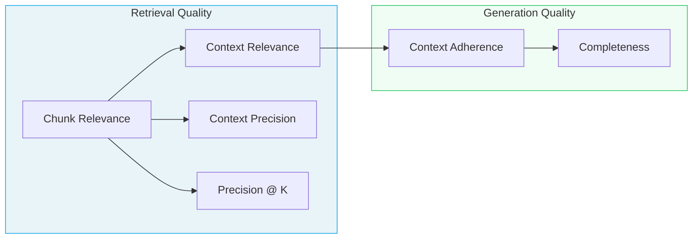

import RAGMetrics from "/snippets/components/RAG-Metrics.mdx";

RAG metrics help you measure how well your retrieval-augmented generation system finds relevant context and produces accurate, complete, and well-grounded responses. These metrics are organized into two categories:

- **Retrieval Quality** – Evaluate whether the right chunks are retrieved and how well they are ranked (chunk relevance, context relevance, context precision, Precision @ K).
- **Generation Quality** – Evaluate whether the model uses the context effectively and grounds responses in retrieved context (context adherence, completeness). For ground truth adherence, correctness, and instruction adherence — which apply to both RAG and non-RAG use cases — see [Response Quality metrics](/concepts/metrics/response-quality/response-quality-overview).

## Problems RAG metrics help you solve

- **Answers hallucinate or contradict your source documents.** Use [Context Adherence](/concepts/metrics/rag/generation-quality/context-adherence) to see whether the model's claims stay grounded in the retrieved context.
- **Retrieved documents look unrelated to the question.** Use [Chunk Relevance](/concepts/metrics/rag/retrieval-quality/chunk-relevance) and [Context Relevance](/concepts/metrics/rag/retrieval-quality/context-relevance) to understand whether individual chunks — and the overall context — actually help answer the query.
- **Retrieval returns lots of noise in the top K results.** Use [Context Precision](/concepts/metrics/rag/retrieval-quality/context-precision) and [Precision @ K](/concepts/metrics/rag/retrieval-quality/precision-at-k) to quantify how many of the highest-ranked chunks are truly relevant and how that changes as you adjust K.
- **Answers are grounded but still feel incomplete.** Use [Completeness](/concepts/metrics/rag/generation-quality/completeness) to detect when important details from the retrieved context never make it into the final response.

## Diagnose your RAG problem

Not sure which metric to start with? Walk through these symptoms to find the right one.

<AccordionGroup>
<Accordion title="My answers contain made-up information" icon="triangle-exclamation">
**Diagnosis:** The model is hallucinating — generating claims not supported by your documents.

**Start with:** [Context Adherence](/concepts/metrics/rag/generation-quality/context-adherence) to measure how well responses stay grounded in retrieved context.

**If Context Adherence is high but answers are still wrong:** The problem may be in retrieval. Check [Context Relevance](/concepts/metrics/rag/retrieval-quality/context-relevance) to see if you're retrieving the right documents in the first place.
</Accordion>

<Accordion title="My retrieval returns too much noise" icon="volume-high">
**Diagnosis:** Your retriever is pulling in chunks that don't help answer the query.

**Start with:** [Chunk Relevance](/concepts/metrics/rag/retrieval-quality/chunk-relevance) to see which individual chunks are useful vs. noise.

**Then check:** [Context Precision](/concepts/metrics/rag/retrieval-quality/context-precision) to get an aggregate view of how much of your retrieved context is actually relevant.

**To tune your K:** Use [Precision @ K](/concepts/metrics/rag/retrieval-quality/precision-at-k) to find the sweet spot where adding more chunks stops helping.
</Accordion>

<Accordion title="The answer is correct but feels thin" icon="feather">
**Diagnosis:** The model is being too conservative — it's grounded but not using all available information.

**Use:** [Completeness](/concepts/metrics/rag/generation-quality/completeness) to detect when relevant details from the context are left out of the response.
</Accordion>

</AccordionGroup>

## How RAG metrics connect

RAG evaluation flows from retrieval to generation. Here's how the metrics relate:

**Reading the diagram:**

- **Chunk Relevance** is the foundation — it determines whether individual chunks help answer the query and feeds into precision metrics.
- **Context Relevance** asks whether the overall context is sufficient, bridging retrieval and generation.
- **Context Adherence** checks if the model stays grounded, while **Completeness** checks if it uses everything relevant.

<Warning title="Common pitfall">
**High Context Adherence + Low Completeness?** Your model is being too conservative. It's staying grounded but only using a fraction of the available context. Adjust your prompt to encourage more comprehensive answers.
</Warning>

<Tip title="Retrieval vs. generation problems">
If **Context Relevance is low**, fix your retriever first — better embeddings, different chunking strategy, or higher K. If Context Relevance is high but **Context Adherence is low**, the problem is in generation — the model has the right context but isn't using it faithfully.
</Tip>

Below is a quick reference table of all RAG metrics by category:

<RAGMetrics />

---

## Next steps

- [Back to Metrics Overview](/concepts/metrics/overview)
- [Compare all metrics](/concepts/metrics/metric-comparison)
