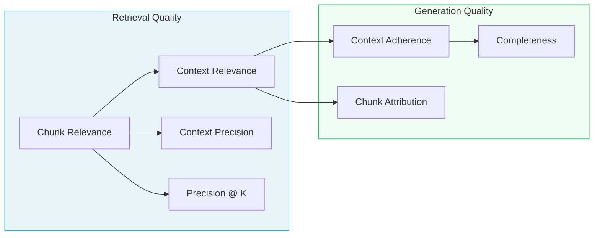

import RAGMetrics from "/snippets/components/RAG-Metrics.mdx";

RAG metrics help you measure how well your retrieval-augmented generation system finds relevant context and produces accurate, complete, and well-grounded responses. These metrics are organized into two categories:

- **Retrieval Quality** – Evaluate whether the right chunks are retrieved and how well they are ranked (chunk relevance, context relevance, context precision, Precision @ K).
- **Generation Quality** – Evaluate whether the model uses the context effectively and grounds responses in retrieved context (chunk attribution utilization, context adherence, completeness). For ground truth adherence, correctness, and instruction adherence — which apply to both RAG and non-RAG use cases — see [Response Quality metrics](/concepts/metrics/response-quality/response-quality-overview).

## Problems RAG metrics help you solve

- **Answers hallucinate or contradict your source documents.** Use [Context Adherence](/concepts/metrics/rag/generation-quality/context-adherence) to see whether the model's claims stay grounded in the retrieved context.
- **Retrieved documents look unrelated to the question.** Use [Chunk Relevance](/concepts/metrics/rag/retrieval-quality/chunk-relevance) and [Context Relevance](/concepts/metrics/rag/retrieval-quality/context-relevance) to understand whether individual chunks — and the overall context — actually help answer the query.
- **Retrieval returns lots of noise in the top K results.** Use [Context Precision](/concepts/metrics/rag/retrieval-quality/context-precision) and [Precision @ K](/concepts/metrics/rag/retrieval-quality/precision-at-k) to quantify how many of the highest-ranked chunks are truly relevant and how that changes as you adjust K.
- **The model ignores some of the retrieved information.** Use [Chunk Attribution Utilization](/concepts/metrics/rag/generation-quality/chunk-attribution) to see which chunks influenced the answer and where useful context was left on the table.
- **Answers are grounded but still feel incomplete.** Use [Completeness](/concepts/metrics/rag/generation-quality/completeness) to detect when important details from the retrieved context never make it into the final response.

## See the difference: Before and after

These examples show what RAG failures look like and how the right metric catches them.

<AccordionGroup>
<Accordion title="Hallucination → Context Adherence" icon="ghost">
**Query:** "What is the refund policy?"

**Retrieved context:** "Refunds are available within 30 days of purchase for unused items with original receipt."

<table>
<thead>
<tr><th>Before (Low Context Adherence)</th><th>After (High Context Adherence)</th></tr>
</thead>
<tbody>
<tr>
<td>"You can get a refund within 60 days, and we also offer store credit for up to 90 days."</td>
<td>"Refunds are available within 30 days of purchase. Items must be unused and you'll need your original receipt."</td>
</tr>
<tr>
<td><em>Hallucinated the 60-day and 90-day policies</em></td>
<td><em>Every claim maps to the context</em></td>
</tr>
</tbody>
</table>
</Accordion>

<Accordion title="Incomplete answer → Completeness" icon="clipboard-list">
**Query:** "Who was Galileo Galilei?"

**Retrieved context:** "Galileo Galilei was an Italian astronomer, physicist, and mathematician who played a major role in the Scientific Revolution."

<table>
<thead>
<tr><th>Before (Low Completeness)</th><th>After (High Completeness)</th></tr>
</thead>
<tbody>
<tr>
<td>"Galileo Galilei was Italian."</td>
<td>"Galileo Galilei was an Italian astronomer, physicist, and mathematician who was central to the Scientific Revolution."</td>
</tr>
<tr>
<td><em>Technically correct but omits key details</em></td>
<td><em>Captures all relevant information</em></td>
</tr>
</tbody>
</table>
</Accordion>

<Accordion title="Irrelevant retrieval → Chunk Relevance" icon="filter">
**Query:** "How do I reset my password?"

<table>
<thead>
<tr><th>Before (Low Chunk Relevance)</th><th>After (High Chunk Relevance)</th></tr>
</thead>
<tbody>
<tr>
<td>Retrieved: "Our company was founded in 2015 and has grown to serve millions of customers worldwide."</td>
<td>Retrieved: "To reset your password, click 'Forgot Password' on the login page and follow the email instructions."</td>
</tr>
<tr>
<td><em>Chunk has nothing to do with the query</em></td>
<td><em>Chunk directly answers the question</em></td>
</tr>
</tbody>
</table>
</Accordion>
</AccordionGroup>

## Diagnose your RAG problem

Not sure which metric to start with? Walk through these symptoms to find the right one.

<AccordionGroup>
<Accordion title="My answers contain made-up information" icon="triangle-exclamation">
**Diagnosis:** The model is hallucinating — generating claims not supported by your documents.

**Start with:** [Context Adherence](/concepts/metrics/rag/generation-quality/context-adherence) to measure how well responses stay grounded in retrieved context.

**If Context Adherence is high but answers are still wrong:** The problem may be in retrieval. Check [Context Relevance](/concepts/metrics/rag/retrieval-quality/context-relevance) to see if you're retrieving the right documents in the first place.
</Accordion>

<Accordion title="My retrieval returns too much noise" icon="volume-high">
**Diagnosis:** Your retriever is pulling in chunks that don't help answer the query.

**Start with:** [Chunk Relevance](/concepts/metrics/rag/retrieval-quality/chunk-relevance) to see which individual chunks are useful vs. noise.

**Then check:** [Context Precision](/concepts/metrics/rag/retrieval-quality/context-precision) to get an aggregate view of how much of your retrieved context is actually relevant.

**To tune your K:** Use [Precision @ K](/concepts/metrics/rag/retrieval-quality/precision-at-k) to find the sweet spot where adding more chunks stops helping.
</Accordion>

<Accordion title="The answer is correct but feels thin" icon="feather">
**Diagnosis:** The model is being too conservative — it's grounded but not using all available information.

**Start with:** [Completeness](/concepts/metrics/rag/generation-quality/completeness) to detect when relevant details from the context are left out of the response.

**Also check:** [Chunk Attribution Utilization](/concepts/metrics/rag/generation-quality/chunk-attribution) to see which chunks actually influenced the answer and which were ignored.
</Accordion>

<Accordion title="Some retrieved chunks never get used" icon="box-archive">
**Diagnosis:** You're retrieving context that the model ignores — either the chunks are marginally relevant or your prompt isn't encouraging full utilization.

**Start with:** [Chunk Attribution Utilization](/concepts/metrics/rag/generation-quality/chunk-attribution) to see exactly which chunks contributed to the response.

**If attribution is low but chunks are relevant:** Consider adjusting your prompt to encourage the model to incorporate more context.
</Accordion>
</AccordionGroup>

## How RAG metrics connect

RAG evaluation flows from retrieval to generation. Here's how the metrics relate:

**Reading the diagram:**

- **Chunk Relevance** is the foundation — it determines whether individual chunks help answer the query and feeds into precision metrics.
- **Context Relevance** asks whether the overall context is sufficient, bridging retrieval and generation.
- **Context Adherence** checks if the model stays grounded, while **Completeness** checks if it uses everything relevant.
- **Chunk Attribution** reveals which specific chunks actually influenced the response.

<Warning title="Common pitfall">
**High Context Adherence + Low Completeness?** Your model is being too conservative. It's staying grounded but only using a fraction of the available context. Adjust your prompt to encourage more comprehensive answers.
</Warning>

<Tip title="Retrieval vs. generation problems">
If **Context Relevance is low**, fix your retriever first — better embeddings, different chunking strategy, or higher K. If Context Relevance is high but **Context Adherence is low**, the problem is in generation — the model has the right context but isn't using it faithfully.
</Tip>

## The Galileo eval journey

RAG metrics are just the starting point. Galileo supports a complete evaluation workflow:

<Steps>
<Step title="Start with preset metrics">
Use RAG metrics out of the box to identify retrieval and generation issues.
</Step>
<Step title="Create custom judges">
Build [LLM-as-a-judge metrics](/concepts/metrics/custom-metrics/custom-metrics-ui-llm) for domain-specific evaluation criteria.
</Step>
<Step title="Refine with feedback">
Use [Continuous Learning via Human Feedback (CLHF)](/concepts/metrics/custom-metrics/continuous-learning-via-human-feedback) to improve judge accuracy over time.
</Step>
<Step title="Deploy guardrails">
Distill your refined judges into [Luna guardrails](/sdk-api/protect/protect) for production protection.
</Step>
</Steps>

Below is a quick reference table of all RAG metrics by category:

<RAGMetrics />

---

## Next steps

- [Back to Metrics Overview](/concepts/metrics/overview)
- [Compare all metrics](/concepts/metrics/metric-comparison)
