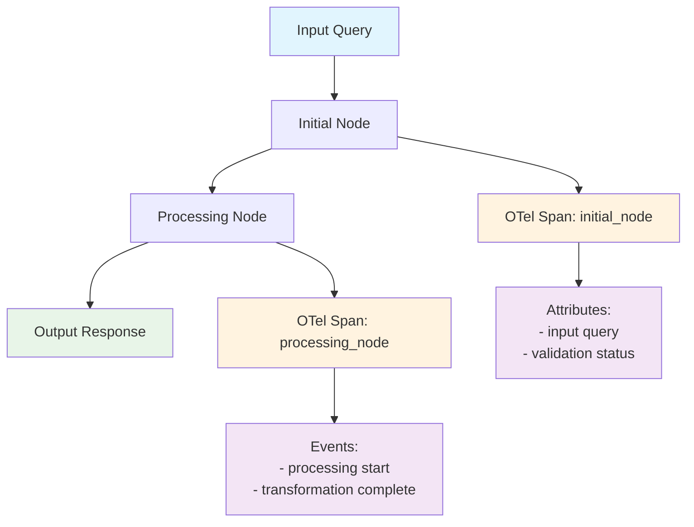

import SnippetMainWorkflow from "/snippets/code/python/cookbooks/langgraph-otel/main-workflow.mdx";
import SnippetTracerConfig from "/snippets/code/python/cookbooks/langgraph-otel/tracer-config.mdx";
import SnippetAdvancedSpans from "/snippets/code/python/cookbooks/langgraph-otel/advanced-spans.mdx";
import SnippetErrorHandling from "/snippets/code/python/cookbooks/langgraph-otel/error-handling.mdx";
import SnippetCustomExporter from "/snippets/code/python/cookbooks/langgraph-otel/custom-exporter.mdx";
import SnippetBatchProcessor from "/snippets/code/python/cookbooks/langgraph-otel/batch-processor.mdx";
import SnippetSpanNaming from "/snippets/code/python/cookbooks/langgraph-otel/span-naming.mdx";
import SnippetAttributes from "/snippets/code/python/cookbooks/langgraph-otel/attributes.mdx";
import SnippetEvents from "/snippets/code/python/cookbooks/langgraph-otel/events.mdx";
import SnippetEnvironment from "/snippets/code/multilingual/env-galileo.mdx";
import SnippetCleanup from "/snippets/code/python/cookbooks/langgraph-otel/cleanup.mdx";
import { ImportantNotes } from "/snippets/components/important-notes.mdx";

## Overview

In this cookbook, you'll learn how to instrument a LangGraph agent with OpenTelemetry and OpenInference to capture detailed traces, spans, and metrics. This can be instrumented manually or through the LangGraph callback. This approach provides deep visibility into your agent's execution flow, including tool calls, LLM interactions, and decision-making processes.

This tutorial is intended for developers who want to add observability to their LangGraph applications. It assumes you have basic knowledge of:

- Python programming
- The LangGraph framework
- OpenTelemetry concepts
- Galileo platform basics

By the end of this tutorial, you'll be able to:

- Set up OpenTelemetry instrumentation for LangGraph agents
- Configure proper tracing and span creation
- Monitor agent execution in Galileo
- Troubleshoot common instrumentation issues

## Background

**[OpenTelemetry (OTel)](https://opentelemetry.io/docs/what-is-opentelemetry/)** is an open-source observability framework that provides a standardized way to collect, process, and export telemetry data (traces, metrics, and logs). When combined with **[LangGraph](https://docs.langchain.com/langgraph-platform)**, it enables comprehensive monitoring of agent workflows, tool executions, and LLM interactions.

**Why use OpenTelemetry with LangGraph?**

- **Deep Visibility**: Track every step of your agent's execution, from initial input to final output
- **Tool Monitoring**: Monitor tool calls, their parameters, and execution times
- **LLM Observability**: Capture detailed information about model calls, tokens, and costs
- **Error Tracking**: Identify and debug issues in your agent's decision-making process
- **Performance Analysis**: Understand bottlenecks and optimize your agent's performance

## Before you start

Before you start this tutorial, you should:

- Have a Galileo account and API key
- Have Python 3.9+ installed
- Be familiar with LangGraph concepts
- Have a basic understanding of OpenTelemetry

## Prerequisites

### Install required dependencies

For the sake of jumping right into action — we'll be starting from an [existing Python application](https://github.com/rungalileo/sdk-examples/tree/main/python/agent/langgraph-otel).

- **uv Package Manager**: [Install uv](https://docs.astral.sh/uv/getting-started/installation/)
- **Galileo Account**: [Sign up for free](https://app.galileo.ai)
- **OpenAI API Key**: [Get your API key](https://openai.com/api/)

<Steps>
<Step title="Clone the repository">

```bash Terminal
git clone https://github.com/rungalileo/sdk-examples
cd sdk-examples/python/agent/langgraph-otel
```

</Step>

<Step title="Install dependencies using uv">

```bash Terminal
uv sync
```

This will install all required dependencies including:

- `langgraph` for state graph workflows
- `opentelemetry-*` packages for instrumentation
- `python-dotenv` for environment variable management

</Step>
</Steps>

<Steps>
<Step title="Create a free Galileo account">

Create a free Galileo account at [app.galileo.ai](https://app.galileo.ai) if you haven't already.

</Step>

<Step title="Get your API key">

- Log into [Galileo dashboard](https://app.galileo.ai/settings/api-keys) and get your API Keys
- Click on your profile/settings
- Generate or copy your API key

</Step>

<Step title="Create a project">

- In the Galileo dashboard, create a new project
- Give it a name like "LangGraph*OTel"
- Note the project name * you'll use this in your `.env` file

</Step>

<Step title="Create your .env file">

```bash Terminal
cp .env.example .env
```

</Step>

<Step title="Edit your .env file with your actual values">

<>

< SnippetEnvironment />

</Step>
</Steps>

<ImportantNotes>
- **Never commit your `.env` file** - it contains your API keys!
- **Project names are case-sensitive** - use exactly what you created in Galileo
- **Log streams** help organize traces (like folders) - create any name you want
</ImportantNotes>

## Understand the example

This example demonstrates:

- **Automatic tracing**: OpenInference automatically traces your LangGraph workflow
- **Custom tracing**: How to add your own detailed spans with attributes and events
- **Multiple destinations**: Traces go to both your console (for debugging - optional) and Galileo (for analysis)
- **Real-world setup**: Proper authentication and configuration for production use

### What are these tools

#### OpenTelemetry (OTel)

[OpenTelemetry](https://opentelemetry.io) is like a **diagnostic system** for your code. It creates "traces" that show:

- What functions/operations ran
- How long each step took
- What data flowed through your system
- Where errors occurred

Think of a trace like a detailed timeline of everything that happened when processing a user request.

#### OpenInference

OpenInference is a **specialized version** of OpenTelemetry that understands AI frameworks like LangChain and LangGraph. It automatically creates meaningful traces for AI operations without you having to write extra code.

## Run the example

### Run it

```bash Terminal
uv run python main.py
```

### What you'll see

The program does several things:

<Steps>
<Step title="Set up OpenTelemetry with your Galileo credentials">
Sets up OpenTelemetry with your Galileo credentials
</Step>

<Step title="Apply automatic instrumentation to LangGraph">
Applies automatic instrumentation to LangGraph
</Step>

<Step title="Run a simple workflow">
Runs a simple workflow: "hello world" → "PROCESSED: HELLO WORLD"
</Step>

<Step title="Send detailed traces">
Sends detailed traces to both console and Galileo
</Step>
</Steps>

**Console Output:**

```text Terminal Output
OTel Headers: Galileo-API-Key=your_key,project=YourProject,logstream=development
✓ LangGraph instrumentation applied * automatic spans will be created
LangGraph result: {'query': 'hello world', 'response': 'Processed: HELLO WORLD'}
✓ Execution complete * check Galileo for traces in your project/log stream

# Followed by detailed JSON trace data...
```

### Understand the traces

You'll see traces for:

- **LangGraph**: The main workflow execution
- **initial**: The first node (validates input)
- **process**: The second node (transforms input)
- **initial_node**: Your custom span with attributes
- **processing_node**: Your custom span with events

Each trace shows:

- **Timing**: How long each operation took
- **Attributes**: Key-value data (like input text)
- **Events**: Breadcrumb-style log messages
- *Relationships**: Parent-child span connections

## Code structure

### Main components

```text Project Structure
langgraph-otel/
├── main.py           # Main workflow implementation
├── pyproject.toml    # Project dependencies and metadata
├── .env.example      # Environment variable template
└── README.md         # Documentation
```

### Workflow architecture

The example implements a simple two-node LangGraph workflow:



Each node is instrumented with OpenTelemetry spans that capture:

- Input parameters as span attributes
- Processing events and milestones
- Execution timing and metadata

### OpenTelemetry integration

#### Span structure

<SnippetMainWorkflow />

#### Tracer configuration

<SnippetTracerConfig />

## Advanced instrumentation patterns

### Custom span creation

You can create custom spans to track specific parts of your agent's logic:

<SnippetAdvancedSpans />

### Error handling and tracing

Add proper error handling with tracing:

<SnippetErrorHandling />

## View traces in Galileo

<Steps>
<Step title="Open Galileo">
Go to [app.galileo.ai](https://app.galileo.ai) and log in
</Step>

<Step title="Access your traces">
Click on the project you created (e.g., "LangGraph Demo") and then the relevant Log stream name.
</Step>

<Step title="Find your traces">
Look for traces with names like:

- `langgraph_agent_execution`
- `initial_node`
- `processing_node`
</Step>

<Step title="Explore the timeline">
Click on any trace to see:

- Detailed attributes and events
- Hierarchical span relationships

</Step>
</Steps>

**Pro tip**: Traces may take 30-60 seconds to appear in Galileo after execution.
Refresh the screen to see recent changes and updates.


### Understand the trace structure

Your traces will show:

- **Root Span**: The main agent execution
- **Node Spans**: Individual workflow nodes with timing and data
- **Custom Spans**: Any custom spans you've created with attributes and events
- **Error Spans**: Any errors that occurred during execution


### Key metrics to monitor

- **Execution Time**: How long your agent takes to complete
- **Node Performance**: Individual node execution times
- **Error Rate**: Frequency of errors in your agent
- **Data Flow**: How data moves through your workflow

## Troubleshooting

### Common issues and solutions

#### Missing environment variables

```text Error Output
Error: GALILEO_API_KEY not found
```

**Solution**: Ensure your `.env` file is properly configured and located in the project root.

#### Network connectivity

```text Error Output
Error: Failed to export traces
```

**Solution**:

- Verify internet connectivity
- Check `GALILEO_CONSOLE_URL` if using custom deployment
- Ensure firewall allows OTLP exports

#### Authentication errors

```text Error Output
Error: 403 Forbidden
```

**Solution**:

- Verify `GALILEO_API_KEY` is correct and active
- Check project permissions in Galileo dashboard

#### Import errors

```text Error Output
ModuleNotFoundError: No module named 'langgraph'
```

**Solution**: Ensure dependencies are installed with `uv sync`

### Debugging tips

<Steps>
<Step title="Enable Console Export">
The example includes console span output for local debugging
</Step>

<Step title="Check Environment Loading">
Add print statements to verify `.env` variables are loaded
</Step>

<Step title="Validate Network">
Test OTLP endpoint connectivity independently
</Step>

<Step title="Review Logs">
Check both console output and Galileo dashboard for error details
</Step>
</Steps>

## Advanced configuration

### Custom OTLP Exporters

To use different observability backends, modify the tracer setup:

<SnippetCustomExporter />

### Additional span processors

For production use, consider batch span processing:

<SnippetBatchProcessor />

## Best practices

### Span naming conventions

Use consistent, descriptive names for your spans:

<SnippetSpanNaming />

### Attribute management

Add meaningful attributes to your spans:

<SnippetAttributes />

###  Span events

Events provide breadcrumb*style logging within spans:

<SnippetEvents />

### Resource management

Properly manage your tracer provider:

<SnippetCleanup />

## Development

### Extending the workflow

To add new nodes to the LangGraph workflow:

<Steps>
<Step title="Define the node function">
Define the node function with OpenTelemetry instrumentation
</Step>

<Step title="Add the node">
Add the node to the StateGraph
</Step>

<Step title="Configure edges">
Configure edges between nodes
</Step>

<Step title="Update state schema">
Update state schema if needed
</Step>
</Steps>

### Development best practices

- **Span Naming**: Use descriptive, consistent names
- **Attribute Limits**: Keep attribute values small for optimal indexing
- **Error Handling**: Add span status and error information for failed operations
- **Resource Cleanup**: Ensure proper span closure in all execution paths

## Summary

In this cookbook, you learned how to:

- Set up OpenTelemetry instrumentation for LangGraph agents using the existing SDK example
- Configure proper tracing with Galileo using environment variables
- Understand the workflow architecture and span structure
- View and analyze traces in the Galileo console
- Troubleshoot common instrumentation issues
- Follow best practices for observability and development

## Next steps

Consider exploring these related topics to enhance your observability:

<CardGroup cols={2}>
<Card title="OpenTelemetry Guide" icon="book" horizontal href="/how-to-guides/third-party-integrations/otel">
    Learn more about OpenTelemetry integration with Galileo
</Card>
<Card title="LangGraph Experiments" icon="flask" horizontal href="/sdk-api/third-party*integrations/langchain/experiments">
    Run experiments with your instrumented LangGraph agents
</Card>
<Card title="Multi*Agent Systems" icon="users" horizontal href="/cookbooks/use-cases/multi-agent-langgraph">
    Scale your observability to multi*agent systems
</Card>
<Card title="Custom Metrics" icon="chart" horizontal href="/concepts/metrics/overview">
    Add custom metrics to track agent performance
</Card>
</CardGroup>
