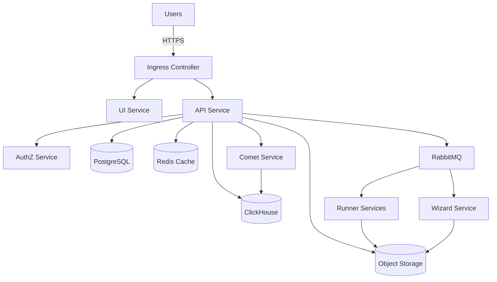
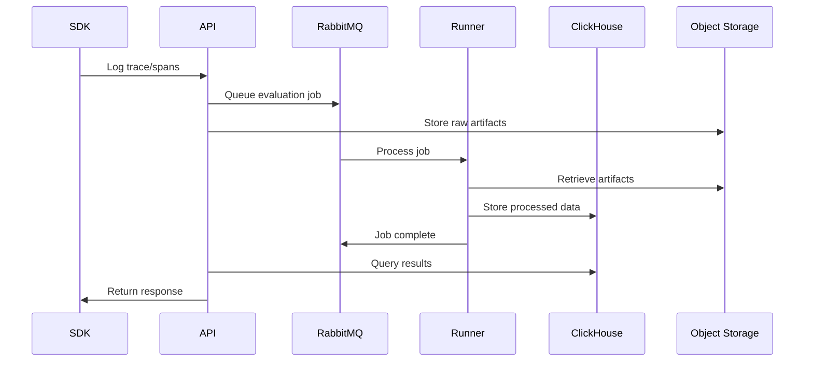
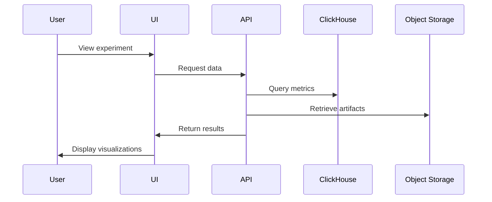
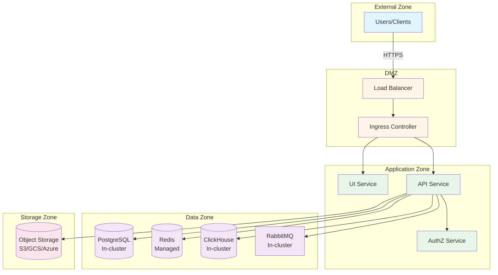
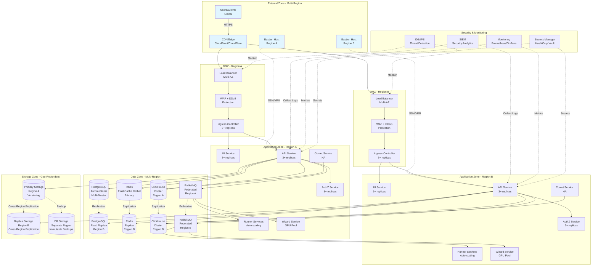
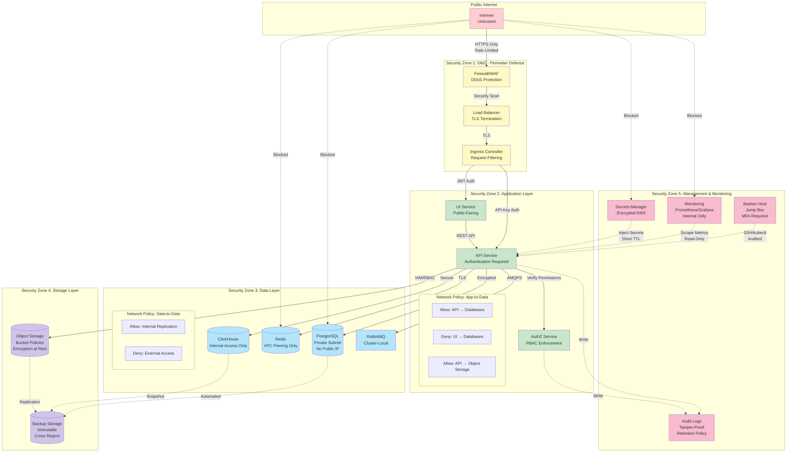

## Galileo Platform Architecture

Galileo Platform is built on a microservices architecture running on Kubernetes, designed for scalability, reliability, and enterprise deployment flexibility.

## High-Level Architecture



## Core Components

### Application Services

<AccordionGroup>
  <Accordion title="API Service" icon="server">
**Role**: Core backend API for all Galileo operations

**Responsibilities**:

- Handles all API requests from UI and SDKs
- Manages experiments, projects, and datasets
- Orchestrates job execution via RabbitMQ
- Integrates with storage and database services

**Resources**: 2 replicas, 1-6 GiB RAM, 0.5-1 CPU

  </Accordion>

  <Accordion title="UI Service" icon="desktop">
**Role**: Web-based console interface

**Responsibilities**:

- Serves the Galileo Console web application
- Provides interactive experiment analysis
- Displays metrics, traces, and visualizations

**Resources**: 2 replicas, 1 GiB RAM, 0.5 CPU

**Dependencies**: API Service

  </Accordion>

  <Accordion title="AuthZ Service" icon="lock">
**Role**: Authorization and access control

**Responsibilities**:

- Enforces role-based access control (RBAC)
- Manages user permissions and access policies
- Validates authorization tokens

**Resources**: 2 replicas, 256-512 MiB RAM, 0.2-1 CPU

**Dependencies**: PostgreSQL

  </Accordion>

  <Accordion title="Comet Service" icon="chart-line">
**Role**: Experiment tracking and metrics aggregation

**Responsibilities**:

- Processes and stores experiment data
- Calculates aggregate metrics
- Manages data retention policies

**Resources**: 1 replica, 4-8 GiB RAM, 1-2 CPU

**Dependencies**: ClickHouse, Object Storage

  </Accordion>

  <Accordion title="Runner Services" icon="play">
**Role**: Job execution and data processing

**Responsibilities**:

- Executes evaluation jobs
- Processes large datasets
- Runs metric calculations

**Resources**:

- Standard Runners: 1 replica, 1.5-4 GiB RAM, 0.75-1 CPU
- Large Runners: 1 replica, 3-16 GiB RAM, 1-1.5 CPU (GPU recommended)

**Dependencies**: Object Storage, RabbitMQ

  </Accordion>

  <Accordion title="Wizard Service" icon="wand-magic-sparkles">
**Role**: Advanced analytics and ML model evaluation

**Responsibilities**:

- Runs Luna-2 evaluations
- Performs complex analysis tasks
- GPU-accelerated computations

**Resources**: 1 replica, 26-32 GiB RAM, 6-8 CPU (GPU recommended)

**Dependencies**: Object Storage, RabbitMQ

  </Accordion>
</AccordionGroup>

### Infrastructure Components

<AccordionGroup>
  <Accordion title="PostgreSQL" icon="database">
**Role**: Primary relational database

**Stores**:

- User accounts and permissions
- Project and experiment metadata
- Configuration and settings

**Options**:

- Self-hosted (in-cluster): 1 primary + 2 replicas
- Managed service: AWS RDS, Cloud SQL, Azure Database

**Resources**: 1-5 GiB RAM, 0.25-1 CPU, 50 GiB storage

  </Accordion>

  <Accordion title="ClickHouse" icon="chart-column">
**Role**: Analytics database for time-series data

**Stores**:

- Trace and span data
- Metrics and evaluations
- High-volume event data

**Components**:

- ClickHouse Cluster: 2 replicas for data storage
- ClickHouse Keeper: 3 replicas for coordination
- ClickHouse Operator: Manages cluster operations

**Resources**: 8-16 GiB RAM per replica, 2-4 CPU, 50 GiB storage

  </Accordion>

  <Accordion title="RabbitMQ" icon="rabbit">
**Role**: Message broker for async job processing

**Responsibilities**:

- Queues evaluation and processing jobs
- Handles inter-service communication
- Provides reliable message delivery

**Components**:

- RabbitMQ Cluster: 3 replicas
- RabbitMQ Operator: Manages cluster

**Resources**: 512 MiB-1 GiB RAM per replica, 256m-1 CPU, 5 GiB storage

  </Accordion>

  <Accordion title="Object Storage" icon="box-archive">
**Role**: Blob storage for datasets, models, and artifacts

**Stores**:

- Experiment datasets and results
- Model artifacts and checkpoints
- Images and large files
- Backup archives

**Options**:

- AWS S3
- Google Cloud Storage
- Azure Blob Storage
- MinIO (self-hosted, S3-compatible)

**Buckets**: 10 buckets for different data types

  </Accordion>

  <Accordion title="Redis" icon="circle-nodes">
**Role**: Caching and session storage

**Responsibilities**:

- Caches frequently accessed data
- Stores user sessions
- Temporary data storage

**Requirements**:

- Must use managed service (self-hosting not supported)
- HA mode with 1+ replica

**Resources**: 1-2 GiB RAM per instance

  </Accordion>

  <Accordion title="Ingress Controller" icon="right-to-bracket">
**Role**: External traffic routing and TLS termination

**Responsibilities**:

- Routes HTTP/HTTPS traffic to services
- SSL/TLS certificate management
- Load balancing

**Options**:

- NGINX Ingress Controller (default)
- AWS ALB Controller
- GCP Load Balancer
- Azure Application Gateway

**Resources**: 2 replicas, 1 GiB RAM, 0.5 CPU

  </Accordion>
</AccordionGroup>

## Deployment Patterns

### Standard Deployment

For most production deployments with managed cloud services:

<Tabs>
  <Tab title="AWS">
    - **Compute**: EKS cluster with 3 node pools
    - **Database**: RDS Aurora PostgreSQL (Auth: IAM or password-based)
    - **Cache**: ElastiCache Redis (Auth: password-based with TLS)
    - **Storage**: S3 buckets (Auth: IAM roles via IRSA)
    - **Ingress**: ALB Ingress Controller or NGINX
  </Tab>

{" "}

<Tab title="Google Cloud">
  - **Compute**: GKE cluster with 3 node pools - **Database**: Cloud SQL
  PostgreSQL (Auth: Cloud SQL Proxy or password-based) - **Cache**: Memorystore
  for Redis (Auth: password-based) - **Storage**: Cloud Storage buckets (Auth:
  Workload Identity) - **Ingress**: GKE Ingress or NGINX
</Tab>

  <Tab title="Azure">
    - **Compute**: AKS cluster with 3 node pools
    - **Database**: Azure Database for PostgreSQL (Auth: Azure AD or password-based)
    - **Cache**: Azure Cache for Redis (Auth: access key)
    - **Storage**: Azure Blob Storage (Auth: Managed Identity or access key)
    - **Ingress**: Application Gateway or NGINX
  </Tab>
</Tabs>

### Air-Gapped Deployment

For environments without internet access:

- All services run in-cluster (PostgreSQL, Redis via managed services)
- MinIO for object storage
- Pre-loaded container images
- Offline model artifacts on shared volume (EFS/NFS)
- Internal DNS and certificate management

### High-Availability Deployment

For mission-critical deployments:

- Multi-zone Kubernetes cluster
- Managed database with multi-region replication
- Multiple replicas for all stateless services (3+)
- Cross-region backup strategy
- Geo-redundant object storage

## Data Flow

### Experiment Logging Flow



### Analysis Flow



## Network Architecture

### Network Topology by Deployment Tier

<Tabs>
  <Tab title="Basic Tier">

  </Tab>

{" "}

<Tab title="Standard Tier">
  ```mermaid graph TB subgraph "External Zone" Users[Users/Clients] VPN[VPN
  Gateway] end subgraph "DMZ" LB[Load Balancer
  <br />
  Multi-AZ] WAF[Web Application
  <br />
  Firewall] Ingress[Ingress Controller
  <br />
  2+ replicas] end subgraph "Application Zone - Multiple AZs" UI[UI Service
  <br />2 replicas] API[API Service
  <br />2 replicas] Auth[AuthZ Service
  <br />2 replicas] Comet[Comet Service] Workers[Runner Services] end subgraph "Data
  Zone - Managed Services" PG[(PostgreSQL
  <br />
  RDS/CloudSQL
  <br />
  HA Mode)] Redis[(Redis
  <br />
  ElastiCache/Memorystore
  <br />
  HA Mode)] CH[(ClickHouse
  <br />
  In-cluster
  <br />
  3+ replicas)] RMQ[RabbitMQ
  <br />
  3+ replicas] end subgraph "Storage Zone" S3Primary[(Primary Bucket
  <br />
  Versioning Enabled)] S3Backup[(Backup Bucket
  <br />
  Cross-Region)] end Users -->|HTTPS| LB VPN -.->|Admin Access| API LB --> WAF WAF
  --> Ingress Ingress --> UI Ingress --> API API --> Auth API --> PG API --> Redis
  API --> CH API --> RMQ API --> S3Primary Comet --> CH Workers --> S3Primary RMQ
  --> Workers S3Primary -.->|Replication| S3Backup style Users fill:#e1f5ff style
  VPN fill:#e1f5ff style LB fill:#fff4e6 style WAF fill:#fff4e6 style Ingress fill:#fff4e6
  style UI fill:#e8f5e9 style API fill:#e8f5e9 style Auth fill:#e8f5e9 style Comet
  fill:#e8f5e9 style Workers fill:#e8f5e9 style PG fill:#f3e5f5 style Redis fill:#f3e5f5
  style CH fill:#f3e5f5 style RMQ fill:#f3e5f5 style S3Primary fill:#fce4ec style
  S3Backup fill:#fce4ec ```
</Tab>

  <Tab title="Enterprise Tier">

  </Tab>
</Tabs>

### Security Zones



### Internal Communication

- All services communicate via Kubernetes internal DNS
- Services use ClusterIP for in-cluster communication
- TLS for sensitive inter-service communication (optional)

### External Access

<Tabs>
  <Tab title="Public Endpoints">
    Four main public endpoints (via ingress): - `console.&lt;domain&gt;` - Web
    UI - `api.&lt;domain&gt;` - API service - `data.&lt;domain&gt;` - Data
    service (optional) - `grafana.&lt;domain&gt;` - Monitoring dashboard
  </Tab>

  <Tab title="Egress Requirements">
    Galileo integrates with external services: | Endpoint | Protocol | Port |
    Purpose | Can Block? | |----------|----------|------|---------|------------|
    | api.sendgrid.com | HTTPS | 443 | Email notifications | Yes | |
    huggingface.co | HTTPS | 443 | Model downloads | Yes* | | listener.logz.io |
    HTTPS | 8053, 8071 | Telemetry | Yes | | prometheus-prod.grafana.net | HTTPS
    | 443 | Metrics | Yes | | us.sentry.io | HTTPS | 443 | APM | Yes | |
    hooks.slack.com | HTTPS | 443 | Notifications | Yes | *Use offline models
    via shared volume if blocked
  </Tab>
</Tabs>

## Security Architecture

### Authentication & Authorization

- Users authenticate via web UI or API keys
- Optional SSO integration (SAML, OAuth)
- JWT tokens for API authentication
- RBAC enforced by AuthZ service

### Data Security

- TLS/SSL for all external communications
- Optional TLS for internal service mesh
- Encryption at rest for databases and object storage
- Secrets management via Kubernetes Secrets or external vaults

### Network Security

- Network policies to restrict pod-to-pod communication
- Private subnets for databases and internal services
- Security groups/firewall rules for ingress/egress
- VPC/VNet isolation

## Scaling Strategies

### Horizontal Scaling

Services that scale horizontally:

- API Service: Scale based on request rate
- UI Service: Scale based on concurrent users
- Runner Services: Scale based on queue depth
- Comet Service: Limited horizontal scaling

### Vertical Scaling

Services that benefit from vertical scaling:

- Wizard Service: More GPU/CPU for complex analysis
- ClickHouse: More memory for query performance
- PostgreSQL: More CPU/memory for complex queries

### Autoscaling Configuration

Galileo supports Kubernetes Horizontal Pod Autoscaler (HPA):

- API: Target 70% CPU utilization
- Runners: Target queue depth < 5 jobs
- UI: Target 60% memory utilization

## Monitoring & Observability

### Metrics

- Prometheus for metrics collection
- Grafana for visualization
- Custom Galileo metrics exposed via API

### Logging

- Centralized logging via Logz.io (optional)
- Fluent-bit for log collection
- VictoriaLogs for log aggregation
- Kubernetes native logging
- Audit logs stored in ClickHouse

## Upgrade & Maintenance

### Upgrade Strategy

- Rolling updates for stateless services
- Database migrations handled automatically
- Helm-based configuration management

### Backup & Recovery

- Automated database backups
- Object storage versioning
- ClickHouse snapshots
- Disaster recovery procedures documented

## Next Steps

<CardGroup cols={2}>
  <Card
    title="Resource Requirements"
    icon="server"
    href="/deployment-docs/resource-requirements"
  >
    Review detailed resource specifications for each component
  </Card>
  <Card
    title="Prerequisites"
    icon="list-check"
    href="/deployment-docs/prerequisites"
  >
    Check prerequisites before deployment
  </Card>
  <Card
    title="Security Considerations"
    icon="shield-check"
    href="/deployment-docs/security/security-and-access-control"
  >
    Review security best practices and requirements
  </Card>
  <Card
    title="Start Deployment"
    icon="rocket"
    href="/deployment-docs/deploying-on-aws-eks"
  >
    Begin deploying on your chosen platform
  </Card>
</CardGroup>
