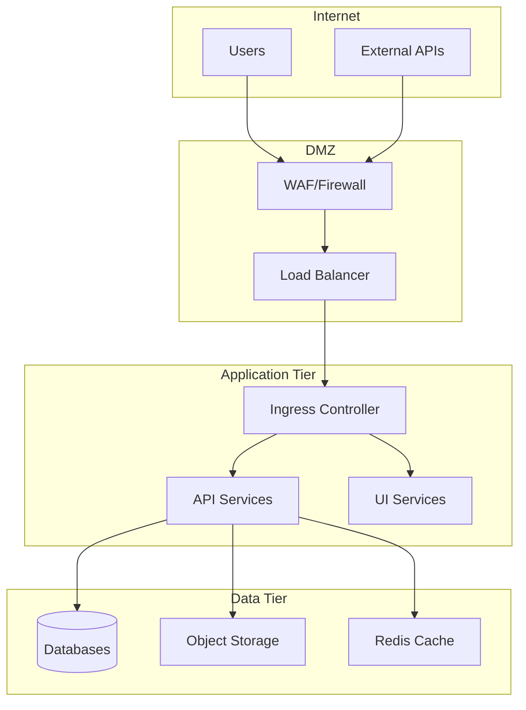

## Overview

Proper infrastructure planning is essential for a successful Galileo deployment. This guide helps you design and prepare your infrastructure to meet your organization's performance, scalability, and security requirements.

<Info>
  **Planning First:** Invest time in planning to avoid costly changes later. A
  well-planned infrastructure ensures optimal performance, cost-efficiency, and
  easier maintenance.
</Info>

## Planning Process

<Steps>
  <Step title="Assess Requirements">
    Evaluate your organization's needs for performance, compliance, and growth
  </Step>
  <Step title="Choose Deployment Tier">
    Select the appropriate deployment tier based on your requirements
  </Step>
  <Step title="Size Infrastructure">
    Calculate resource requirements for your expected workload
  </Step>
  <Step title="Design Architecture">
    Plan network topology, security zones, and integration points
  </Step>
  <Step title="Validate Design">
    Review design with stakeholders and Galileo support team
  </Step>
</Steps>

## Capacity Planning

### User and Workload Assessment

Start by understanding your expected usage patterns:

<Card title="Usage Metrics to Consider" icon="chart-line">
  - **Concurrent Users:** Peak and average user counts - **Data Volume:** Daily
  data ingestion and processing needs - **Model Complexity:** Types and sizes of
  ML models - **Experiment Frequency:** Number of experiments per day/week -
  **API Call Volume:** Expected API requests per second - **Storage Growth:**
  Projected data growth over 12-24 months
</Card>

### Sizing Calculator

Use this table to estimate your initial infrastructure needs:

| Workload Size  | Users   | Daily Data | Node Pool Size | Storage | Estimated Cost/Month |
| -------------- | ------- | ---------- | -------------- | ------- | -------------------- |
| **Small**      | 1-25    | &lt;100GB  | 4-6 nodes      | 1TB     | $3,000-5,000         |
| **Medium**     | 26-100  | 100GB-1TB  | 8-12 nodes     | 5TB     | $8,000-15,000        |
| **Large**      | 101-500 | 1-10TB     | 15-25 nodes    | 20TB    | $20,000-40,000       |
| **Enterprise** | 500+    | &gt;10TB   | 30+ nodes      | 50TB+   | $50,000+             |

<Warning>
  These are baseline estimates. Actual requirements vary based on usage patterns
  and chosen deployment tier.
</Warning>

### Performance Requirements

Define your performance objectives:

- **Response Time:** Target latency for API calls (e.g., &lt;500ms)
- **Throughput:** Experiments per hour capability
- **Availability:** Required uptime (99.9% = 43 minutes downtime/month)
- **Recovery:** RTO and RPO objectives for disaster recovery

## Network Architecture

### Network Topology Design

Plan your network architecture with security zones:



### Network Requirements

#### Bandwidth Planning

| Component           | Minimum  | Recommended | Notes                         |
| ------------------- | -------- | ----------- | ----------------------------- |
| **Internet Egress** | 100 Mbps | 1 Gbps      | For user access and API calls |
| **Inter-AZ**        | 1 Gbps   | 10 Gbps     | For cross-zone replication    |
| **Node-to-Node**    | 10 Gbps  | 25 Gbps     | Within same AZ                |
| **Storage Network** | 10 Gbps  | 25 Gbps     | For high I/O operations       |

#### IP Address Planning

Plan your CIDR blocks to avoid conflicts:

```yaml
# Example IP allocation
vpc_cidr: 10.0.0.0/16

subnets:
  # Public subnets (DMZ)
  public_subnet_1: 10.0.1.0/24
  public_subnet_2: 10.0.2.0/24
  public_subnet_3: 10.0.3.0/24

  # Private subnets (Application)
  private_subnet_1: 10.0.10.0/23
  private_subnet_2: 10.0.12.0/23
  private_subnet_3: 10.0.14.0/23

  # Database subnets
  db_subnet_1: 10.0.20.0/24
  db_subnet_2: 10.0.21.0/24
  db_subnet_3: 10.0.22.0/24

# Reserve for future expansion
reserved: 10.0.100.0/22
```

### DNS and SSL Planning

<Tabs>
  <Tab title="External DNS">
    Plan your external DNS structure:
    
    ```
    galileo.yourdomain.com         → Main application
    api.galileo.yourdomain.com     → API endpoints
    *.galileo.yourdomain.com       → Wildcard for services
    ```
  </Tab>
  
  <Tab title="Internal DNS">
    Configure internal DNS for service discovery:
    
    ```
    <service>.<namespace>.svc.cluster.local
    postgres.galileo.svc.cluster.local
    redis.galileo.svc.cluster.local
    ```
  </Tab>
  
  <Tab title="SSL Certificates">
    Options for SSL certificates:
    
    - **Wildcard Certificate:** `*.galileo.yourdomain.com`
    - **SAN Certificate:** Multiple domains in one cert
    - **Let's Encrypt:** Free automated certificates
    - **Internal CA:** For internal services only
  </Tab>
</Tabs>

## Security Architecture

### Security Zones

Implement defense-in-depth with multiple security layers:

| Zone            | Purpose         | Security Controls                                  |
| --------------- | --------------- | -------------------------------------------------- |
| **Internet**    | External access | DDoS protection, Rate limiting                     |
| **DMZ**         | Edge services   | WAF, IDS/IPS, SSL termination                      |
| **Application** | Core services   | Network policies, RBAC, Secrets management         |
| **Data**        | Sensitive data  | Encryption at rest, Access controls, Audit logging |
| **Management**  | Admin access    | Bastion hosts, MFA, Session recording              |

### Compliance Requirements

<Card title="Common Compliance Standards" icon="shield-check">
  **Identify applicable standards early:** - **SOC 2:** Security and
  availability controls - **GDPR:** Data privacy for EU users - **HIPAA:**
  Healthcare data protection - **PCI DSS:** Payment card data security - **ISO
  27001:** Information security management - **FedRAMP:** US government
  requirements
</Card>

### Identity and Access Management

Plan your IAM strategy:

```yaml
# Example RBAC structure
roles:
  - name: platform-admin
    permissions: ["*"]

  - name: data-scientist
    permissions:
      - experiments.create
      - experiments.run
      - datasets.read

  - name: viewer
    permissions:
      - "*.read"

  - name: ml-engineer
    permissions:
      - models.deploy
      - pipelines.manage
      - metrics.configure
```

## Storage Architecture

### Storage Tiers

Plan storage based on access patterns:

| Tier     | Use Case         | Technology     | Performance | Cost |
| -------- | ---------------- | -------------- | ----------- | ---- |
| **Hot**  | Active data      | SSD/NVMe       | Very High   | $$$  |
| **Warm** | Recent data      | SSD            | High        | $$   |
| **Cool** | Archived data    | HDD            | Medium      | $    |
| **Cold** | Long-term backup | Object storage | Low         | ¢    |

### Data Lifecycle Management

Implement policies for data retention and archival:

```yaml
data_lifecycle:
  experiments:
    hot: 30 days # Recent experiments
    warm: 90 days # Last quarter
    cool: 1 year # Historical
    archive: 7 years # Compliance

  logs:
    hot: 7 days
    warm: 30 days
    cool: 90 days
    delete: 365 days

  models:
    hot: active # Deployed models
    warm: 90 days # Recent versions
    archive: forever # All versions kept
```

## High Availability Design

### Multi-AZ Deployment

<Info>
  **Best Practice:** Deploy across multiple availability zones for resilience
  against zone failures.
</Info>

```yaml
availability_zones:
  - zone_1:
      node_count: 3
      services: [api, ui, workers]

  - zone_2:
      node_count: 3
      services: [api, ui, workers]

  - zone_3:
      node_count: 2
      services: [databases, storage]

load_balancing:
  type: cross-zone
  health_checks: enabled
  failover: automatic
```

### Disaster Recovery Planning

Define your recovery objectives:

| Metric   | Definition                 | Target    | Implementation                        |
| -------- | -------------------------- | --------- | ------------------------------------- |
| **RTO**  | Recovery Time Objective    | 4 hours   | Automated failover procedures         |
| **RPO**  | Recovery Point Objective   | 1 hour    | Hourly snapshots and replication      |
| **MTTR** | Mean Time to Repair        | 2 hours   | Automated diagnostics and remediation |
| **MTBF** | Mean Time Between Failures | 720 hours | Redundancy and preventive maintenance |

## Integration Planning

### External System Integration

Identify systems that need to integrate with Galileo:

<Tabs>
  <Tab title="Data Sources">
    - Data warehouses (Snowflake, BigQuery, Redshift) - Data lakes (S3, ADLS,
    GCS) - Streaming platforms (Kafka, Kinesis, Pub/Sub) - Databases
    (PostgreSQL, MySQL, MongoDB)
  </Tab>

{" "}

<Tab title="ML Platforms">
  - Model registries (MLflow, Kubeflow) - Training platforms (SageMaker, Vertex
  AI) - Feature stores (Feast, Tecton) - Experiment tracking (Weights & Biases,
  Neptune)
</Tab>

  <Tab title="DevOps Tools">
    - CI/CD pipelines (Jenkins, GitLab, GitHub Actions) - Monitoring
    (Prometheus, Datadog, New Relic) - Logging (ELK Stack, Splunk, CloudWatch) -
    Secrets management (Vault, AWS Secrets Manager)
  </Tab>
</Tabs>

### API Gateway Strategy

Plan your API management approach:

```yaml
api_gateway:
  features:
    - rate_limiting: 1000 req/min per user
    - authentication: OAuth 2.0 / API keys
    - caching: 5 minute TTL for read operations
    - monitoring: All requests logged
    - versioning: /v1/, /v2/ paths

  endpoints:
    public:
      - /api/v1/health
      - /api/v1/status

    authenticated:
      - /api/v1/experiments/*
      - /api/v1/models/*
      - /api/v1/datasets/*
```

## Cost Optimization Strategy

### Resource Optimization

Strategies to manage infrastructure costs:

1. **Right-sizing:** Start small and scale based on actual usage
2. **Reserved Instances:** Commit to 1-3 year terms for discounts
3. **Spot Instances:** Use for non-critical batch workloads
4. **Auto-scaling:** Scale down during off-peak hours
5. **Storage Tiering:** Move old data to cheaper storage classes

### Budget Planning

<Card title="Cost Breakdown Example" icon="dollar-sign">
  **Monthly cost allocation for medium deployment:** - **Compute (40%):** $4,000
  - Kubernetes nodes - **Storage (25%):** $2,500 - Databases and object storage
  - **Network (15%):** $1,500 - Data transfer and load balancing - **Managed
  Services (15%):** $1,500 - RDS, ElastiCache, etc. - **Backup/DR (5%):** $500 -
  Snapshots and replication **Total:** ~$10,000/month
</Card>

## Implementation Checklist

### Pre-Deployment Checklist

<Card title="Infrastructure Readiness" icon="list-check">
  ✅ **Before deployment, ensure:** - [ ] Network architecture documented - [ ]
  Security zones configured - [ ] CIDR blocks allocated - [ ] DNS records
  prepared - [ ] SSL certificates obtained - [ ] IAM roles created - [ ] Storage
  classes configured - [ ] Backup strategy implemented - [ ] Monitoring tools
  deployed - [ ] Disaster recovery plan tested - [ ] Cost alerts configured - [
  ] Compliance requirements met
</Card>

## Next Steps

<CardGroup cols={2}>
  <Card
    title="Resource Requirements"
    icon="server"
    href="/deployment-docs/resource-requirements"
  >
    Review detailed resource specifications
  </Card>
  <Card
    title="Prerequisites"
    icon="list-check"
    href="/deployment-docs/prerequisites"
  >
    Verify all prerequisites are met
  </Card>
  <Card
    title="Deployment Tiers"
    icon="layer-group"
    href="/deployment-docs/deployment-tiers"
  >
    Choose your deployment tier
  </Card>
  <Card
    title="Cloud Deployment"
    icon="cloud"
    href="/deployment-docs/deploying-on-aws-eks"
  >
    Start your cloud deployment
  </Card>
</CardGroup>

## Getting Support

Need help with infrastructure planning?

<Info>
  **Galileo Professional Services:** Our team can assist with infrastructure
  design, capacity planning, and deployment architecture. Contact
  sales@galileo.ai for consultation services.
</Info>
