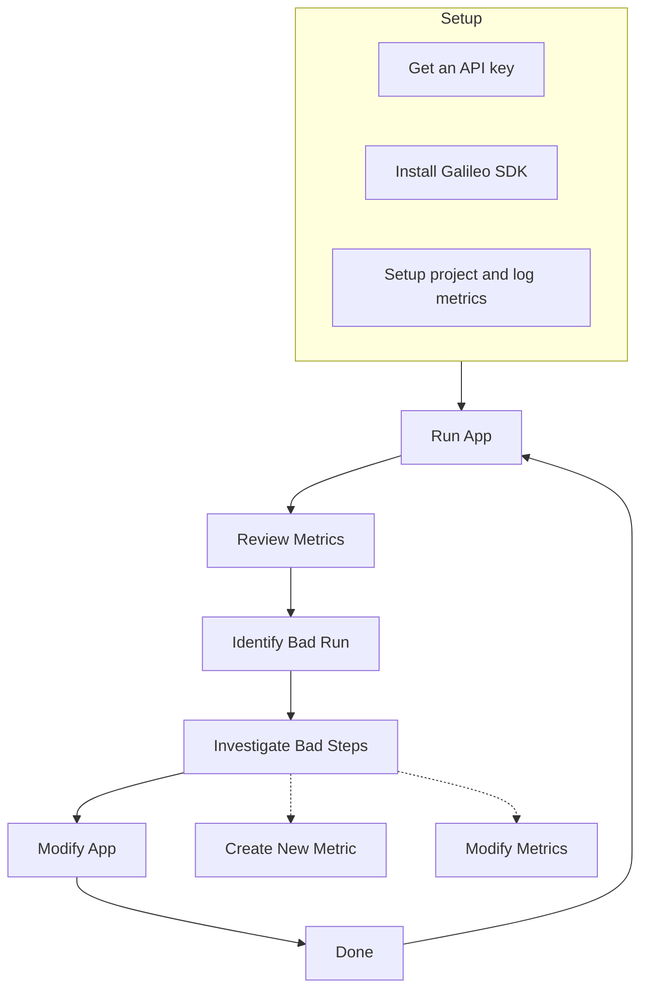

The **Galileo Workflow** is a structured workflow for monitoring, diagnosing, and optimizing your application's performance. By following these steps, you can quickly identify issues, investigate their root causes, adjust your metrics or application as needed, and continuously improve the overall performance and reliability of your project.

## Step-by-Step Explanation

<Steps>
  <Step title="Setup">
   - **Create an account**: Sign up for Galileo to access its features.  
   - **Get an API key**: Obtain the unique key that allows your application to send data to Galileo.  
   - **Install Galileo's SDK**: Integrate Galileo into your application by installing the necessary software development kit.  
   - **Set up your project and log metrics**: Within Galileo, define your project settings and configure your application to send performance or behavioral metrics.
  </Step>

  <Step title="Run App">
   After setup, run your application so that it starts logging data and metrics to Galileo.
  </Step>

  <Step title="Review Metrics">
   Open Galileo's dashboard to review the metrics (e.g., performance, usage, or any custom metrics you've defined).
  </Step>

  <Step title="Identify Bad Run">
   Look for runs or sessions where the metrics indicate an issue (e.g., a red metric, a dip in accuracy, or a spike in errors).
  </Step>

  <Step title="Investigate Bad Steps">
   Explore and investigate the problematic run. Galileo provides insights, metrics and traces so you can pinpoint which steps caused an issue.
  </Step>

  <Step title="Create a New Metric (If Needed)">
   If the existing metrics aren't sufficient, create a new metric to track additional data or more accurately measure the problematic aspect of your application.
  </Step>

  <Step title="Modify Metrics (If Needed)">
   Adjust or refine your metrics as needed—update thresholds for alerts, tweak the data points being tracked, or change how Galileo aggregates or displays data.
  </Step>

  <Step title="Modify App">
   After determining the necessary changes, modify your application (e.g., fix bugs, tune hyperparameters, or update logic).
  </Step>

  <Step title="Done">
   Once you've implemented fixes, mark the cycle as complete. However, typically you would return to **Run App** and **Review Metrics** to confirm the problem is resolved and that no new issues have surfaced.
  </Step>
</Steps>

## Working with Experiments

### From Spot Testing to Systematic Evaluation

When you start working with your application, you'll naturally progress from basic testing to more comprehensive evaluation. This journey helps you build confidence in your application's performance and systematically improve its behavior. For detailed information about experimentation capabilities, see our [Experimentation Overview](/sdk-api/python/experimentation/experimentation).

<Steps>
  <Step title="Initial Testing">
    Start with the basics. Run your application with simple test cases to get a feel for how it performs. This is like taking your first steps:
    
    - Test with straightforward, expected inputs
    - Watch how your app behaves in ideal conditions
    - Look for any immediate issues or unexpected behaviors
    - Get comfortable with your metrics and what they tell you

    This phase helps you establish a baseline for what "good" looks like.
  </Step>

  <Step title="Expanding Test Coverage">
    Once you're comfortable with basic testing, it's time to broaden your horizons. This is where Galileo's dataset features become valuable:
    
    - Introduce more complex and varied inputs
    - Use Galileo's dataset feature to organize and maintain test cases
    - Or bring your own dataset if you already have test data
    - Test edge cases and unusual scenarios
    - Look for patterns in how your app handles different types of inputs

    Think of this as stress-testing your application across a wide range of scenarios.
  </Step>

  <Step title="Finding and Fixing Issues">
    As you test more extensively, you'll discover areas where your app needs improvement:
    
    - Identify specific inputs that cause problems
    - Look for patterns in problematic cases
    - Create focused datasets for particular issues
    - Track how your fixes perform against these problem cases
    - Build a library of test cases for regression testing

    This systematic approach helps you not only fix issues but also prevent them from recurring.
  </Step>

  <Step title="Continuous Improvement">
    Now you're in a cycle of continuous improvement:
    
    - Regularly run tests against your datasets
    - Monitor for new issues or patterns
    - Quickly identify when changes cause problems
    - Maintain datasets that represent your key test cases
    - Track your app's improving performance over time

    This ongoing process helps ensure your app keeps getting better while maintaining quality.
  </Step>
</Steps>

### Working with Datasets

You have two ways to work with datasets in Galileo. For detailed information about dataset management, see our [Datasets Documentation](/sdk-api/python/experimentation/datasets):

1. **Use Galileo's Dataset Feature**
   - Maintain and organize your test data directly in Galileo
   - Track which inputs cause problems
   - Automatically group similar issues

2. **Bring Your Own Dataset**
   - Import your existing test data
   - Use your own data organization
   - Keep your existing workflow

### Creating Focus Sets

When you find problems, you can:
1. Create subsets of data that trigger specific issues
2. Track how well your fixes work on these subsets
3. Make sure fixes don't cause new problems
4. Build a library of test cases for future testing

### Tips for Success

1. **Start Small**: Begin with basic testing, then expand
2. **Group Issues**: Create focused datasets for similar problems
3. **Track Progress**: Monitor how changes affect both specific issues and overall performance
4. **Keep History**: Save problematic inputs to prevent regressions

