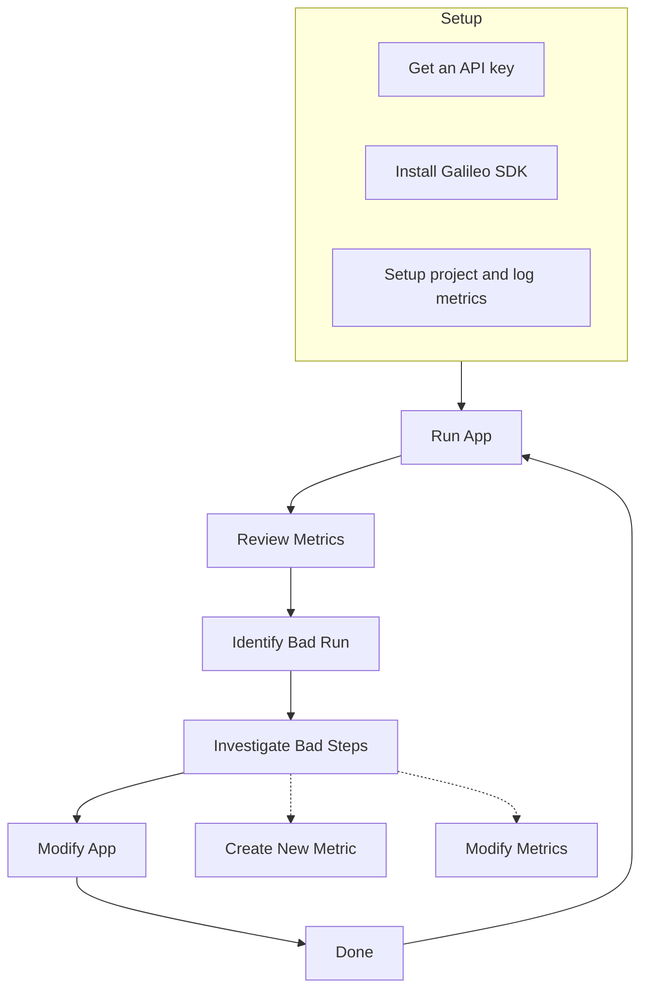

The **Galileo Workflow** is a structured workflow for monitoring, diagnosing, and optimizing your application's performance. By following these steps, you can quickly identify issues, investigate their root causes, adjust your metrics or application as needed, and continuously improve the overall performance and reliability of your project.

## Step-by-Step Explanation

<Steps>
  <Step title="Setup">
   - **Create an account**: Sign up for Galileo to access its features.
   - **Get an API key**: Obtain the unique key that allows your application to send data to Galileo.
   - **Install Galileo's SDK**: Integrate Galileo into your application by installing the necessary software development kit.
   - **Set up your project and log metrics**: Within Galileo, define your project settings and configure your application to send performance or behavioral metrics.

</Step>

  <Step title="Run App">
   After setup, run your application so that it starts logging data and metrics to Galileo.

</Step>

  <Step title="Review Metrics">
   Open Galileo's dashboard to review the metrics (e.g., performance, usage, or any custom metrics you've defined).

</Step>

  <Step title="Identify Bad Run">
   Look for runs or sessions where the metrics indicate an issue (e.g., a red metric, a dip in accuracy, or a spike in errors).

</Step>

  <Step title="Investigate Bad Steps">
   Explore and investigate the problematic run. Galileo provides insights, metrics and traces so you can pinpoint which steps caused an issue.

</Step>

  <Step title="Create a New Metric (If Needed)">
   If the existing metrics aren't sufficient, create a new metric to track additional data or more accurately measure the problematic aspect of your application.

</Step>

  <Step title="Modify Metrics (If Needed)">
   Adjust or refine your metrics as needed—update thresholds for alerts, tweak the data points being tracked, or change how Galileo aggregates or displays data.

</Step>

  <Step title="Modify App">
   After determining the necessary changes, modify your application (e.g., fix bugs, tune hyperparameters, or update logic).

</Step>

  <Step title="Done">
   Once you've implemented fixes, mark the cycle as complete. However, typically you would return to **Run App** and **Review Metrics** to confirm the problem is resolved and that no new issues have surfaced.

</Step>
</Steps>

## What's Next?

After you run your application and set up your metrics, you can start running experiments to improve your application.
Experiments allow you to run multiple variations of your application and compare the results to find the best performing configuration, and identify issues and edge cases that you may have missed..

<Card title="Learn more about Logging" icon="terminal" href="/getting-started/logging" horizontal>
  Learn how to use the Galileo SDK to log data from your application.

</Card>

<Card title="Learn about Experiments" icon="flask" href="/getting-started/experiments/overview" horizontal>
  Create evaluations to test your application on a diverse set of inputs.

</Card>
