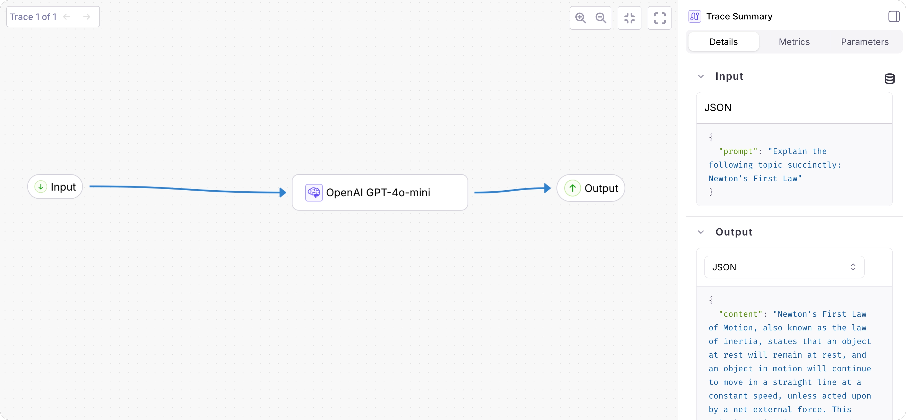
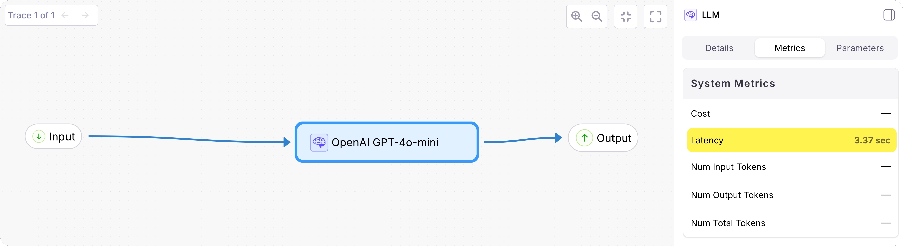

## Overview

The Galileo OpenAI wrapper supports synchronous calls only. This guide shows you how to log asynchronous calls to Galileo.

## Before you start

To complete this how-to, you will need:

- An [OpenAI API key](https://openai.com/api/)
- A [Galileo project](/concepts/projects) configured
- Your [Galileo API key](https://app.galileo.ai/settings/api-keys)

## Install dependencies

To use Galileo, you need to install some package dependencies in your virtual environment, as well as configuring environment variables.

<Steps>
<Step title="Create a virtual environment using your preferred method and activate it"/>

<Step title="Install the required packages">

```bash
pip install "galileo[openai]" python-dotenv
```

</Step>

<Step title="Create a `.env` file, and add the following values">

```ini .env
GALILEO_API_KEY=your_galileo_api_key
GALILEO_PROJECT=your_project_name
GALILEO_LOG_STREAM=your_log_stream

OPENAI_API_KEY=your_openai_api_key
```

</Step>
</Steps>

## Create the basic Python app to call OpenAI

<Steps>
<Step title="Create a Python file for your application called `app.py`."/>

<Step title="Add the following code to call OpenAI to ask a question">

```python app.py
import os
import asyncio
import openai
from dotenv import load_dotenv
from galileo import GalileoLogger

load_dotenv()

client = openai.AsyncOpenAI(api_key=os.environ.get("OPENAI_API_KEY"))

async def prompt_open_ai(prompt: str) -> str:
    response = await client.chat.completions.create(
        model="gpt-4o-mini",
        messages=[{"role": "user", "content": prompt}],
    )
    return response.choices[0].message.content.strip()

async def main():
    prompt = "Explain the following topic succinctly: Newton's First Law"
    response = await prompt_open_ai(prompt)
    print(response)

if __name__ == "__main__":
    asyncio.run(main())
```
</Step>

<Step title="Run the Python app to ensure everything is working">

```bash
python app.py
```

You should see a description of Newton's first law.

```output
(.venv) ➜  python app.py   
Newton's First Law, also known as the Law of Inertia, states that an object
at rest will stay at rest and an object in motion will stay in motion with
the same speed and in the same direction, unless acted upon by an
unbalanced force. In simpler terms, it means that an object will keep doing
what it's currently doing until a force makes it do something different.
This law is fundamental to understanding motion and forces as it pertains
to physics.
```

</Step>
</Steps>

## Add simple logging with the Galileo `@log` decorator

Galileo has a `@log` decorator that logs function calls as spans. If these decorated calls are called whilst there is an active trace, they are added to that trace. If there is no active trace, a new one is created for this span.

In this guide, you will be adding the `@log` decorator to log the `prompt_open_ai` function.

<Steps>

<Step title="Import the log decorator">

At the top of your file, add an import for the log decorator:

```python app.py
from galileo import log
```

</Step>

<Step title="Decorate the function">

Update the function definition to include the `@log` decorator:

```python app.py
@log(span_type="llm", name="OpenAI GPT-4o-mini")
async def prompt_open_ai(prompt: str) -> str:
    ...
```

This will log the function as an LLM span using the `span_type="llm"` parameter. You can read more about these in our [span types documentation](/sdk-api/python/logging/log-decorator#span-types).

This also sets the name of the span to "OpenAI GPT-4o-mini".

</Step>

<Step title="Run the Python app">

```bash
python app.py
```

When the app runs, the span will be logged automatically, with the input as the `prompt`, the output as the returned `response`. The duration will also be logged.

</Step>

<Step title="View the logged trace">

From the [Galileo Console](https://app.galileo.ai), open the log stream for your project. You will see a trace with a single span containing the logged function call.

Select the trace to see a detailed view:



Select the OpenAI span to see the latency.



</Step>

</Steps>


## See also

Include references and/or links to other related documentation such as other how-to guides, conceptual topics, troubleshooting information, and limitation details if any.

* Reference link
* Concept link
* Troubleshooting link
