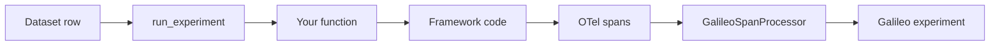

{/* <!-- markdownlint-disable MD044 MD037 --> */}

import SnippetOtelSetup from "/snippets/code/python/how-to-guides/experiments/otel-experiment/otel-setup.mdx";
import SnippetEnableInstrumentation from "/snippets/code/python/how-to-guides/experiments/otel-experiment/enable-instrumentation.mdx";
import SnippetAgentSetup from "/snippets/code/python/how-to-guides/experiments/otel-experiment/agent-setup.mdx";
import SnippetRunAgent from "/snippets/code/python/how-to-guides/experiments/otel-experiment/run-agent.mdx";
import SnippetRunExperiment from "/snippets/code/python/how-to-guides/experiments/otel-experiment/run-experiment.mdx";
import SnippetEnvVars from "/snippets/code/python/how-to-guides/experiments/otel-experiment/env-vars.mdx";

{/* <!-- markdownlint-enable MD044 --> */}

If your application uses a framework with built-in [OpenTelemetry](https://opentelemetry.io/) instrumentation, you can run experiments against it using Galileo's `GalileoSpanProcessor`. The span processor captures OTel traces and routes them to the experiment automatically — no need to use the Galileo `log` decorator or manual logging.

This is useful when you are working with frameworks like [Microsoft Agent Framework](/sdk-api/third-party-integrations/opentelemetry-and-openinference/microsoft-agent-framework), [Google ADK](/sdk-api/third-party-integrations/opentelemetry-and-openinference/google-adk), [Pydantic AI](/sdk-api/third-party-integrations/opentelemetry-and-openinference/pydantic-ai), or any other framework that emits OTel spans.

In this guide you will:

1. [Set up OpenTelemetry with Galileo](#set-up-opentelemetry-with-galileo)
2. [Create an agent with framework instrumentation](#create-the-agent)
3. [Expose an entry point for the experiment runner](#create-the-experiment-entry-point)
4. [Run the experiment](#run-the-experiment)

## How it works

When you run an experiment with a custom function, Galileo's experiment runner:

1. Creates an experiment and sets the `experiment_id` in the Galileo context.
2. For each row in the dataset, it calls your function and wraps the call with dataset context (ground truth input, output, and metadata).
3. The `GalileoSpanProcessor` reads this context and attaches it to every OTel span your framework creates.
4. Spans are exported to Galileo's OTLP endpoint with the experiment ID, routing them to the experiment instead of a regular Log stream.



<Note>
Because the experiment runner manages the trace lifecycle, you must disable Galileo's native logger to avoid duplicate traces. Set `GALILEO_LOGGING_DISABLED=true` before importing your agent code.
</Note>

## Prerequisites

Install the Galileo SDK with OpenTelemetry support, plus any framework-specific packages:

```bash Terminal
pip install "galileo[otel]" opentelemetry-api opentelemetry-sdk opentelemetry-exporter-otlp
```

## Set up environment variables

Configure your Galileo credentials and disable the native logger:

<SnippetEnvVars />

| Variable | Required | Description |
|---|---|---|
| `GALILEO_API_KEY` | Yes | Your [Galileo API key](/references/faqs/find-keys#galileo-api-key) |
| `GALILEO_PROJECT` | Yes | The [project](/concepts/projects) to log experiments to |
| `GALILEO_CONSOLE_URL` | No | Only needed for [custom deployments](/sdk-api/experiments/experiments#api-key). Defaults to `https://app.galileo.ai` |
| `GALILEO_API_URL` | No | Only needed for custom deployments. Defaults to `https://api.galileo.ai`. Used by the `GalileoSpanProcessor` to construct the OTLP endpoint |
| `GALILEO_LOGGING_DISABLED` | Yes | Set to `true` to disable the native logger. Required when using OTel for experiments |

## Set up OpenTelemetry with Galileo

Create a `TracerProvider` and attach the `GalileoSpanProcessor`. This processor automatically configures authentication and the OTLP endpoint using your environment variables.

<SnippetOtelSetup />

Then enable your framework's instrumentation. For example, with Microsoft Agent Framework:

<SnippetEnableInstrumentation />

<Tip>
Set `enable_sensitive_data=True` to capture LLM inputs and outputs in your traces. If set to `False`, only span metadata (timing, token counts, etc.) is sent.
</Tip>

## Create the agent

Set up your agent with your framework of choice. The key requirement is that the framework emits OTel spans through the registered `TracerProvider`.

<SnippetAgentSetup />

## Create the experiment entry point

The experiment runner calls your function once per dataset row. Your function receives the row data and must return a string result.

<SnippetRunAgent />

The function should handle both `str` and `dict` inputs, since the experiment runner passes the parsed row data which can be in either format depending on your dataset structure.

## Run the experiment

Use `run_experiment` to iterate over the dataset, call your agent function, and evaluate the results with metrics.

<SnippetRunExperiment />

<Warning>
Set `GALILEO_LOGGING_DISABLED=true` **before** importing your agent module. The agent module initializes OTel on import, and the native logger must be disabled before that happens to avoid conflicts.
</Warning>

### Key parameters

| Parameter | Description |
|---|---|
| `experiment_name` | Name shown in the Galileo console. If a duplicate name exists, a timestamp is appended automatically |
| `dataset` | A list of dictionaries with `input` and optional `output` (ground truth) fields, a Galileo `Dataset` object, or a dataset name |
| `dataset_id` | ID of an existing Galileo dataset. Alternative to `dataset` |
| `dataset_name` | Name of an existing Galileo dataset. Alternative to `dataset` |
| `function` | Your entry point function, called once per dataset row |
| `metrics` | List of [metrics](/sdk-api/metrics/metrics) to evaluate. Supports built-in, [custom LLM-as-a-judge](/concepts/metrics/custom-metrics/custom-metrics-ui-llm), and [local metrics](/concepts/metrics/custom-metrics/custom-metrics-ui-code#local-metrics) |
| `project` | Project name (can also be set via the `GALILEO_PROJECT` environment variable) |
| `project_id` | Project ID. Alternative to `project` |
| `experiment_tags` | Dictionary of key-value pairs to tag the experiment for filtering and comparison |

### Ground truth

When your dataset includes an `output` field, this value is attached to the OTel spans as ground truth. Metrics like [Ground Truth Adherence](/concepts/metrics/response-quality/ground-truth-adherence) use this to evaluate the agent's response.

The experiment runner uses `galileo_dataset_context` to attach the ground truth to the OTel context, so it is available to the `GalileoSpanProcessor` without any manual configuration.

## Supported frameworks

Any framework with OpenTelemetry instrumentation works with this approach. See the framework-specific guides for OTel setup details:

<CardGroup cols={2}>
  <Card title="Microsoft Agent Framework" icon="microsoft" horizontal href="/sdk-api/third-party-integrations/opentelemetry-and-openinference/microsoft-agent-framework">
    Built-in OTel instrumentation, no extra packages needed.
  </Card>
  <Card title="Google ADK" icon="google" horizontal href="/sdk-api/third-party-integrations/opentelemetry-and-openinference/google-adk">
    Integrate Google Agent Development Kit with Galileo via OTel.
  </Card>
  <Card title="Pydantic AI" icon="python" horizontal href="/sdk-api/third-party-integrations/opentelemetry-and-openinference/pydantic-ai">
    Use Pydantic AI's OTel support with Galileo.
  </Card>
  <Card title="Strands Agents" icon="python" horizontal href="/sdk-api/third-party-integrations/opentelemetry-and-openinference/strands-agents">
    Integrate Strands Agents with Galileo via OTel.
  </Card>
</CardGroup>

## Next steps

<CardGroup cols={2}>
  <Card title="Run experiments in code" icon="code" horizontal href="/sdk-api/experiments/running-experiments">
    Learn about all experiment approaches including prompt templates and custom functions.
  </Card>
  <Card title="OpenTelemetry overview" icon="signal-stream" horizontal href="/sdk-api/third-party-integrations/opentelemetry-and-openinference">
    Learn more about Galileo's OpenTelemetry integration for logging and monitoring.
  </Card>
  <Card title="Metrics reference" icon="brain" horizontal href="/sdk-api/metrics/metrics">
    Explore the full list of available metrics for experiments.
  </Card>
  <Card title="Datasets" icon="database" horizontal href="/sdk-api/experiments/datasets">
    Learn how to create and manage datasets for experiments.
  </Card>
</CardGroup>
