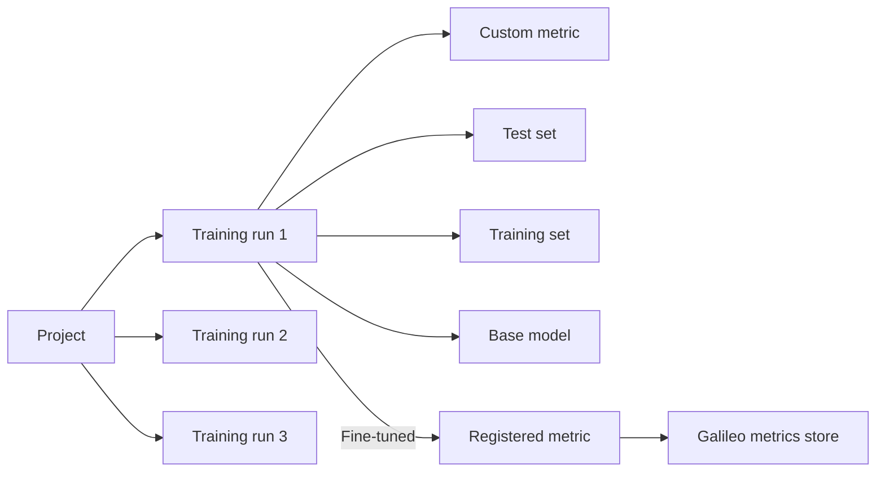

This page is the conceptual backbone of Luna Studio. If you're new to the product, skim it once before working through the [Quickstart](/luna-studio/quickstart). The vocabulary here is reused across every other page.

## The mental model

A **project** holds a series of **training runs** that explore variations of a custom **metric**. Each run combines a **test set**, a **training set**, and a **base model** to produce a fine-tuned metric. Once a run is **Fine-tuned**, you can **register** the metric back into the Galileo metrics store.

## Projects

A **project** is the top-level container. It groups training runs that share a goal — typically tuning a single metric for a single application or domain.

Examples of well-scoped projects:

- `support-tone-classifier` — train a metric that scores how on-brand a support agent's reply sounds.
- `rag-evaluator` — train a metric that scores whether a RAG answer is grounded in retrieved chunks.
- `pii-detector` — train a metric that flags responses leaking personally identifiable information.

You can create as many projects as you want. Projects show on the **Projects** page (the home of the app at `/{org}`).

See [Projects overview](/luna-studio/projects/overview).

## Training runs

A **training run** is a single attempt at fine-tuning a metric. Each run captures four inputs:

| Input        | What it is                                                                                     |
| ------------ | ---------------------------------------------------------------------------------------------- |
| Metric       | A predefined metric template (e.g. Toxicity) or a custom prompt you wrote.                     |
| Test set     | A small labelled dataset used **only for evaluation** at the end of the run.                   |
| Training set | A larger labelled dataset used to fine-tune the base model. Often generated from the test set. |
| Base model   | One of **Luna Small**, **Luna Medium**, or **Luna Large** — the underlying evaluator model.    |

Runs have a **lifecycle status**: Queued → Training → Fine-tuned → Registered. A run can also fail (status: Failed). See [Run lifecycle](/luna-studio/runs/lifecycle) for the full state machine.

## Metrics

A **metric** is a function that takes some part of an LLM trace and returns a score. Luna Studio supports six **output types**:

- **Boolean** — true/false (e.g. "is this toxic?").
- **Floating Point** — a number in a range (e.g. confidence score).
- **Categorical** — one of a fixed set of labels.
- **Percentage** — a number between 0 and 100.
- **Multilabel** — multiple categorical labels per input.
- **Numeric** — an unbounded number.

Each metric runs against a specific **step** in a Galileo trace:

- **LLM span** — a single LLM call.
- **Retriever** — a single retrieval step.
- **Agent span** — a single agent step.
- **Trace** — the full request/response trace.

Today, Luna Studio metrics operate over the **Text** modality only.

A metric flows through the same lifecycle as the run that produced it: Queued, Training, Fine-tuned, Registered, Failed.

See [Metrics overview](/luna-studio/metrics/overview).

## Datasets

Luna Studio splits datasets into two flavors:

### Test sets

A **test set** is a small, hand-labelled dataset used to evaluate a fine-tuned metric. Test sets are the "ground truth" for the run — they should be labelled carefully and should not be seen during training.

Required columns: **input**, **label**.

### Training sets

A **training set** is the dataset used to fine-tune the base model. Training sets can be:

- **Generated from a test set** — Luna uses ~20% of the test set as seed examples and generates ~3,000 labelled samples via an LLM-as-judge prompt.
- **Uploaded** — your own labelled production logs (CSV or JSONL).
- **Imported from Galileo** — pulled from a project in your connected Galileo workspace.

See [Datasets overview](/luna-studio/datasets/overview).

## Base models

Luna Studio fine-tunes one of three Luna base models:

| Model       | Trade-off                                                                      |
| ----------- | ------------------------------------------------------------------------------ |
| Luna Small  | Fastest training, smallest serving cost. Good for narrow, well-scoped metrics. |
| Luna Medium | Balanced. The default if you're not sure.                                      |
| Luna Large  | Slowest to train; captures more nuance. Use for subjective or complex metrics. |

Pick the base model in **Step 4 — Config and launch** of the new-run wizard.

## Integrations

To run anything, Luna Studio needs API keys for the LLM providers it talks to:

- **For metric generation** (Step 3 — Training set): an API key for whichever model you select in the Generate drawer (gpt-5, gpt-4o, or claude-3.7-sonnet).
- **For Galileo features** (Import from Galileo, Register metric): a Galileo API key.

Integrations are **org-scoped** — once added, every member of your org and every project can use them. See [Integrations overview](/luna-studio/integrations/overview).

## Lifecycle statuses

The same five statuses appear on runs and metrics throughout the app:

- **Queued** — accepted but not yet started.
- **Training** — fine-tuning is in progress.
- **Fine-tuned** — training succeeded; not yet registered.
- **Registered** — the metric is live in the Galileo metrics store.
- **Failed** — training or registration failed; see the run details for the reason.

See [Lifecycle and statuses](/luna-studio/metrics/lifecycle-and-statuses) for status transitions and what each pill means visually.

## Where to go next

<CardGroup cols={2}>
  <Card title="Quickstart" icon="rocket" href="/luna-studio/quickstart">
    A 15-minute, end-to-end tour of the product.
  </Card>
  <Card title="New run wizard" icon="wand-magic-sparkles" href="/luna-studio/runs/new-run/overview">
    Step-by-step reference for the four-step run creation flow.
  </Card>
  <Card title="Glossary" icon="book" href="/luna-studio/reference/glossary">
    Quick-reference definitions for every term used in the docs.
  </Card>
  <Card title="FAQ" icon="circle-question" href="/luna-studio/reference/faq">
    Common questions about choosing test sets, picking models, and more.
  </Card>
</CardGroup>
