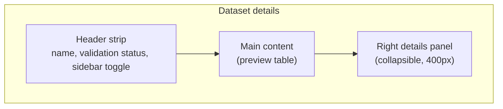

The dataset details page shows everything Luna Studio knows about a single dataset — its preview rows, validation state, source metadata, and the runs and metrics that depend on it.

To get here, click any row on the [Datasets](/luna-studio/datasets/overview) page.

<Frame caption="Dataset details for a single test set, with row preview and validation status"></Frame>

## Page layout

### Header strip

- **Dataset name** &mdash; the `<h1>`. Click the pencil icon next to it (in the breadcrumb) to rename via the **Edit dataset name** modal.
- **Validation status line** &mdash; one of: _Dataset validated_ / _Validating dataset…_ / _Dataset validated with warnings_ / _Validation error: {message}_.
- **Sidebar toggle** &mdash; collapses or expands the right details panel.

### Main content — preview table

The center renders a 100-row preview of the dataset:

| Column | When it shows                                                                           |
| ------ | --------------------------------------------------------------------------------------- |
| `#`    | Always.                                                                                 |
| Input  | Always.                                                                                 |
| Label  | Hidden if validation says no `label` column was found.                                  |
| Origin | **Training sets only.** Shows where each row came from (Generated, or a test-set chip). |

The table caps at 100 rows. If your dataset has more, a footer reads "Showing first 100 of N rows".

#### Origin column (training sets)

For training sets, the **Origin** column makes the lineage explicit:

| Origin value    | Renders as                                                            |
| --------------- | --------------------------------------------------------------------- |
| Generated       | Muted "Generated" text (no link).                                     |
| {test-set-name} | Interactive chip — click to navigate to that test set's details page. |

This is how you trace a row back to the test set whose seeds produced it.

### Right details panel

The collapsible panel shows the dataset's metadata:

| Row             | What it shows (test sets)                                      | What it shows (training sets)                                                                                                                              |
| --------------- | -------------------------------------------------------------- | ---------------------------------------------------------------------------------------------------------------------------------------------------------- |
| Rows            | Row count, formatted with thousands separators.                | Row count.                                                                                                                                                 |
| Source          | Source cell (icon + label, e.g. "Upload" / "URL" / "Galileo"). | Interactive chip linking to the originating test set, with sub-text like "20% used in training set". (Or the Source cell for non-generated training sets.) |
| Created at      | Creation timestamp.                                            | Creation timestamp.                                                                                                                                        |
| Last updated at | Most recent change.                                            | Most recent change.                                                                                                                                        |
| Used in metric  | Outline-style badges, one per metric using it.                 | Outline-style badges, one per metric using it.                                                                                                             |
| Runs            | (Not shown for test sets in this iteration.)                   | List of interactive chips, one per run that consumed this set.                                                                                             |

If a row's value is empty (e.g. no metric uses this dataset yet), it shows `—`.

## Validation states

The header validation line maps to the same four states everywhere validation appears:

| State                       | What you see                                                                     | What to do                                                         |
| --------------------------- | -------------------------------------------------------------------------------- | ------------------------------------------------------------------ |
| Validating…                 | Spinner + "Validating dataset…"                                                  | Wait — usually just a few seconds.                                 |
| Validated                   | Green check + "Dataset validated"                                                | Ready to use.                                                      |
| Validated with warnings     | Amber alert + "Dataset validated with warnings."                                 | Inspect the preview. Common warnings: partial UTF-8, mixed casing. |
| Validation error: {message} | Red alert + the specific error, e.g. "Missing column \"label\" in uploaded CSV." | Fix the file and re-add the dataset, or pick a different source.   |

For more detail, see [Validation](/luna-studio/datasets/validation).

## Renaming a dataset

Click the pencil icon next to the dataset name in the breadcrumb. The **Edit dataset name** modal opens with the current name pre-filled. The new name has to be unique within your org for that dataset type (test set vs training set).

## Where to go next

<CardGroup cols={2}>
  <Card title="Validation" icon="circle-check" href="/luna-studio/datasets/validation">
    Schema rules, common errors, and how to fix them.
  </Card>
  <Card title="Add a dataset" icon="upload" href="/luna-studio/datasets/add-a-dataset">
    Upload, URL, or Galileo import.
  </Card>
  <Card title="Test sets" icon="database" href="/luna-studio/datasets/test-sets">
    Reference for evaluation datasets.
  </Card>
  <Card title="Training sets" icon="dumbbell" href="/luna-studio/datasets/training-sets">
    Reference for fine-tuning datasets.
  </Card>
</CardGroup>
