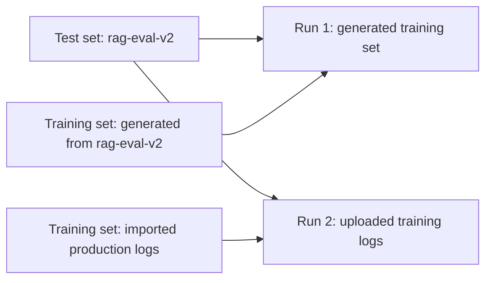

The **Datasets** page (sidebar → **Datasets**) is where you manage every dataset in your org. Datasets are **org-scoped** — once added, they're available across every project for any training run.

<Frame caption="Datasets page with the Test sets and Training sets tabs"></Frame>

## Test sets vs. training sets

Luna Studio splits datasets into two flavors, accessible via tabs on the page:

<CardGroup cols={2}>
  <Card title="Test sets" icon="database" href="/luna-studio/datasets/test-sets">
    Small, hand-labelled datasets used to evaluate fine-tuned metrics. Required for every run.
  </Card>
  <Card title="Training sets" icon="dumbbell" href="/luna-studio/datasets/training-sets">
    Larger datasets used to fine-tune the base model. Often generated from a test set.
  </Card>
</CardGroup>

The active tab determines what shows in the table and which **Add** button is shown.

## Datasets table

Both tabs use the same column layout:

| Column          | What it shows                                                                         |
| --------------- | ------------------------------------------------------------------------------------- |
| Dataset name    | The dataset's name.                                                                   |
| Rows            | Row count, with thousands separators.                                                 |
| Source          | One of **Galileo** (Galileo glyph), **Upload** (upload icon), or **URL** (link icon). |
| Used in metric  | Outline-style badges for each metric that uses this dataset. Empty if unused.         |
| Created at      | When the dataset was added.                                                           |
| Last updated at | When the dataset was most recently changed.                                           |

Click any row to view the dataset.

## Top-bar actions

- **Search** &mdash; filter by dataset name.
- **Add test set / Add training set** &mdash; primary button. The label tracks the active tab. Opens the **Add dataset** modal — see [Add a dataset](/luna-studio/datasets/add-a-dataset).

## How datasets relate to runs

Each [training run](/luna-studio/runs/lifecycle) consumes exactly one test set and one training set. The same dataset can be reused across many runs.

The **Used in metric** column on the datasets table shows you which metrics' fine-tuning depends on a dataset — useful before deleting one.

## Source types

| Source  | What it means                                                               |
| ------- | --------------------------------------------------------------------------- |
| Upload  | You uploaded a `.csv` or `.jsonl` file from your machine.                   |
| URL     | Luna fetched the dataset from an http/https/s3/gs URL.                      |
| Galileo | Luna pulled the dataset from a project in your connected Galileo workspace. |

For training sets specifically, an additional source applies:

- **Generated** &mdash; produced by the [Generate from test set](/luna-studio/runs/new-run/step-3-training-set#generate-from-test-set) flow inside the run creation flow.

## Where to go next

<CardGroup cols={2}>
  <Card title="Test sets" icon="database" href="/luna-studio/datasets/test-sets">
    What test sets are, schema rules, and best practices.
  </Card>
  <Card title="Training sets" icon="dumbbell" href="/luna-studio/datasets/training-sets">
    What training sets are and how to create or reuse them.
  </Card>
  <Card title="Add a dataset" icon="upload" href="/luna-studio/datasets/add-a-dataset">
    Reference for the three dataset sources (Upload, URL, Galileo).
  </Card>
  <Card title="Dataset validation" icon="circle-check" href="/luna-studio/datasets/validation">
    What Luna checks when you add a dataset.
  </Card>
</CardGroup>
