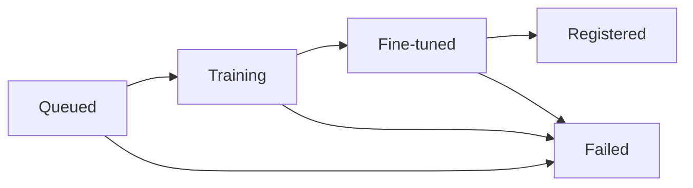

The same five statuses appear on training runs and metrics throughout Luna Studio. They're rendered as **status pills** — colored chips with an icon and label — so you can scan a long list at a glance.

## The five statuses

| Status     | Pill visual                     | Meaning                                                                           |
| ---------- | ------------------------------- | --------------------------------------------------------------------------------- |
| Queued     | Hollow dot, neutral colour.     | Accepted; not yet started.                                                        |
| Training   | Spinner.                        | Fine-tuning is in progress.                                                       |
| Fine-tuned | Filled dot, blue / positive.    | Training succeeded. Ready to register.                                            |
| Registered | Filled check, success colour.   | Published to the Galileo metrics store.                                           |
| Failed     | Filled alert icon, destructive. | Training, validation, or registration failed. See the run details for the reason. |

## Where pills appear

Status pills are used in three places:

- **Runs table** &mdash; on every row, in the **Status** column.
- **Run details header** &mdash; next to the run name.
- **Metrics table** &mdash; on every row, in the **Status** column.

The visual treatment is identical in all three.

## Transitions

A few transitions are worth calling out:

- **Queued → Failed** is rare but happens if the run can't be allocated (e.g. integration removed mid-flow).
- **Training → Failed** is the most common failure mode (out-of-memory, provider error). See [Run failed](/luna-studio/reference/troubleshooting#run-failed).
- **Fine-tuned → Failed** can happen if registration to Galileo fails (e.g. duplicate name). The run remains Fine-tuned; the registration attempt is what surfaces the error in the [Register metric modal](/luna-studio/runs/register-metric).

There is no transition out of **Registered** — once published, a metric stays Registered in Luna Studio. To remove a metric from the Galileo platform, do it from the [Galileo metrics store](/concepts/metrics/overview); the Luna Studio record stays as a published-history entry.

## Filtering by status

The [Training runs](/luna-studio/projects/training-runs-home#filter-toolbar) page has a multi-select **Status** filter. Combine it with the **Starred** filter for fast triage:

- Triaging failures? Filter to **Failed** only.
- Checking ready-to-register runs? Filter to **Fine-tuned** only.
- Auditing what's live? Filter to **Registered**.

## Accessibility

Status pills are colour + icon + text, never colour-only. Screen readers announce the status text. The Training spinner is wrapped in an `aria-live="polite"` region so screen readers don't repeatedly announce the spinning state.

## Where to go next

<CardGroup cols={2}>
  <Card title="Run lifecycle" icon="arrows-rotate" href="/luna-studio/runs/lifecycle">
    Status meanings in the context of a single run.
  </Card>
  <Card title="Run details" icon="circle-info" href="/luna-studio/runs/run-details">
    Status-aware main content for each state.
  </Card>
  <Card title="Troubleshooting" icon="bug" href="/luna-studio/reference/troubleshooting">
    What to do for **Failed** runs.
  </Card>
</CardGroup>
