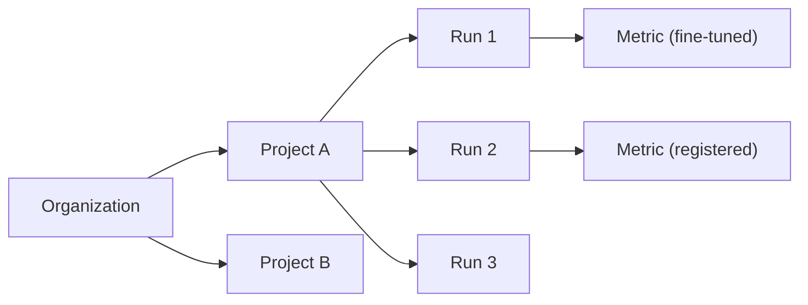

A **project** is the top-level container in Luna Studio. It groups training runs that share a goal — typically improving a single GenAI application or use case within a given domain.

The **Projects** page is the home of the app at `/{org}` (and the Luna Studio logo always returns you here).

<Frame caption="Projects page listing every project in your organization"></Frame>

## Projects table

The projects table shows every project in your org, with these columns:

| Column       | What it shows                                                                     |
| ------------ | --------------------------------------------------------------------------------- |
| Project name | The name you gave the project.                                                    |
| Metrics      | Outline-style chips listing the metrics produced by this project's training runs. |
| Created at   | When the project was first created.                                               |
| Last run     | When the most recent run was launched.                                            |
| Actions      | A `…` menu with **Delete project**.                                               |

Click any row to open the project's [Training runs](/luna-studio/projects/training-runs-home) page.

## Top-bar actions

- **Search** &mdash; the input on the right of the page header filters projects by name.
- **New project** &mdash; primary button on the right. Opens the create project modal — see [Create a project](/luna-studio/projects/create-a-project).

## Delete a project

Open the `…` action menu on a project row and click **Delete project**. The action is destructive — Luna Studio will prompt you to confirm before deleting.

<Warning>Deleting a project removes all of its training runs from Luna Studio. **Registered metrics** are not affected — they remain in the [Galileo metrics store](/concepts/metrics/overview) until you delete them there.</Warning>

## How projects relate to other concepts

- Integrations and datasets are **org-scoped** — they're shared across every project.
- Runs and metrics are **project-scoped** — they live inside one project.

## Where to go next

<CardGroup cols={2}>
  <Card title="Create a project" icon="folder-plus" href="/luna-studio/projects/create-a-project">
    Walk through the create project modal.
  </Card>
  <Card title="Training runs home" icon="list" href="/luna-studio/projects/training-runs-home">
    The main project workspace: stats, filters, and the runs table.
  </Card>
</CardGroup>
