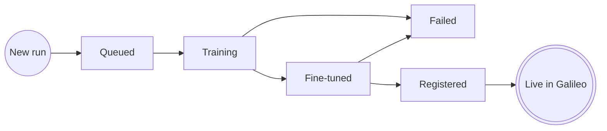

Every training run in Luna Studio progresses through a small state machine. The same statuses are reused on the [Metrics](/luna-studio/metrics/overview) page, since each run produces exactly one metric.

## The state machine

## Statuses

### Queued

The run was accepted but training hasn't started yet. Most runs sit in **Queued** for less than a minute while Luna Studio allocates resources.

**What you see in the UI:** the [Run details](/luna-studio/runs/run-details) page shows "Run is queued and will start training shortly."

### Training

The base model is fine-tuning on your training set. Training time depends on the base model:

- **Luna Small** &mdash; fastest, typically minutes.
- **Luna Medium** &mdash; balanced.
- **Luna Large** &mdash; slowest, can take longer for large training sets.

**What you see in the UI:** the run details page shows "Training in progress. Metrics will appear here once it completes." The status pill shows a spinner.

<Note>
  You can leave the page during training — the run continues server-side. When you come back, the
  page reflects the current state.
</Note>

### Fine-tuned

Training succeeded. Luna Studio has evaluated the resulting metric against the test set and shows you the scores.

**What you see in the UI:** the run details main area shows a metrics grid (F1, AUC-ROC, etc.) versus a baseline. A **Register metric** button appears in the page footer.

### Registered

You've published the metric to the Galileo metrics store. It's now usable across the Galileo platform for evaluation, observability, and guardrails.

**What you see in the UI:** the status pill flips to **Registered**. The **Register metric** footer disappears (the action is no longer relevant). The run row in the project table no longer shows the **Register metric** action link.

### Failed

Something went wrong during training or validation.

**What you see in the UI:** the run details page shows a destructive alert titled "Run failed" with the failure reason. Common reasons:

- **Out of memory** &mdash; the base model couldn't fit the training set. Try Luna Small, or shrink the training set.
- **Validation error** &mdash; the dataset failed schema validation after the run was launched.
- **Provider error** &mdash; an external LLM API returned an error during generation.

If the failure is transient, you can launch a new run with the same configuration. The existing run stays in **Failed** for audit.

## How statuses appear in the UI

The status pill renders consistently everywhere it appears (runs table, run details header, metrics table):

| Status     | Visual                          |
| ---------- | ------------------------------- |
| Queued     | Hollow dot, neutral colour.     |
| Training   | Spinner.                        |
| Fine-tuned | Filled dot, blue/positive.      |
| Registered | Filled check, success colour.   |
| Failed     | Filled alert icon, destructive. |

See [Lifecycle and statuses](/luna-studio/metrics/lifecycle-and-statuses) for visual examples and accessibility notes.

## Filtering by status

The [Training runs](/luna-studio/projects/training-runs-home) page has a multi-select **Status** filter. Use it to see, e.g., only **Failed** runs you need to debug, or only **Fine-tuned** runs ready for registration.

## Where to go next

<CardGroup cols={2}>
  <Card title="Run details" icon="circle-info" href="/luna-studio/runs/run-details">
    What you see for each status, in detail.
  </Card>
  <Card title="Register a metric" icon="circle-check" href="/luna-studio/runs/register-metric">
    The Fine-tuned → Registered transition.
  </Card>
</CardGroup>
