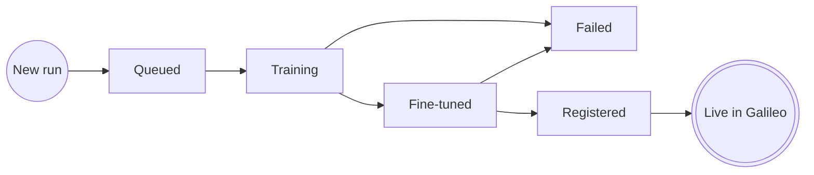

Every training run in Luna Studio progresses through a small state machine. The same statuses are reused on the [Metrics](/luna-studio/metrics/overview) page, since each run produces exactly one metric.

## The state machine

## Statuses

### Queued

The run was accepted but training hasn't started yet. The time a run spends in Queued state depends on the max number of GPUs allocated to Luna Studio by your organization and current number of trainings running.
For example if max GPUs is 2, and 2 trainings are running already, your run will remain in queued till 1 existing run finishes training.

### Training

The base model is fine-tuning on your training set. Typical training times vary between 2-5 hours.

<Note>You can leave the page during training — the run continues server-side. When you come back, the page reflects the current state.</Note>

### Fine-tuned

Training succeeded. Luna Studio has evaluated the resulting metric against the test set and shows you the scores.

**What you see in the UI:** the run details main area shows a metrics grid (F1, AUC-ROC, etc.) versus a baseline. A **Register metric** button appears in the page footer.

### Registered

You've published the metric to the Galileo metrics store. It's now usable across the Galileo platform for evaluation, observability, and guardrails.

### Failed

Something went wrong during training or validation.

**What you see in the UI:** the run details page shows a destructive alert titled "Run failed" with the failure reason. Common reasons:

- **Out of memory** &mdash; the base model couldn't fit the training set. Try Luna Small, or shrink the training set.
- **Validation error** &mdash; the dataset failed schema validation after the run was launched.
- **Provider error** &mdash; an external LLM API returned an error during generation.

If the failure is transient, you can launch a new run with the same configuration. The existing run stays in **Failed** for audit.
