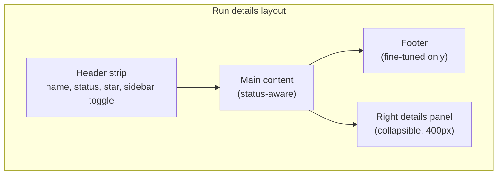

The run details page is the per-run workspace. It changes shape based on the run's status — pending runs show progress, fine-tuned runs show metric scores, and failed runs show a destructive alert.

To get here, click any row on the [Training runs](/luna-studio/projects/training-runs-home) page.

<Frame caption="Run details for a fine-tuned run, with metric scores and ROC and PR curves">
  
</Frame>

## Page layout

The page uses three regions:

### Header strip

The header always shows:

- **Run name** &mdash; the `<h1>`. Click the pencil icon next to it (in the breadcrumb) to rename via the **Edit run name** modal.
- **Status pill** &mdash; the current [lifecycle status](/luna-studio/runs/lifecycle).
- **Star toggle** &mdash; click to mark the run as starred (same as the table's star column).
- **Sidebar toggle** &mdash; collapses or expands the right details panel.

### Right details panel

The collapsible 400px right panel shows the run's metadata:

| Row             | What it shows                                                                                     |
| --------------- | ------------------------------------------------------------------------------------------------- |
| Created at      | Run creation timestamp.                                                                           |
| Last updated at | Most recent status change.                                                                        |
| Metric          | The metric template or custom prompt name, plus output type and step (e.g. "Boolean · LLM span"). |
| Test set        | Linked test set with row count and source (e.g. "320 rows · 3 columns · Uploaded").               |
| Training set    | Linked training set with row count and source (e.g. "2,500 rows · Generated from rag-eval-v2").   |
| Base model      | The picked Luna model (Luna Small, Luna Medium, or Luna Large).                                   |

Each linked entity is an **interactive chip** — clicking it navigates to that dataset's [Dataset details](/luna-studio/datasets/dataset-details) page.

## Main content by status

The center content changes based on the run's [lifecycle status](/luna-studio/runs/lifecycle).

### Queued

The run was accepted but training hasn't started. The page shows:

> Run is queued and will start training shortly.

A small spinner indicates progress.

### Training

Fine-tuning is in progress. The page shows:

> Training in progress. Metrics will appear here once it completes.

A spinner is announced via an aria-live region for screen readers.

### Fine-tuned and Registered

Training completed successfully. The page shows a **metrics grid** — one card per metric Luna evaluated. Each card includes:

- **Metric label** &mdash; e.g. "F1 score", "AUC-ROC", "Accuracy".
- **Current value** &mdash; the score the fine-tuned metric achieved on the test set, in large type.
- **Baseline** &mdash; the score before fine-tuning, in muted text (when available).
- **Delta pill** &mdash; `+0.30` (positive), `-0.15` (negative), or `±0.00` (neutral) coloured accordingly.

Example:

| Metric   | Current | Baseline | Delta |
| -------- | ------- | -------- | ----- |
| F1 score | 0.92    | 0.62     | +0.30 |
| AUC-ROC  | 0.89    | 0.69     | +0.20 |

<Note>
  ROC and PR curves are intentionally not yet shown on the run details page. They'll be added in a
  future release — for now, the metrics grid is the primary diagnostic.
</Note>

### Failed

The page shows a destructive alert titled **Run failed** with a failure reason, e.g.:

> Training failed after 2 epochs: out-of-memory on base model. Try reducing the training-set size or contact support.

See [Troubleshooting](/luna-studio/reference/troubleshooting#run-failed) for common failures and fixes.

## Footer

The footer renders **only** for **Fine-tuned** runs. It contains a single primary button:

- **Register metric** &mdash; opens the [Register metric](/luna-studio/runs/register-metric) modal.

For all other statuses (Queued, Training, Failed, Registered), the footer is hidden.

## Renaming a run

Click the pencil icon next to the run name in the breadcrumb. The **Edit run name** modal opens with the current name pre-filled. Save to apply.

## Star a run

Click the star icon in the header strip. The icon turns amber when the run is starred. Use the **Starred** filter on the [Training runs](/luna-studio/projects/training-runs-home) page to find it again.

## Where to go next

<CardGroup cols={2}>
  <Card title="Register a metric" icon="circle-check" href="/luna-studio/runs/register-metric">
    Publish a Fine-tuned run to the Galileo metrics store.
  </Card>
  <Card title="Run lifecycle" icon="arrows-rotate" href="/luna-studio/runs/lifecycle">
    The five statuses runs flow through.
  </Card>
  <Card title="Troubleshooting" icon="bug" href="/luna-studio/reference/troubleshooting">
    Why a run might fail and how to recover.
  </Card>
  <Card title="Datasets" icon="database" href="/luna-studio/datasets/overview">
    Inspect the test or training set used by this run.
  </Card>
</CardGroup>
