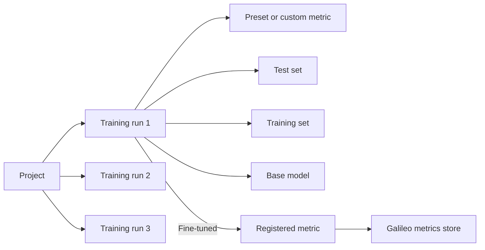

This page is the conceptual backbone of Luna Studio. If you're new to the product, skim it once before working through the [Quickstart](/luna-studio/ui/quickstart). The vocabulary here is reused across every other page.

## The mental model

A **project** holds a series of **training runs** that explore variations of a preset or custom **metric**. Each run combines a **test set**, a **training set**, and a **base model** to produce a fine-tuned metric. When a run is **Fine-tuned** and the metric is eligible for registration, you can **register** it in the Galileo metrics store.

## Projects

A **project** is the top-level container. It groups training runs that share a goal — typically tuning multiple metrics for a single application or domain. This also closely maps to the concept of a project in Galileo.

Examples of well-scoped projects:

- `customer-support-copilot` — improve an assistant that helps support teams draft accurate, on-brand responses.
- `enterprise-search-assistant` — improve a RAG-style assistant that answers employee questions from internal knowledge sources.
- `sales-engineering-assistant` — improve an assistant that helps teams respond to requests for proposals, questionnaires, and technical buyer questions.

You can create as many projects as you want. Projects show on the **Projects** page.

See [Projects overview](/luna-studio/ui/projects/overview).

## Training runs

A **training run** is a single attempt at fine-tuning a metric. Each run captures four inputs:

| Input        | What it is                                                                                              |
| ------------ | ------------------------------------------------------------------------------------------------------- |
| Metric       | A predefined metric template (e.g. Toxicity) or a custom prompt you wrote.                              |
| Test set     | A small labelled dataset used for **data generation (20%) and evaluation (80%)** at the end of the run. |
| Training set | A larger labelled dataset used to fine-tune the base model. Often generated from the test set.          |
| Base model   | The Luna model configured for your organization, shown in the run summary before launch.                |

Runs expose the following lifecycle statuses: **Queued**, **Generating data**, **Data ready**, **Training**, **Fine-tuned**, **Registered**, **Failed**, and **Cancelled**. The data-generation statuses apply when Luna Studio generates synthetic training data or labels uploaded training logs. See [Run lifecycle](/luna-studio/ui/runs/lifecycle) for the full state machine.

## Metrics

A **metric** is a function that takes some part of an LLM trace and returns a score.

### Output types

Luna Studio currently supports two **output types**:

- **Boolean** — a binary outcome (e.g. "is this toxic?"). Encode Boolean dataset labels as integer `0` and `1`.
- **Categorical** — one of a fixed set of labels.

Other output types, such as floating-point, percentage, multilabel, and numeric metrics, can appear in Galileo but are not trainable in Luna Studio yet.

### Input levels and metric shapes

Each metric has two related settings:

- **Input level** &mdash; where the metric evaluates data, such as an LLM span or a trace.
- **Metric shape** &mdash; the columns each training row contains, such as input only, output only, an input/output pair, RAG context, or tool data.

For custom metrics, Luna Studio currently supports these combinations:

| Input level | Trainable metric shapes                                                |
| ----------- | ---------------------------------------------------------------------- |
| LLM span    | Input only, Output only, Input/output pair, RAG, With tools            |
| Trace       | Input only, Output only, Input/output pair                              |

Full-trace and full-session fine-tuning are not available in the Luna Studio UI. The standalone SDK has advanced label-only workflows for these formats; see [Full traces](/luna-studio/sdk/tutorials/full-traces) and [Full sessions](/luna-studio/sdk/tutorials/full-sessions).

**Multimodal support** - Today, Luna Studio metrics operate over the **Text** modality only.

A metric reflects the lifecycle of the run that produced it. Fine-tuned metrics that are eligible for registration can move to Registered.

See [Metrics overview](/luna-studio/ui/metrics/overview).

## Datasets

Luna Studio splits datasets into two flavors:

### Test sets

A **test set** is a small, hand-labelled dataset used to evaluate a fine-tuned metric. Test sets are the "ground truth" for the run and should be labelled carefully. Luna Studio keeps the 80% evaluation portion out of training; the remaining 20% can supply enhancement examples for generated training data.

Required columns depend on the metric's input type. See [Prerequisites](/luna-studio/ui/prerequisites) for the full list.

### Training sets

A **training set** is the dataset used to fine-tune the Luna metric. Training sets can be:

- **Generated from a test set** — Luna Studio uses part of the test set as enhancement data, samples 50 rows for review, and targets 2,000 synthetic labelled examples with the LLM-as-judge prompt and data-generation pipeline. Enhancement rows can also be included in the final training split, so 2,000 is not an exact final row count.
- **Uploaded** — your own labelled production logs as CSV. If logs are unlabelled, choose **Label with metric prompt** to run the labelling flow before training.
- **Imported from Galileo** — pulled from a project in your connected Galileo workspace.

See [Datasets overview](/luna-studio/ui/datasets/overview).

## Base models

Luna Studio fine-tunes the Luna base model selected for your run. The available model list is configured by your Luna Studio deployment, so your workspace may show different options.

Confirm the base model in **Step 4 — Config and launch** of the run creation flow.

For accuracy benchmarks, GPU latency tables, and the underlying SLM architecture behind these base models, see the [Luna-2 overview](/concepts/luna/luna).

## Integrations

Some Luna Studio workflows need provider credentials for the external services they call:

- **For metric generation** (Step 3 — Training set): the credentials for whichever configured provider and model you select in the Generate drawer.
- **For Galileo features** (Import from Galileo, Register metric): a Galileo API URL and key available to the Luna Studio runtime.

LLM provider integrations can be a personal override or a workspace default. At runtime, Luna Studio uses your personal credential for a provider when present and otherwise falls back to that provider's workspace credential. In the current release, Galileo import and registration read deployment settings rather than the personal or workspace Galileo integration saved in the app. See [Integrations overview](/luna-studio/ui/integrations/overview).

Luna Studio can also be deployed against different training platforms, including Vertex AI Pipelines, AzureML Pipelines, SageMaker Pipelines, and Kubernetes. Those deployment-level integrations are fixed when the application is deployed, rather than configured by end users at runtime. For the full picture, see [Availability and deployment](/luna-studio/ui/availability).

## Lifecycle statuses

Run-related screens use the following status vocabulary:

- **Queued** — waiting for data generation or training to start.
- **Generating data** — Luna Studio is creating or labelling a training dataset.
- **Data ready** — generated data is ready and the run is waiting to be launched for training.
- **Training** — fine-tuning is in progress.
- **Fine-tuned** — training succeeded; not yet registered.
- **Registered** — the metric is live in the Galileo metrics store.
- **Failed** — data generation, training, or evaluation failed; see the run details for the reason.
- **Cancelled** — a user stopped the run before it reached a terminal success state.

See [Run lifecycle](/luna-studio/ui/runs/lifecycle) for the full state machine and what each status means.

## Where to go next

<CardGroup cols={2}>
  <Card title="Quickstart" icon="rocket" href="/luna-studio/ui/quickstart">
    A 15-minute, end-to-end tour of the product.
  </Card>
  <Card title="New run deep dive" icon="wand-magic-sparkles" href="/luna-studio/ui/runs/new-run/overview">
    Step-by-step reference for the four-step run creation flow.
  </Card>
  <Card title="FAQ" icon="circle-question" href="/luna-studio/ui/reference/faq">
    Common questions about choosing test sets, picking models, and more.
  </Card>
</CardGroup>
