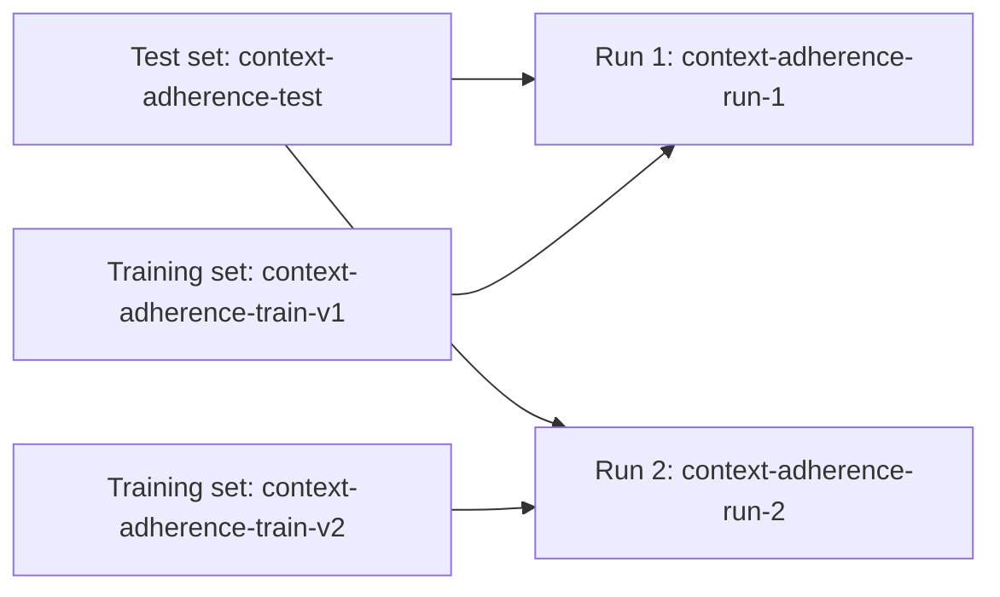

The **Datasets** page (sidebar → **Datasets**) is where you manage every dataset in your workspace. Datasets are workspace-wide — once added, they are available across every project for any training run.

<Frame caption="Datasets page with the Test sets and Training sets tabs"></Frame>

## Test sets vs. training sets

Luna Studio splits datasets into two flavors, accessible via tabs on the page:

<CardGroup cols={2}>
  <Card title="Test sets" icon="database" href="/luna-studio/ui/datasets/test-sets">
    Small, human-labelled datasets used to evaluate fine-tuned metrics. Required for every run.
  </Card>
  <Card title="Training sets" icon="dumbbell" href="/luna-studio/ui/datasets/training-sets">
    Larger datasets used to fine-tune the base model. Often generated from a test set.
  </Card>
</CardGroup>

## How datasets relate to runs

Each [training run](/luna-studio/ui/runs/lifecycle) consumes exactly one test set and one training set. The same dataset can be reused across many runs.

The **Used in metric** column on the datasets table shows you which metrics' fine-tuning depends on a dataset — useful before deleting one.

## Source types

| Source  | What it means                                                                       |
| ------- | ----------------------------------------------------------------------------------- |
| Upload  | You uploaded a `.csv` or `.jsonl` file from your machine.                           |
| URL     | Luna Studio fetched the dataset from a public or pre-signed HTTP(S) URL.              |
| Galileo | Luna Studio pulled the dataset from a project in your connected Galileo workspace. |

<Note>The source picker accepts JSONL during ingestion, but the current run-validation and data-generation paths read CSV. Convert JSONL to CSV before using the dataset in a run.</Note>

For training sets specifically, an additional source applies:

- **Generated** &mdash; produced by the [Generate from test set](/luna-studio/ui/runs/new-run/step-3-training-set#generate-from-test-set) flow inside the run creation flow.

## Where to go next

<CardGroup cols={2}>
  <Card title="Test sets" icon="database" href="/luna-studio/ui/datasets/test-sets">
    What test sets are, schema rules, and best practices.
  </Card>
  <Card title="Training sets" icon="dumbbell" href="/luna-studio/ui/datasets/training-sets">
    What training sets are and how to create or reuse them.
  </Card>
  <Card title="Add a dataset" icon="upload" href="/luna-studio/ui/datasets/add-a-dataset">
    Reference for the three dataset sources (Upload, URL, Galileo).
  </Card>
  <Card title="Dataset validation" icon="circle-check" href="/luna-studio/ui/datasets/validation">
    What Luna Studio checks when a dataset is used in a run.
  </Card>
</CardGroup>
