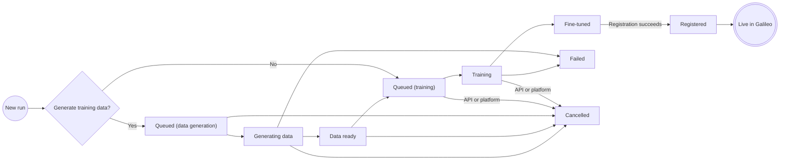

Every training run in Luna Studio progresses through a small state machine. The exact path depends on whether you generate a training set or select an existing one.

## The state machine

## Statuses

### Queued

The run is waiting for its next server-side stage. Luna Studio uses the same Queued label while a data-generation task is waiting to start and while fine-tuning is waiting for training capacity.

Training queue time depends on the GPU capacity and concurrency configured for your deployment. For example, if two GPUs are allocated and both are busy, another run remains Queued until capacity is available.

### Generating data

Luna Studio is generating a sample or final training dataset, or labelling uploaded training logs. You can leave the page while the server-side task continues.

### Data ready

The generated training dataset is ready. Review the result and continue through the run wizard to launch fine-tuning.

### Training

The base model is fine-tuning on your training set. Typical training times vary between 2-5 hours.

<Note>You can leave the page during training — the run continues server-side. When you come back, the page reflects the current state.</Note>

### Fine-tuned

Training succeeded. Luna Studio has evaluated the resulting metric against the test set and shows you the scores.

**What you see in the UI:** the run details main area shows a metrics grid (F1, AUC-ROC, etc.) versus a baseline. A **Register metric** button appears in the page footer; registration preflight can disable it and show a blocker.

### Registered

You've published the metric to the Galileo metrics store. It's now usable across the Galileo platform for evaluation, observability, and guardrails.

### Failed

Something went wrong during data generation, training, or evaluation. A registration error leaves the run Fine-tuned; correct a reversible issue and try again, or keep the artifact in Luna Studio when its metric contract is not registrable.

**What you see in the UI:** the run details page shows a destructive alert titled "Run failed" with the failure reason. Common reasons:

- **Out of memory** &mdash; the base model couldn't fit the training set. Try Luna Small, or shrink the training set.
- **Validation error** &mdash; the dataset failed schema validation after the run was launched.
- **Provider error** &mdash; an external LLM API returned an error during generation.

If the failure is transient, you can launch a new run with the same configuration. The existing run stays in **Failed** for audit.

### Cancelled

A cancellation was recorded before the run completed. Luna Studio stops owned background tasks and makes a best-effort attempt to stop in-flight platform compute. Artifacts already produced are retained.

In the current UI, you can cancel a draft while working in the run wizard, including while training data is queued or being generated. The run details header and Training runs table do not currently provide a cancellation action once fine-tuning has been launched, even though an API or platform cancellation can still cause a queued or training run to appear as Cancelled.

Cancellation is terminal; launch a new run if you want to try the configuration again.
