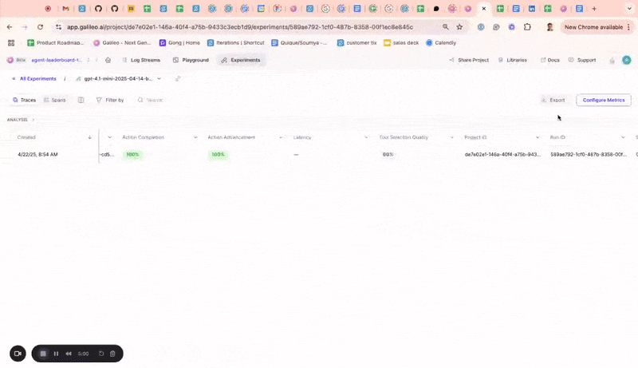
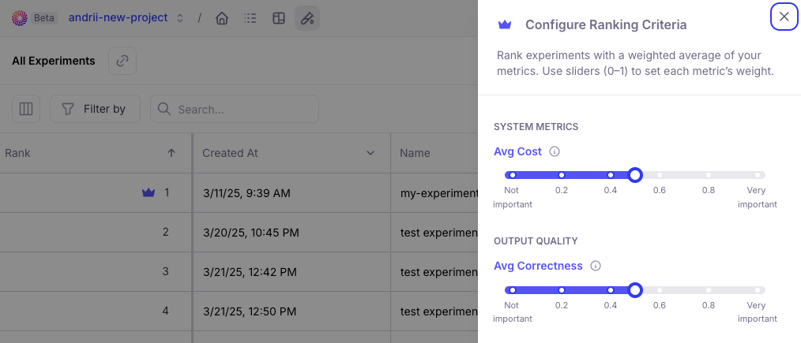
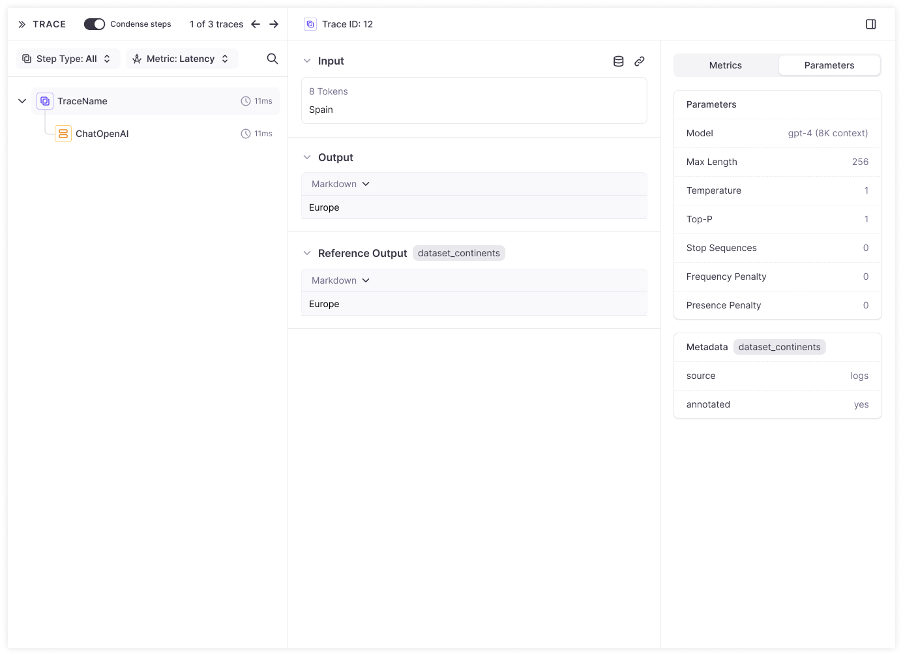
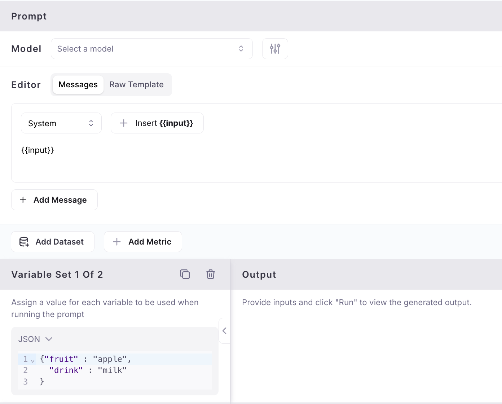
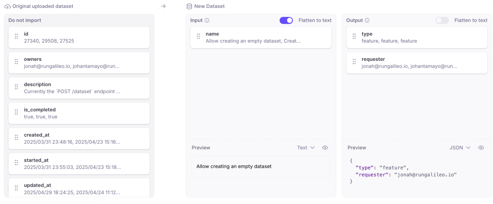

This page provides information about the latest updates and enhancements to Galileo.

## May 13th, 2025

### Key New Features

1. **Sessions**

    The free version of Galileo now has support for Sessions. Sessions provide users a coherent view of multi-turn interactions. The traces from each turn of the conversation can be viewed under the session.

    To create a session, developers can use the Galileo Logger, use the `start_session` method in Python and the `startSession` method in TypeScript.
    Here is a multi-turn conversation about state capitals of the US:

    

1. **Adapting LLM metrics with CLHF**

    The free Galileo offering now supports **Continuous Learning for Human Feedback** (CLHF) which helps users easily adapt LLM metrics for their app by providing human feedback.  As you start using Galileo Preset LLM-powered metrics (e.g. Context Adherence or Instruction Adherence), or start creating your own LLM-powered metrics, you might not always agree with the results. This capability helps you solve this problem.

    As you identify mistakes in your metrics, you can provide ‘feedback’ to ‘auto-improve’ your metrics. Your feedback gets translated (by LLMs) into few-shot examples that are appended to the Metric’s prompt.

    This process has shown to increase accuracy of metrics by 20-30%.

    <iframe
    width="560"
    height="315"
    src="https://www.youtube.com/embed/Rl8YLFCyoiw"
    title="YouTube video player"
    frameborder="0"
    allow="accelerometer; autoplay; clipboard-write; encrypted-media; gyroscope; picture-in-picture"
    allowfullscreen
    ></iframe>

1. **Playground improvements**

    The playground now has an updated layout and shows a preview of the input prompt that will be run when using variable slots in your prompt template which are filled in by manually entering variables or getting them from a dataset.

## May 2nd, 2025

### Key New Features

1. **Metrics on experiments UI:** You can now compute additional metrics for logged experiments directly within the experiments UI. Until now, users didn’t have a way to compute more metrics for logged experiments from the UI or SDK.

2. **Public APIs:** Released [public APIs](https://v2docs.galileo.ai/api-reference/) to allow developers to manage logstreams, experiments, and trace data programmatically. While these can already be managed through the TypeScript and Python SDK, public APIs allow users to programmatically interact with these components in any language. Sample use cases include logging data from a production AI app, running experiments, and retrieving evaluation result

3. **Aggregate metrics and ranking criteria for Experiments:** Added to All Experiments page. Aggregate metrics compile the metric values from individual traces in an experiment to show a combined value for each metric on the all experiments page. This enables you to quickly assess the performance of the underlying traces in an experiment. Ranking criteria allow you to determine which experiments were most successful by specifying a weighted average of the underlying metrics for each experiment.

4. **Reference output and metadata availability:** The reference output and metadata from the datasets are now available in the corresponding experiment traces so it can easily referenced.

### Datasets and Playground

5. **Enhanced playground inputs:** to show complete dataset input rather than only variables so you can more flexibly define variable inputs.

6. **Flatten to text in dataset upload:** When uploading datasets from a CSV or JSON file, the contents of a column are automatically flattened to text instead of being stored as JSON when there’s only one file column mapped to an input, output or dataset column.

7. **New Model in Playground and Metrics:** Added Support for new GPT 4.1 model in playground and metrics.

### SDK

8. **G2.0 Typescript SDK improvements:** Supporting Export types at the top-level (galileo/types), added a method to access the singleton logger.

### General Usability

9. **Performance optimization:** Resolved performance issues causing occasional UI slowdowns, ensuring smoother and faster navigation.

10. **Extended session durations:** to reduce repetitive Google sign-ins, improving user convenience.

11. **Support chat icon control:** You now have the option to show or hide the support chat icon, customizing your interface according to your preferences. Previously, the support chat icon would overlap and cover key user interface elements. This change makes it easier to access the full user interface without the chat icon getting in the way.
