{/* <!-- markdownlint-disable MD024 MD037 --> Repeated headings */}


<Update label="2026-03-20" description="Autotune, Editable trends view, Metric roll-up features, Dataset and Experiments UI improvements">

## Key new features and improvements

### Autotune

Galileo now supports Autotune, an enhancement to Continuous Learning via Human Feedback (CLHF) that improves LLM-as-a-judge metric performance through expert feedback. Annotators and subject matter experts can:

<iframe
  className="w-full aspect-video rounded-xl"
  src="https://www.youtube.com/embed/fwlhZ6-W-I4"
  title="Autotune: Improve LLM-as-a-Judge Metrics with Expert Feedback"
  frameBorder="0"
  allow="accelerometer; autoplay; clipboard-write; encrypted-media; gyroscope; picture-in-picture"
  allowFullScreen
></iframe>

- correct metric outputs, define expected values, and add natural language explanations
- test prompt changes before publishing and recompute historical results
- apply improvements to future runs across out-of-the-box and custom LLM metrics

Autotune aggregates that feedback and automatically adapts the metric prompt with full visibility into changes. To autotune a metric, hover over any LLM-based metric and click "Add feedback".

To learn more, see [Autotune](/concepts/metrics/autotune-llm-as-a-judge-metrics).

### Editable trends view

Galileo now supports a fully editable trends view, giving every team control over exactly what they monitor — all from the same logstream.

{/* TODO: Add video embed once available */}

- drag, reorder, duplicate, and delete widgets and sections in edit mode
- customize each widget's metric, aggregation, and visualization type
- customize and persist filters, group by, time range, and interval settings

To get started, go to **Logstreams → Trends** and click **Edit layout**.

### Metric roll-up features

Span and Trace level metrics are now rolled up to the Session level for any metrics computed in the logstreams. This helps you identify problematic sessions that might need more investigation without digging deeper into Trace and Span levels.

You can now customize the logic used to roll-up metric computations. For example, you can customize how Span-level metrics are shown at Trace and Session levels.

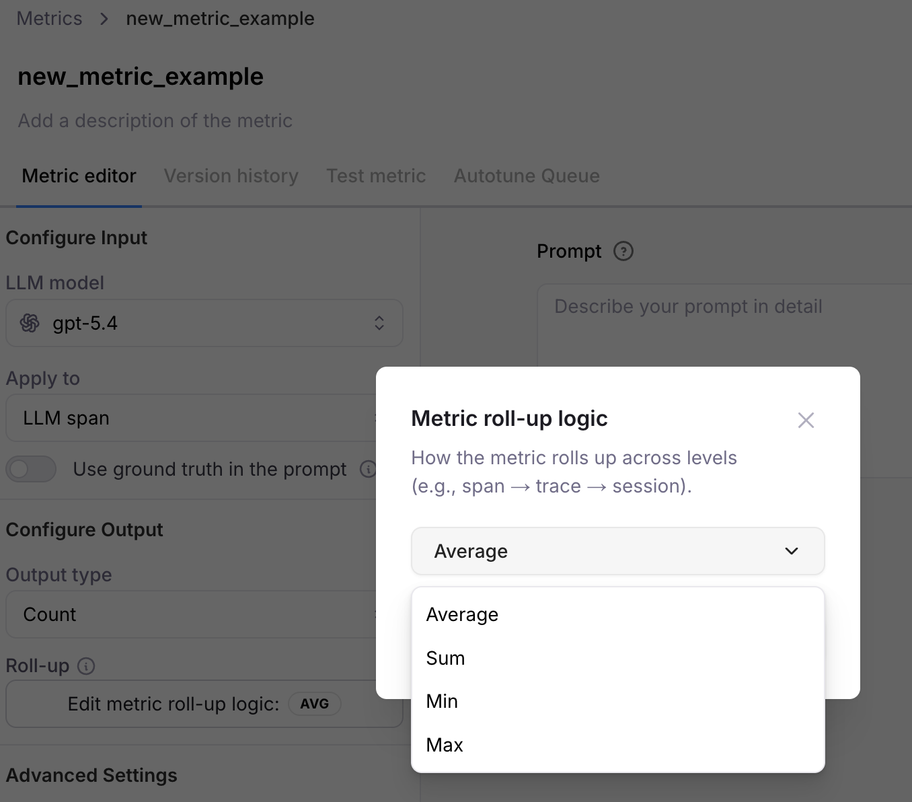

This new roll-up option appears on metrics with "Output type" of "Count" or "Percentage". A new "Roll-up logic" menu item appears on existing metrics with count and percentage output types.

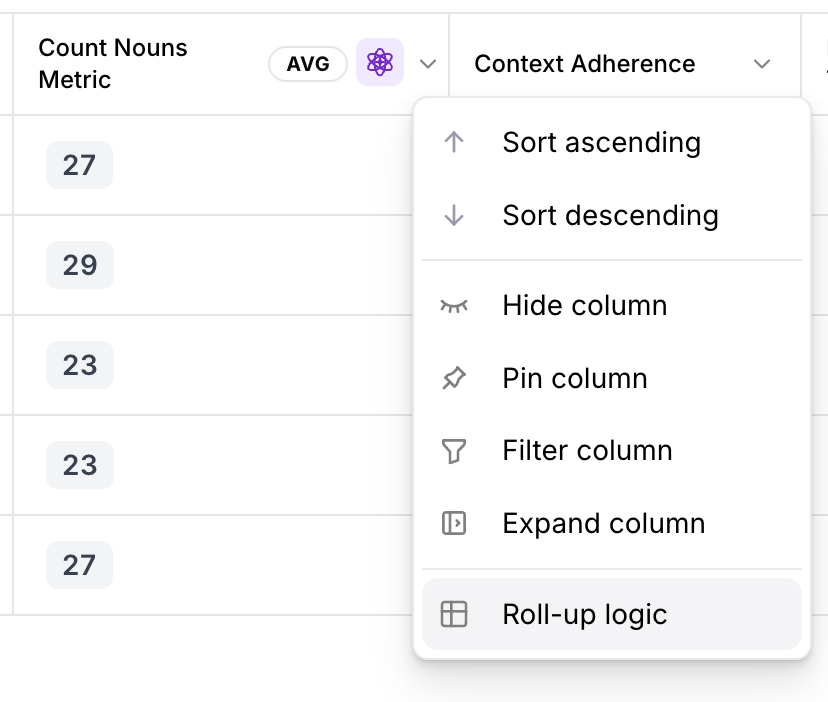

Metrics with "Output type" of "Boolean" are now shown as "true" and "false" (instead of percentage, as previously).

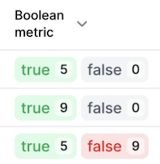

### Datasets UI improvements


Datasets in the Galileo Console UI now support 4 columns:

- Input
- Generated Output
- Ground Truth
- Metadata

The previous column "Reference Output" has been renamed to "Ground Truth".

[Learn more](https://v2docs.galileo.ai/sdk-api/experiments/datasets#dataset-fields)

### Experiments UI improvements

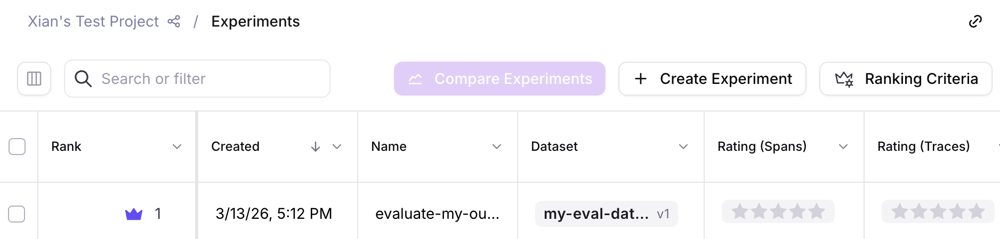

New "Create Experiment" buttons allow you to easily create experiments through the Galileo Console UI.

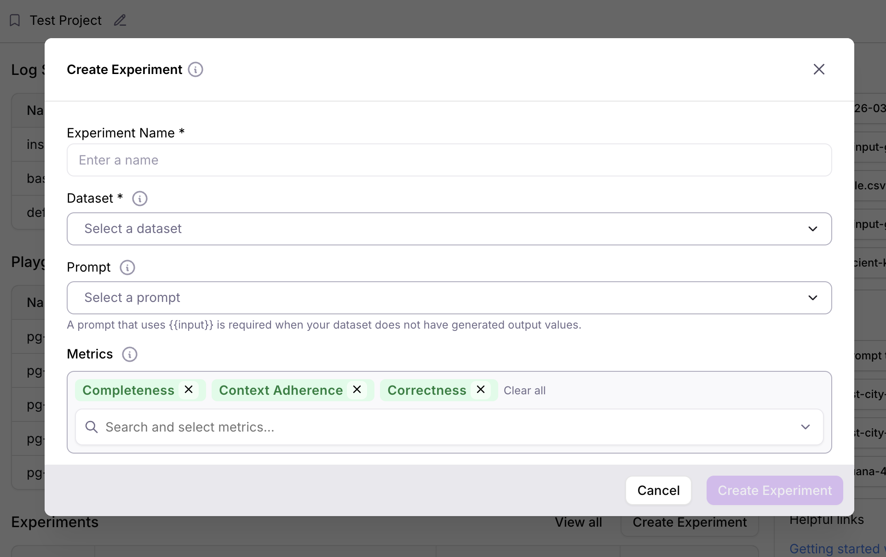

Furthermore, you can now create experiments from datasets without requiring an LLM to re-generate output data. Simply include your existing pre-generated data in the dataset column "Generated Output".

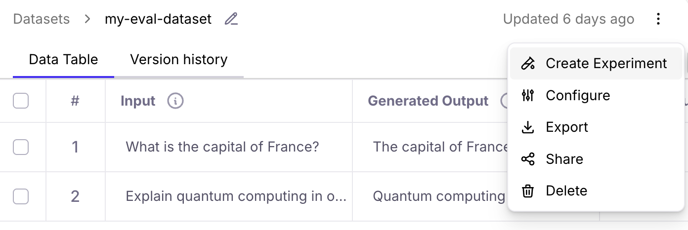

[Learn more](/getting-started/experiments)

</Update>

<Update label="2026-03-13" description="Galileo's Agent Control, OpenAI model update, Google ADK update, Python and TypeScript SDK updates">

## Key new features and improvements

### Galileo's Agent Control launched in open source

Galileo's new open-source [Agent Control](https://agentcontrol.dev/) plane lets you categorically block bad outcomes, steer agents to the right path at runtime, and update policies across your entire fleet in minutes, without code changes or app restarts.

<iframe
  className="w-full aspect-video rounded-xl"
  src="https://www.youtube.com/embed/_0F91yBrRa0"
  title="YouTube video player"
  frameBorder="0"
  allow="accelerometer; autoplay; clipboard-write; encrypted-media; gyroscope; picture-in-picture"
  allowFullScreen
></iframe>

Agent Control is backed by partners including AWS Strands Agents, CrewAI, Glean, ServiceNow, and Rubrik, and it works with the guardrail providers you already use, from Galileo’s Luna models, Cisco’s AI Defense,  AWS Bedrock, and even your own proprietary guardrails.

The [GitHub repo](https://github.com/agentcontrol/agent-control) is live, built in the open with contributions from some of the largest AI infrastructure companies in the world.

[Go to Quick Start](https://github.com/agentcontrol/agent-control#quick-start)

### OpenAI model update

The new GPT 5.4 model from OpenAI is now available in Playground, Prompt store, Synthetic Data Generation, and Metrics Hub.

### Google ADK update

Galileo's [Google ADK integration](https://v2docs.galileo.ai/sdk-api/third-party-integrations/google-adk/google-adk-native) is now listed on Google's official [ADK page](https://google.github.io/adk-docs/).

[Try the example](https://google.github.io/adk-docs/integrations/galileo/)

### Python SDK update

A new version of Galileo's [Python SDK](https://v2docs.galileo.ai/sdk-api/python/sdk-reference) is now available with major enhancements to support:

- Creating datasets with up to 4 columns: `input`, `generated_output`, `ground_truth`, and `metadata`
- Creating experiments from datasets without requiring an LLM to re-generate output data

Corresponding changes are coming soon to the Galileo console UI.

[Learn more](https://v2docs.galileo.ai/sdk-api/experiments/running-experiments#run-experiments-with-generated-output)

### TypeScript SDK update

A new version of Galileo's [TypeScript SDK](https://v2docs.galileo.ai/sdk-api/typescript/sdk-reference) is now available with major enhancements across the codebase, including:

- Session metadata support
- Experiment refactor and tags
- OpenAI handler and wrapper improvements
- `GalileoLogger` streaming and batching improvements
- Unified `GalileoConfig` and auth improvements
- Error handling and logging improvements

[Learn more](https://www.npmjs.com/package/galileo)


</Update>


<Update label="2026-02-27" description="Galileo MCP Signals, model updates, support for Microsoft Agent Framework, new RAG metrics, new publications, security improvements, annotation queues (enterprise beta)">

## Key new features and improvements

### Galileo MCP Server can now be used with Signals

Using our [MCP](/getting-started/mcp/setup-galileo-mcp) (Model Context Protocol) server, we can feed [Signals](https://galileo.ai/signals) directly into your IDE, whether that's VS Code or Cursor. This gives your coding agent full access to the most recent Signals, their root cause analysis, and any suggested fixes.

The agent improvement loop becomes automated when you can prompt your IDE: "Fetch the most recent signals from Galileo and propose fixes for them in my code." You can go from detection to diagnosis to fix without leaving your development environment.

[More examples](/getting-started/mcp/setup-galileo-mcp#get-signals)

### Anthropic and Gemini model updates

Claude Sonnet 4.6 and Gemini 3.1 Pro have been added to Playground, Prompt store, and Metrics hub.

### Support for Microsoft Agent Framework

Galileo now supports logging traces from Microsoft Agent Framework applications using OpenTelemetry.

[Learn more](/sdk-api/third-party-integrations/opentelemetry-and-openinference/microsoft-agent-framework)

### New RAG metrics

Three new metrics are now available to help you evaluate retrieval quality and ranking:

- [Chunk Relevance](/concepts/metrics/response-quality/chunk-relevance)
- [Context Precision](/concepts/metrics/response-quality/context-precision)
- [Precision @ K](/concepts/metrics/response-quality/precision-at-k)

### Luna 2 paper and Mastering RAG

Read the [Luna 2 paper](https://arxiv.org/abs/2602.18583) and check out [Mastering RAG](https://galileo.ai/mastering-rag) for a deeper look at how to build and evaluate production-grade RAG systems.

## Security improvements

Galileo would like to thank Ayman Amer for collaborating with us on recent security improvements. We appreciate your contributions, [Ayman](https://linkedin.com/in/ayman-amer1)!

## Annotation Queues (Enterprise Beta)

 [Annotations](/concepts/annotations/overview) allow users to provide human feedback on LLM inputs and outputs. Galileo’s Annotation Queues enable teams to organize and scale human feedback by grouping project logs (sessions, traces, and spans) for structured review by subject-matter experts.

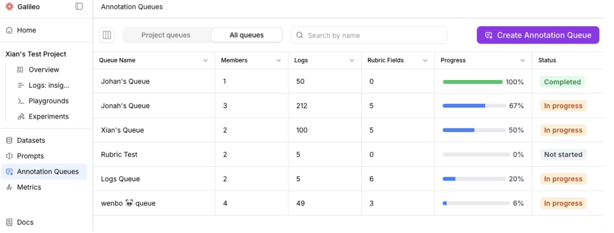
Please contact <a href="mailto:support@galileo.ai?subject=Interest%20in%20Annotation%20Queues%20(Enterprise%20Beta)">support@galileo.ai</a> to participate in the enterprise beta.

</Update>

{/*<!-- markdownlint-disable MD024 --> Repeated headings*/}
<Update label="2026-02-13" description="OpenAI Responses API support, new integrations, metric recomputation flow, performance benchmarks, SQL metrics">

## Key new features and improvements

### OpenAI Responses API (with tracing)

Galileo now supports the **[OpenAI Responses API](/sdk-api/third-party-integrations/openai/openai#responses-api-python-only)** out of the box,
with full tracing support. Easily instrument and trace your OpenAI Responses API calls to view LLM activity,
token usage, and end-to-end execution within Galileo.

### Custom model integrations

Galileo now supports flexible **custom model integrations**,
enabling you to connect proprietary or third-party models directly into your observability workflows.
Explore the [full integration guide](/sdk-api/third-party-integrations/model-integrations/custom-model-integrations/custom-model-integrations).

For implementation details, see the SDK reference:

- [Custom integrations payload schema](/sdk-api/third-party-integrations/model-integrations/custom-model-integrations/custom-model-integrations#custom-integrations-payload-schema)
- [OAuth2 token format](/sdk-api/third-party-integrations/model-integrations/custom-model-integrations/custom-model-integrations#oauth2-token-format)

### Pydantic integration

Galileo now integrates with **[Pydantic AI](/sdk-api/third-party-integrations/opentelemetry-and-openinference/pydantic-ai)** for structured tracing and observability.

### Mastra integration

Native [Mastra integration](/sdk-api/third-party-integrations/opentelemetry-and-openinference/mastra)
is now available using the new observability class.

### New Anthropic model

Claude Opus 4.6 has been added to Playground, Prompt store, and Metrics hub.

## Metric recomputation flow improvements

When adding a new metric or editing an existing metric in a Log stream,
users are now prompted to recompute metrics for past logs.
Galileo provides a streamlined UX for recomputing historical metrics,
making it easier to maintain consistent metric coverage across your data.

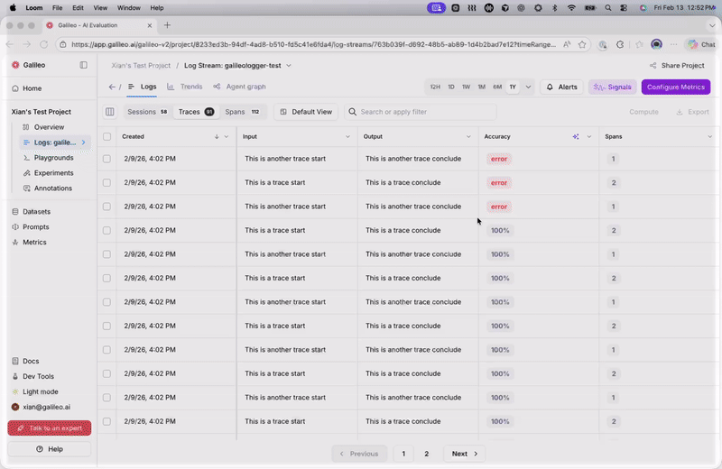

## Performance benchmarks for preset metrics

Preset metrics now include performance benchmarks (e.g. for [action completion](/concepts/metrics/agentic/action-completion#performance-benchmarks)).

New users can explore a new [Preset Metrics Examples](/getting-started/sample-projects/preset-metric-examples) sample project to see Galileo's out-of-the-box metrics in action.

## New SQL metrics

Galileo now supports **SQL-based metrics** for advanced evaluation
and analysis workflows.

[Learn more](/concepts/metrics/text2sql/text2sql-overview)

</Update>

{/* <!-- markdownlint-disable MD024 MD037 --> Repeated headings */}

<Update label="2026-01-30" description="Traffic analytics, Metric enhancements, and page updates for Logs and Trends">

## Key new features and improvements

### Agent Graph: Traffic analytics and metric enhancements

Agent Graph now includes traffic analytics.
Easily visualize which agent paths are the most frequently traversed, so you can prioritize the flows that have the greatest impact on your users.

Click on an edge (connection between nodes) to view details –
including a histogram of how often edges are traversed.


Metric enhancements in the Agent Graph allow you to select specific metrics to visualize.
Use this feature to explore the metrics that matter the most for your application.


## Trends page updates

Charts for system metrics, including Cost, Latency, Input Tokens,
Output Tokens, and Total Tokens are available on the Trends page.

## Logs page updates

In the **Sessions** table, use the **Traces** column to view the traces for each session.
In the **Traces** table, use the **Spans** column to view the spans for each trace.

</Update>

<Update label="2026-01-23" description="Galileo Signals, Log stream and experiment views">

## Key new features and improvements

### Announcing Galileo Signals

Signals is the upgrade to Galileo's flagship insights feature, built to further accelerate the eval engineering loop.

- Detect subtle AI errors that simple human reviews would never catch
- Generate an optimized metric based on any observed failure
- See your signals directly on the agent graph for instant visibility

<iframe
  className="w-full aspect-video rounded-xl"
  src="https://www.youtube.com/embed/rzs-phLImUk"
  title="YouTube video player"
  frameBorder="0"
  allow="accelerometer; autoplay; clipboard-write; encrypted-media; gyroscope; picture-in-picture"
  allowFullScreen
></iframe>

Learn more:

- [Galileo Signals: Find Issues with AI](https://galileo.ai/signals)
- [Context Engineering at Scale: How We Build Galileo Signals](https://galileo.ai/blog/context-engineering-at-scale-how-we-built-galileo-signals)

### Save new views in Log streams and Experiments

Galileo allows you to make changes to tables’ columns, including re-ordering how columns are displayed.

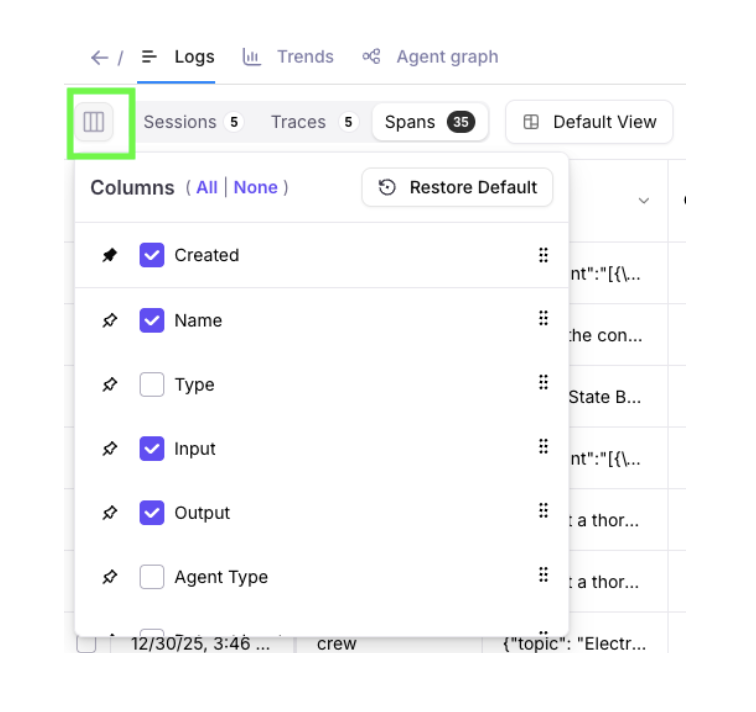

You’re now able to save the state of your columns and
filters into one or more views. Views can be shared with all project members,
or private only to you. Views can be updated, duplicated, or deleted.

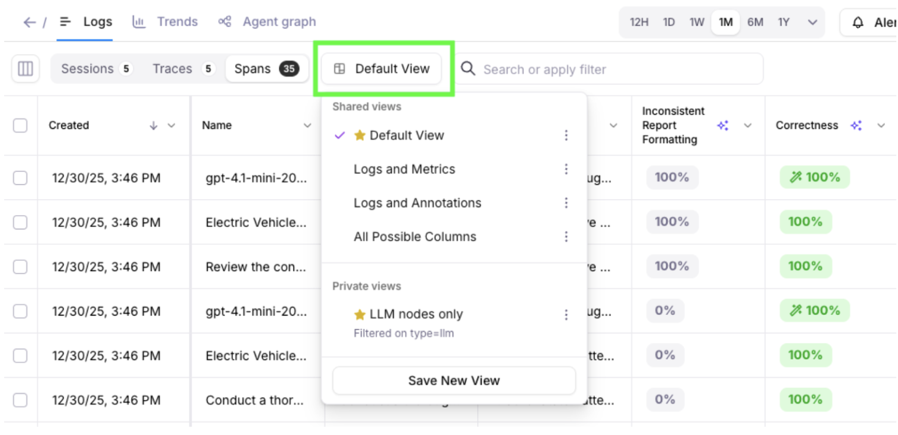

Saved views persist across browsers and computers –
making it easy to pick up your analysis where you left off.

</Update>

<Update label="2026-01-16" description="Composite metrics, security improvements, AWS Bedrock inference profiles">

## Key new features and improvements

### Composite metrics

Composite Metrics are now available in Galileo, enabling you to build advanced evaluations
by combining the results of existing metrics into a single, higher-level score.
Composite metrics are advanced custom metrics that can access and leverage the
results of other metrics to perform sophisticated evaluations. Unlike standard
metrics that operate independently, composite metrics build upon previously
computed metric values to create more nuanced and context-aware assessments.

[Learn more](/concepts/metrics/custom-metrics/composite-metrics)

### Security improvements

An independent, third-party security assessment confirmed that Galileo web applications
align with industry-accepted practices and widely adopted security standards (OWASP, NIST, OSSTMM).

Following recent assessments, several updates were implemented to further
strengthen the security of Galileo applications. There is no evidence that any
users were adversely affected. As a general security best practice, users are advised
to sign into Galileo and review their account’s settings.

Galileo welcomes the safe and responsible reporting of vulnerabilities.
Reporters can contact [security@galileo.ai](mailto:security@galileo.ai) with a description of the issue,
steps to reproduce, and if possible, a link to a private /
secured video demonstrating the issue. Galileo would like to thank
Musawer Khan for collaborating with us on a recent report!

### AWS Bedrock Integration – Support for Inference Profiles

Galileo now supports configuring
[AWS Bedrock Integrations](sdk-api/third-party-integrations/model-integrations/aws-bedrock/awsbedrock)
using the `inference_profiles` property. This enhancement allows customers
to map Galileo-supported model identifiers to their own AWS Bedrock
inference profile ARNs, providing greater flexibility and alignment
with existing Bedrock configurations.

</Update>

<Update label="2025-12-19" description="Integrations, Agent Graph, OpenAI models, Annotations enhancements, Enterprise TTL">

## Key new features and improvements

### Integration Enhancements

- Easier integrations set up for agent frameworks through
  [OpenTelemetry (OTel)](/sdk-api/third-party-integrations/opentelemetry-and-openinference)

- Robust support for integrating with
  [OpenAI Agents SDK](/sdk-api/third-party-integrations/openai-agents/openai-agents).

### Agent Graph Visualization Improvements

Agent Graph now helps you more quickly detect issues in your agents.
Colorful analytics and charts visualize potential problems in span nodes.

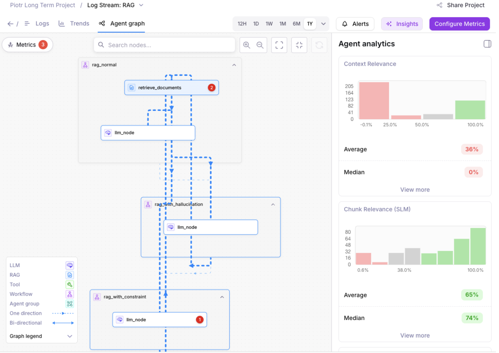

### OpenAI Model Updates

GPT 5.1 and GPT 5.2 models from OpenAI are now available in
Playground, Prompt store, Synthetic Data Generation, and Metrics Hub.

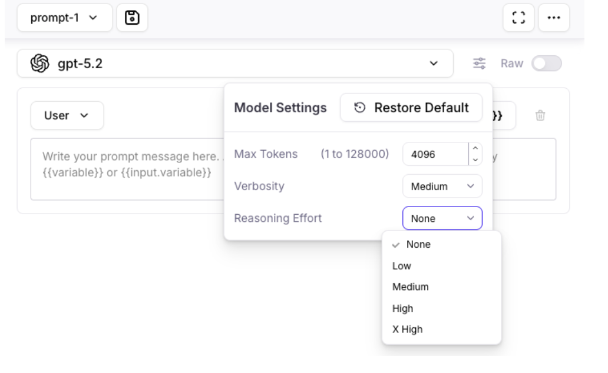

### Annotations Enhancements

Expanded support for [Annotations](concepts/annotations/overview) to Sessions and Spans, in addition to Traces.

- The Logs page allows you to view and export annotations as columns.
- The Messages page highlights available annotations with a dot indicator.

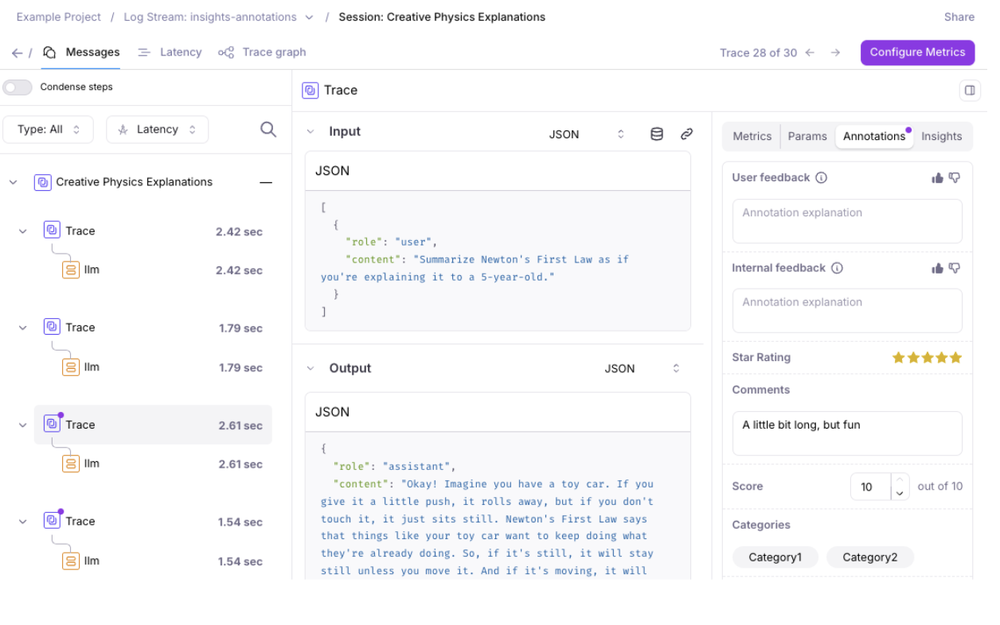

### Time to Live (TTL) for Enterprise Customers

Enterprise customers can now use TTL (Time to Live) to automatically
remove log data and experiments after a configurable time period.
This feature supports companies' data retention and security policies.

[Request a demo](https://galileo.ai/contact-sales) to
learn more about the enterprise version of Galileo.

</Update>

<Update label="2025-12-12" description="Distributed Tracing Beta, LLM Additions">

## Key new features and improvements

### Distributed Tracing (Beta)

[Distributed Tracing (Beta)](/sdk-api/logging/distributed-tracing) is now available for testing and feedback. You can find an example of this in our [SDK examples repo](https://github.com/rungalileo/sdk-examples/tree/main/python/logging-samples/distributed-tracing).


### New LLMs added to Playground, Prompt Store, and Metrics Hub

These new Large Language Models have been added to Playground, Prompt store, and Metrics hub:

For Anthropic:

- Claude Sonnet 4.5
- Claude Opus 4.5
- Claude Haiku 4.5
- Claude Opus 4.1

For Vertex AI:

- Gemini 3

</Update>

<Update label="2025-12-05" description="New features, improvements, and fixes for December 5, 2025">

## Key new features and improvements

### Export Data

- Galileo allows you to export your data
  (including Sessions, Traces, Spans, Metrics, Annotations, Metadata, and Tags)
  for use in other data stores and applications.

- Exporting now supports downloading 1 GB of data
  from the Galileo Console. Easily select pages
  of records to export smaller data sizes.


#### Export via the Python SDK

The Python SDK [`export_records` function](https://v2docs.galileo.ai/sdk-api/python/reference/export) supports exporting from code. Example code snippet:

```python
from galileo import GalileoLogger
from galileo.export import export_records
from galileo.projects import get_project
from galileo.resources.models import LLMExportFormat
from galileo.resources.models.root_type import RootType


project = get_project(name=PROJECT_NAME)
logger = GalileoLogger(project=PROJECT_NAME,
                      log_stream=LOG_STREAM_NAME)


records = export_records(project_id=project.id,
                        root_type=RootType.SESSION, # or RootType.TRACE or RootType.SPAN
                        export_format=LLMExportFormat.JSONL) # or LLMExportFormat.CSV

print(list(records))
```

### Search Nodes in Agent Graph

Agent graph in the Galileo Console now supports searching nodes.


As your bot grows, the Agent Graph can contain dozens of LLMs,
tools, workflows, RAG steps, and agent groups.
Manually hunting through them becomes slow and error-prone.

Search lets you jump directly to the exact node
(e.g., “RAG Document Search”, “Claim Prediction”,
“Final Response Generation”) instead of scrolling and visually scanning.

### New How-to Guides

Check out the new guide: [Run an experiment
against a RAG app](https://v2docs.galileo.ai/how-to-guides/experiments/rag-and-tools/rag-and-tools)
to learn how to set up an experiment to evaluate a RAG application.

</Update>

<Update label="2025-11-14" description="Improvements to Log streams and playgrounds">

## Key new features and improvements

### Improvements to Logs and Messages UI

- Logs UI now supports over 1M rows of sessions, traces, and spans.
- Hover-over the Input and Output columns in the Logs UI to quickly view data.

  

  <br />

- Messages UI defaults to a more readable interface for spans.

  

  <br />

- Log Stream Insights UI improvements, including the ability to view affected spans.

  

### Playground improvements

- Playground's LLM responses now persist. For long Playground runs that take a while to process, users can come back to the Playground later, and any outputs / results will appear if available (even after browser and computer restarts).


</Update>

<Update label="2025-11-07" description="Edit out-of-the-box metric prompts, console improvements">

## Key new features and improvements

### Integration with Vercel SDK

Galileo integrates with the [Vercel AI SDK using OTel](/sdk-api/third-party-integrations/opentelemetry-and-openinference/vercel-ai).

### Read-only user support

Organizations on [app.galileo.ai](http://app.galileo.ai) can now set up [users with “Read-only” roles](/concepts/access-control#system-level-roles) - and large lists of users and groups now load more quickly.

<Columns cols={2}>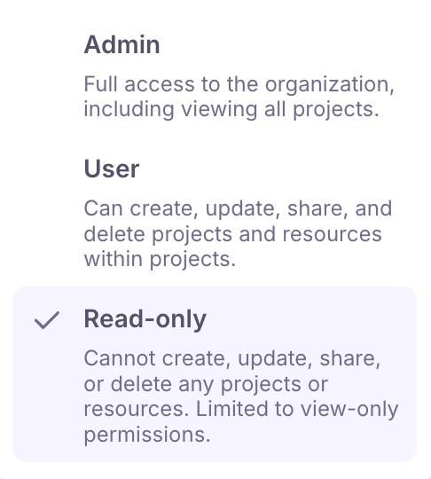</Columns>

### Galileo console UI improvements

- Log streams now have an improved pagination user experience, including the ability to select one or all log pages.

  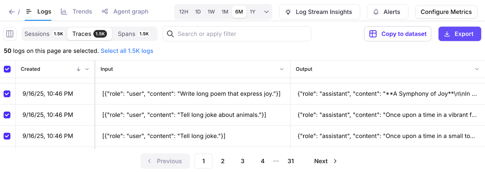

- Experiment lists now load more quickly, and it's now possible to rename or delete experiments.
- Bug fixes to make metrics computation more reliable each time.

### Support for redacted inputs and outputs

Redaction is now supported when logging spans manually. Redacted inputs and outputs remove any sensitive information that should not be displayed in the Galileo console.

### Playground model improvements

Playground users can configure “gpt-5”, “gpt-5-mini”, and “gpt-5-nano” models to use up to 128,000 max tokens. This allows outputs to be successfully generated when there are long inputs and reasoning steps.


### Removal of deprecated models

Deprecated Large Language Models have been removed from Playground, Prompt store, and Synthetic Data Generation.

The removed models are:

- babbage-002
- davinci-002
- gpt-3.5-turbo
- gemini-1.0-pro
- gemini-1.5-pro
- gemini-1.5-flash
- claude-3-sonnet

### Metric improvements

For Galileo preset metrics, you can now view the prompt before duplicating it.

</Update>

<Update label="2025-10-22" description="Galileo MCP, updated Agent Metrics">

## Key new features and improvements

### Galileo MCP: Agent Evals

You can now apply eval-powered insights where you actually build: in your IDE with the release of our [new Agent Evals MCP](/getting-started/mcp/setup-galileo-mcp).

Our MCP server transforms your IDE's AI assistant into an eval-powered copilot. With natural language commands, you can now:

- Generate synthetic test datasets on demand to simulate edge cases and failure scenarios
- Access logstream insights that pinpoint precisely where and why agents deviate from expected behavior
- Set up and validate prompt templates directly in your development environment
- Instrument your codebase with Galileo observability as your AI assistant suggests and applies integration code
- Tab complete your way to fixes by going from improvement insights and root causes, directly to generated solutions

[Try it here](/getting-started/mcp/setup-galileo-mcp).

### Agent Metrics Updated

We've also extended the out-of-the-box [agent metrics](/concepts/metrics/agentic/agentic-overview) available within Galileo with our four new agent-specific metrics that measure the dimensions that impact user experience in production - [Agent Flow](/concepts/metrics/agentic/agent-flow), [Agent Efficiency](concepts/metrics/agentic/agent-efficiency), [Conversation Quality](https://v2docs.galileo.ai/concepts/metrics/agentic/conversation-quality), and [User Intent Change](https://v2docs.galileo.ai/concepts/metrics/agentic/intent-change).

All four of these metrics are now available to be toggled on or off at the click of a button.

</Update>

<Update label="2025-10-17" description="Edit out-of-the-box metric prompts, console improvements">

## Key new features and improvements

### View and edit out-of-the-box LLM-as-a-judge metric prompts

You can now view and edit the prompts for Galileo's out of box LLM as a judge metrics to be able to easily adapt them or create your own custom metrics using them. In order to use this, click edit on a metric and duplicate it in order to edit the metric prompt.


### Galileo console UI improvements

- Improved Log stream loading. Larger Log streams with up to millions of records can load 10X to 30X faster.
- Improved Search and Filter experience. Search across pages with a new tree-filtering implementation.

  

</Update>

<Update label="2025-10-10" description="Documentation on using experiments in unit tests, Google ADK support via OTel, UI and SDK improvements">

## Key new features and improvements

### Documentation on using experiments in unit testing

Running unit tests against your AI apps and evaluating the output is an important part of an AI SDLC, and evaluation-driven development.

We've enhanced our documentation to include a guide on how to [run experiments in unit tests](/sdk-api/experiments/running-experiments-in-unit-tests).

### Google ADK support in OTel

Our OTel capability has been extended to support Google's Agent Development Kit (ADK).

### Log Stream Insights

Log Stream Insights can now use OpenAI and Vertex AI (Google Gemini) API keys, in addition to Anthropic. When more than one supported integration is detected, Insights will prioritize model usage in this order:

- Anthropic
- Vertex AI
- OpenAI

### Galileo console UI improvements

- You can now display the most recent 1000 traces and spans in very large sessions
- More readable metric names are shown on the All Experiments page
- Users can dynamically set column widths on the Experiment pages
- The Insights panel now shows the Last Run date and an updated Timeline view

### Python SDK updates

- You can now run experiments with datasets of up to 100,000 rows
- You can add [`experiment_tags`](/sdk-api/python/reference/experiment_tags) as an optional parameter in [`run_experiment`](/sdk-api/python/reference/experiments#run-experiment)
- Projects can be deleted using [`delete_project`](/sdk-api/python/reference/projects#delete-project)

</Update>

<Update label="2025-10-03" description="SDK improvements, faster metrics streaming, and ground truth support">

## Key new features and improvements

### SDK code snippets in UI

When creating your first prompt, dataset, or experiment, the SDK code snippet you need to log them is now provided in the Galileo interface. This reduces context switching by providing copy-paste-ready examples right when you need them.

### 10X faster metrics streaming on Log streams

We've made fundamental improvements under the hood, enabling a 10X improvement in Log stream speed.

### Ground truth support for custom LLM-as-a-Judge metrics

Custom LLM-as-a-Judge metrics can now access your Ground Truth as an input. To use it, simply toggle on the **"Use reference output as input"** toggle in the Custom LLM-as-a-Judge workflow, then using the term **"reference output"** in your prompt.

For now, custom LLM-as-a-Judge metrics using Ground Truth is only supported in experiments because they need the reference output variable to function.

### JavaScript SDK v1.27.0 release

New features and improvements in the TypeScript/JavaScript SDK

- **Associate datasets with experiments on run** - Streamline your experiment workflow by linking datasets directly when running experiments
- **Enable metrics for LogStream** - Apply custom metrics directly to your Log streams for real-time monitoring
- **Improved createCustomLlmMetric API** - Now takes a parameter object instead of individual parameters for better developer experience
- **Updated API types** - Latest type definitions for better TypeScript support
- **Dependency updates** - Updated axios and form-data dependencies to latest versions for improved security and performance

### Reliability bug fixes

Several bug fixes to ensure your experience with Galileo is reliable and consistent every time.

</Update>

<Update label="2025-09-26" description="Improved documentation, organization permissions, and UI enhancements">

## Key new features and improvements

### Enhanced navigation with new left-side menu

Galileo now features a new left-side navigation menu that provides easier access to all Galileo features. This streamlined navigation improves the user experience by organizing features logically and reducing the time needed to find and access different parts of the platform.


### Organization-scoped URLs for multi-organization users

For users who belong to multiple organizations, Galileo URLs now include organization scope to ensure you're always working within the correct organizational context. This enhancement prevents confusion when switching between different organizations and ensures data isolation and proper access control.

### Improved default view for table view

The "Table View" now defaults to "Traces" for users who have not created Sessions, providing a more relevant starting point for users who primarily work with individual traces rather than multi-turn conversations.

### Enhanced trace, session, and span navigation

You can now Command-Click (or Ctrl-Click on Windows/Linux) on any Trace, Session, or Span to open the row in a new browser window. This feature enables better multitasking and comparison workflows by allowing you to keep multiple items open simultaneously.

### Updated tab names for better clarity

Tab names have been updated to be more descriptive and user-friendly:

- "Messages" - for viewing conversation content
- "Latency" - for performance analysis
- "Trace graph" - for visual trace representation

These clearer labels help users quickly identify the information they're looking for when analyzing traces.

### Streamlined Insights workflow

Click on any example within Insights to automatically open the messages view with the Insights panel, creating a seamless workflow for investigating issues and understanding context around detected problems.

### Various bug fixes and stability improvements

This release includes numerous bug fixes across the product to improve overall stability, performance, and user experience.

## Documentation and content enhancements

### Updated product documentation

We've updated our product documentation with a new structure, removal of duplicated information, and an easier way to navigate. The improved documentation provides clearer guidance and better organization to help you get the most out of Galileo's features.

</Update>

<Update label="2025-09-05" description="">

## Key new features and improvements

### SDK support for synthetic data generation

Expanded SDK capabilities for dataset extension with synthetic data generation:

Both the **Python SDK** [`extend_dataset`](/sdk-api/python/reference/datasets#extend-dataset) and **TypeScript SDK** [`extendDataset`](/sdk-api/typescript/reference/README/functions/extendDataset) functions enable programmatic creation of synthetic data to extend existing datasets with generated examples based on configurable parameters for model settings, prompts, instructions, examples, and data types.

</Update>

<Update label="2025-08-29" description="New custom metric creation flow">

## Key new features and improvements

### New custom metric creation flow

Enhanced Agent monitoring with Galileo's new custom metric creation flow This feature allows users to create custom metrics at session, trace, and span levels for different output types including boolean, categorical, discrete, count, and percentages.

This new testing flow enables users to test metrics on past logs and experiments, allowing for quick iteration and validation to ensure the metric is working as expected before deploying to production.

<iframe
  className="w-full aspect-video rounded-xl"
  src="https://www.youtube.com/embed/oYAxfsAOdGU"
  title="YouTube video player"
  frameBorder="0"
  allow="accelerometer; autoplay; clipboard-write; encrypted-media; gyroscope; picture-in-picture"
  allowFullScreen
></iframe>

</Update>

<Update label="2025-08-22" description="Enhanced SDK, CrewAI Integration, and Insights Improvements">

## Key new features and improvements

### New CrewAI integration

New native [integration with CrewAI](/how-to-guides/third-party-integrations/add-galileo-to-crewai/add-galileo-to-crewai) to provide better observability and debugging capabilities for agents and multi-agent workflows within the CrewAI framework. The integration now offers improved logging, metrics tracking, and session management for complex agent interactions.

### SDK improvements and deprecation updates

- **[Deprecated method updates](/sdk-api/python/reference/prompts) for Python SDK prompts**: The `create_prompt_template` method has been deprecated in favor of `create_prompt`, and `get_prompt_template` has been deprecated in favor of `get_prompt`for better clarity and consistency. These changes improve the API design while maintaining backward compatibility during the transition period.
- **Fixed data type handling**: The `get_prompt` method now returns the correct data type, resolving issues with prompt retrieval and ensuring consistent behavior across the SDK.
- **Updated SDK examples**: The Python SDK examples have been refreshed with improved code patterns and best practices, particularly in the dataset experiments workflow.

### Synthetic data generation

Galileo now supports [synthetic data generation](/sdk-api/experiments/datasets#synthetic-data-generation), allowing you to create training and evaluation datasets via the UI. This feature enables you to generate diverse, controlled datasets for testing your AI applications without manual data collection.

Use synthetic data generation to:

- Create large-scale datasets for comprehensive testing
- Generate edge cases and challenging scenarios
- Ensure consistent data quality across experiments
- Rapidly prototype and iterate on your AI applications

### Log Stream Insights performance improvements

The Log Stream Insights feature has been optimized for better performance and user experience:

- **Reduced processing overhead**: Insights backend processing is now disabled by default for enterprise customers, reducing unnecessary costs and improving system performance.
- **On-demand insights**: Users can now trigger Log Stream Insights manually through the UI when needed, providing more control over when insights are generated.
- **Enhanced reliability**: Improved error handling and processing stability to reduce the frequency of issues encountered by customers.
  These changes make the Insights feature more robust and cost-effective while maintaining its powerful analysis capabilities for agent debugging and optimization.

### Documentation and content enhancements

Continued improvements to documentation around [role-based access control (RBAC)](/concepts/access-control) and enhanced navigation for better developer experience.

</Update>

<Update label="2025-08-15" description="Addition of GPT-5 Models, Updated Documentation">

## Key new features and improvements

### Support for GPT-5, GPT-5-mini, and GPT-5-nano

Galileo now supports OpenAI's latest GPT-5 family of models, including GPT-5, GPT-5-mini, and GPT-5-nano. These models are now available across all Galileo features including the Playground, Metrics creation, and Prompt store.


### Documentation and content enhancements

Documentation improvements around [role-based access control (RBAC)](/concepts/access-control) as well as improved documentation navigation.

</Update>

<Update label="2025-08-01" description="Aggregate Agent Graph View">

## Key new features

### Aggregate agent graph view

Galileo's agent reliability suite now includes an Aggregate Agent Graph View, letting you visualize the most common paths your agent takes across [sessions](/concepts/logging/sessions/sessions-overview). This feature helps surface usage trends, component performance, and outlier behaviors that are otherwise hard to spot in individual traces or spans.

With agent-based architectures becoming more complex and non-deterministic, having an aggregated DAG (Directed Acyclic Graph) view is crucial for debugging, optimizing, and validating agent workflows at scale.


</Update>

<Update label="2025-07-25" description="Build Your Own Evaluation Metrics and Track Agent Workflows">

## Key new features

### Build custom evaluation metrics with your own prompt

Define your own evaluation metrics by providing a custom prompt. This gives you full control to evaluate outputs based on specific criteria, allowing for tailored evaluations based on your needs.

Apply these metrics at span, trace, or session levels, or create agentic metrics to evaluate complete workflows. Currently, outputs are binary only (e.g., Pass/Fail) but support for numerical, categorical, and text-based outputs are on the roadmap.

### Agentic metrics for workflow evaluations

Galileo has four new metrics specifically designed for agent workflows. Use these metrics to track efficiency, quality, and intent across multi-step agent processes.

These metrics include:

- **Agent Flow** - Ensures the agent followed the ideal execution path.
- **Agent Efficiency** - Rewards concise, goal-oriented behavior while avoiding redundant steps or unnecessary tool calls.
- **Conversation Quality** - Session-level metric for evaluating overall conversation quality. Uses multi-trace inputs/outputs and does not require thinking logs or tool logs.
- **Intent Change** - Detects user intent shifts throughout a conversation, helping identify changes in user goals.

Apply these metrics at [span](/sdk-api/logging/galileo-logger#add-spans), [trace](/sdk-api/logging/galileo-logger#start-a-trace#traces), or [session levels](/concepts/logging/sessions/sessions-overview), or create agentic metrics to evaluate complete workflows.

These metrics pair well with Galileo's high-signal agent-centric [metrics](/concepts/metrics/overview#metrics-overview) including [tool selection](/concepts/metrics/agentic/tool-error), [action advancement](/concepts/metrics/agentic/action-advancement#understanding-action-advancement), and [instruction adherence](/concepts/metrics/response-quality/instruction-adherence).

### Export logs

Export selected or all logs from Log streams and experiments in either CSV or JSON format with the columns of your choosing. This allows you to upload them into datalakes, add them to an archive, further explore the data, maintain them for compliance purposes, or whatever else may fit your needs.


### Columns in all experiments table

View more information around the dataset, model, or prompt used in an experiment from within the all experiments table. Navigate via links to the relevant dataset or prompt to explore deeper within the project.

</Update>

<Update label="2025-07-11" description="Alerting, Prompt Versioning, and GenAI Protection">

## Key new features

### Slack and email alerts on your applications

Keep close tabs on your AI apps and agents with the ability to create Slack or email alerts on your Log streams. Get notified on the metrics that matter most to you and your team — whether its [correctness](/concepts/metrics/response-quality/correctness), output [PII](/concepts/metrics/safety-and-compliance/pii), [context relevance](/concepts/metrics/rag/retrieval-quality/context-relevance), or more. Leverage flexible thresholds and conditions to optimize for the right balance between signal and noise.


### Save and version prompts in the prompt store

Save your prompts in a central prompt store with built-in version control. From within the playground, load an existing prompt from the prompt store, edit the prompt and save as either a new prompt or new version of existing prompt. Check out different versions of the prompt or even rollback to previous versions as needed.


### Proactive GenAI security with updated Protect safeguards

Protect has been added to the latest version of the [Galileo Python SDK](/sdk-api/python/reference/protect) to intercept prompts and outputs to proactively safeguard your organization and your end-users from unwanted or even dangerous outputs. Get started with Protect's safeguards through [Galileo Metrics](/concepts/metrics/overview). Protect is specifically designed to defend your application against:

- Harmful requests and security threats (e.g. [Prompt Injections](/concepts/metrics/safety-and-compliance/prompt-injection), toxic language)
- Data Privacy protection (e.g. PII leakage)
- [Hallucinations](/how-to-guides/conversational-ai/fixing-hallucinations-and-factual-errors)

</Update>

<Update label="2025-06-25" description="Improve your agents with Agent Insights">

## Key new features

### Galileo agent insight engine

Get insights into how to improve your agent: Galileo now analyzes your logs, identifies potential problems and provides them on your project dashboard. Agents can fail in numerous ways that are different from traditional software. The Galileo agent [Insights Engine](https://galileo.ai/insights-engine) knows what to look for, classifies them and even provides suggested actions to remediate them.


#### Identify trends within log metrics

Keep your eyes on trends happening within your project's Log stream metrics over a period of time to easily identify anomalies or find patterns. Dive deeper into patterns with additional views, filtering and groups of trend lines based on available parameters.


#### Chart view for experiments

You can now view the results of any experiment in an easy-to-digest chart view, allowing you to gain further meaning behind metric performance. Further explore the charts with the help of filters to examine metric samples by clicking into the visualization.


### Retriever node visualization

Parse through and debug the output of your retriever node with ease as each chunk and it's attribution and utilization metrics are distinctly represented.


### Metric versioning and customization per Log stream

Now, you can view and restore previous versions of metrics directly in the metrics hub interface. Test out different versions of a metric, or use different versions of a metric across different Log streams and experiments. Helpful for scenarios where you may want to explore different changes without impacting existing logs or charts.

### Automatic session naming

Sessions are now named automatically using available session data if no custom name is provided.

</Update>

<Update label="2025-06-18" description="Luna-2 Now available in Galileo enterprise">

## Key new features

### Luna-2 available for use for enterprise users

[Luna-2](/concepts/luna/luna#luna-2-overview) is now available for Enterprise Customers. Luna-2 is a major upgrade that brings purpose-built intelligence to every evaluation and guardrail use case. With a redesigned architecture and rigorous RLAIF training pipelines, Luna-2 delivers:

- **Higher-quality evaluation across 8+ dimensions**, including helpfulness, correctness, coherence, verbosity, maliciousness, hallucination, and more.
- **Granular binary and scalar scoring**: Flexible outputs for both detection (binary pass/fail) and precise scoring (e.g., 1-5 scale), ready to plug into your pipelines or dashboards.
- **Context-aware comparisons**: Optimized for pairwise and multi-turn comparisons, with better discernment in edge cases.
- **Consistency and reproducibility**: More stable than traditional LLM-as-judge methods, with high agreement across similar prompts and contexts.

[Read the Research](https://galileo.ai/research?_gl=1*3oy6mf*_gcl_au*MTIwMDg1MjYzMC4xNzUwMDg1ODUy) that went into Luna-2.

</Update>

<Update label="2025-06-13" description="Sessions as Graph, Log Stream Insights, Playground History, and Local Metrics">

## Key new features

More powerful agent observability with updates to three complementary views—Timeline, Conversation, and Graph—designed to help you debug faster, detect issues earlier, and understand agent performance from every angle.

### Trace agent execution in real-time with timeline view

Galileo's new **Timeline View** lets you step through your agent's full execution path, making it easier to pinpoint delays and spot bottlenecks at a glance.
No more digging through scattered logs—see how long each tool or agent step takes and where latency builds up.

Click on any step to inspect metadata, inputs/outputs, and nested actions, giving you full visibility into what's slowing things down.


### Debug from the user's perspective with conversation view

The new **Conversation View** recreates the exact exchange your users experienced—from inputs to outputs—side by side with system decisions. This helps you debug how your agent logic feels in practice, not just how it functions under the hood.

Use it to:

- Spot confusing or off-track responses
- Validate that the system matches user intent
- Reproduce and resolve edge cases faster


### Combine with graph view for end-to-end observability

These new views pair well with last week's Graph view release, which transforms traditional logs into interactive, inspectable agent flows.

Use the full trio to:

- Graph View: Visualize decision paths and tool usage
- Timeline View: Identify performance issues and slowdowns
- Conversation View: Understand the user experience start to finish

With these improvements, you can get a more holistic view of agent behavior.

</Update>

<Update label="2025-06-05" description="Sessions as Graph, Log Stream Insights, Playground History, and Local Metrics">

## Key new features

Faster debugging, smarter issue detection, seamless experiment saving, and custom metric support for streamlined GenAI evaluation.

### Visualize sessions with graph view

Galileo's new **Graph View** replaces traditional tree-based log visualization, enabling you to **analyze complex sessions quickly**. Instead of digging through a deeply nested tree with hundreds of logs, you can now explore each trace as an interactive graph.

Click any node to inspect inputs, outputs, metrics, and intermediate actions, making it easier to identify bottlenecks, trace failures, and debug long-running workflows.


### Detect issues automatically with Log Stream Insights (Beta)

Galileo's **Log Stream Insights** automatically scans your logs to **surface common failure patterns and recurring issues**, saving you hours of manual review. For each surfaced issue, users receive:

- Descriptions of the detected pattern
- Concrete examples across traces
- Suggested remediation strategies
- Frequency trends over time

This helps teams reduce MTTD (mean time to detect) and rapidly address performance regressions.


### Preserve work and experiment freely with playground saving & history

Galileo now **automatically saves your Playground session state**, so you never lose work in progress. You can:

- Resume where you left off without manual saves
- Save multiple sessions to explore variations in prompts and workflows
- Access run history and log experiments for repeatability

This feature enables your team to **iterate faster and collaborate more effectively** within a single project environment.


### Evaluate with your own metrics using local scorers

With **Local Custom Metrics**, you can now define and compute **custom evaluation metrics locally** using your existing Python workflows and evaluation logic. These metrics can be uploaded directly into your Galileo experiments for side-by-side comparison with built-in metrics.

This gives you complete control over your evaluation criteria while centralizing metric tracking inside Galileo experiments.
Use it to:

- Seamlessly integrate with local libraries and tools
- Rapidly iterate on evaluation logic
- Gain full metric visibility within your evaluations
- Compare experiments at a glance to determine the best results

</Update>

<Update label="2025-05-13" description="Sessions, CLHF, and Playground improvements">

## Key new features

### Sessions

The free version of Galileo now has support for Sessions. Sessions provide users a coherent view of multi-turn interactions. The traces from each turn of the conversation can be viewed under the session.

To create a session, developers can use the Galileo Logger, using the `start_session` method in Python ot the `startSession` method in TypeScript.

Here is a multi-turn conversation about state capitals of the US:


### Adapting LLM metrics with CLHF

The free Galileo offering now supports [**Continuous Learning for Human Feedback** (CLHF)](concepts/metrics/custom-metrics/continuous-learning-via-human-feedback) which helps users easily adapt LLM metrics for their app by providing human feedback. As you start using Galileo Preset LLM-powered metrics (e.g. Context Adherence or Instruction Adherence), or start creating your own LLM-powered metrics, you might not always agree with the results. This capability helps you solve this problem.

As you identify mistakes in your metrics, you can provide ‘feedback' to ‘auto-improve' your metrics. Your feedback gets translated (by LLMs) into few-shot examples that are appended to the Metric's prompt.

This process has shown to increase accuracy of metrics by 20-30%.

<iframe
  className="w-full aspect-video rounded-xl"
  src="https://www.youtube.com/embed/Rl8YLFCyoiw"
  title="YouTube video player"
  frameBorder="0"
  allow="accelerometer; autoplay; clipboard-write; encrypted-media; gyroscope; picture-in-picture"
  allowFullScreen
></iframe>

### Playground improvements

The playground now has an updated layout and shows a preview of the input prompt that will be run when using variable slots in your prompt template which are filled in by manually entering variables or getting them from a dataset.


</Update>

<Update label="2025-05-02" description="Metrics on experiments UI, public APIs, and more">

## Key new features

### Metrics on experiments UI

You can now compute additional metrics for logged experiments directly within the experiments UI. Until now, users didn't have a way to compute more metrics for logged experiments from the UI or SDK.

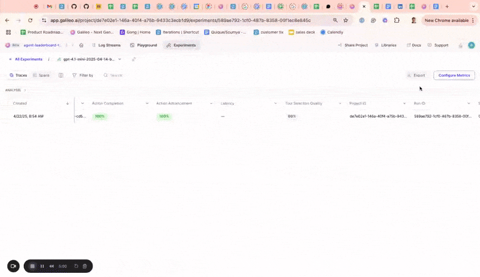

### Public APIs

Released [public APIs](/sdk-api/overview) to allow developers to manage Log streams, experiments, and trace data programmatically. While these can already be managed through the TypeScript and Python SDK, public APIs allow users to programmatically interact with these components in any language. Sample use cases include logging data from a production AI app, running experiments, and retrieving evaluation result

### Aggregate metrics and ranking criteria for experiments

Added to All Experiments page. Aggregate metrics compile the metric values from individual traces in an experiment to show a combined value for each metric on the all experiments page. This enables you to quickly assess the performance of the underlying traces in an experiment. Ranking criteria allow you to determine which experiments were most successful by specifying a weighted average of the underlying metrics for each experiment.

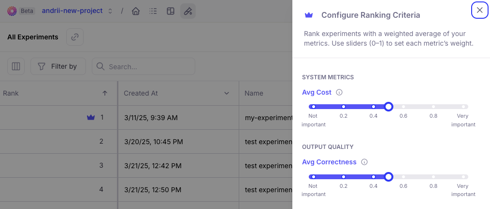

### Reference output and metadata availability

The reference output and metadata from the datasets are now available in the corresponding experiment traces so it can easily referenced.

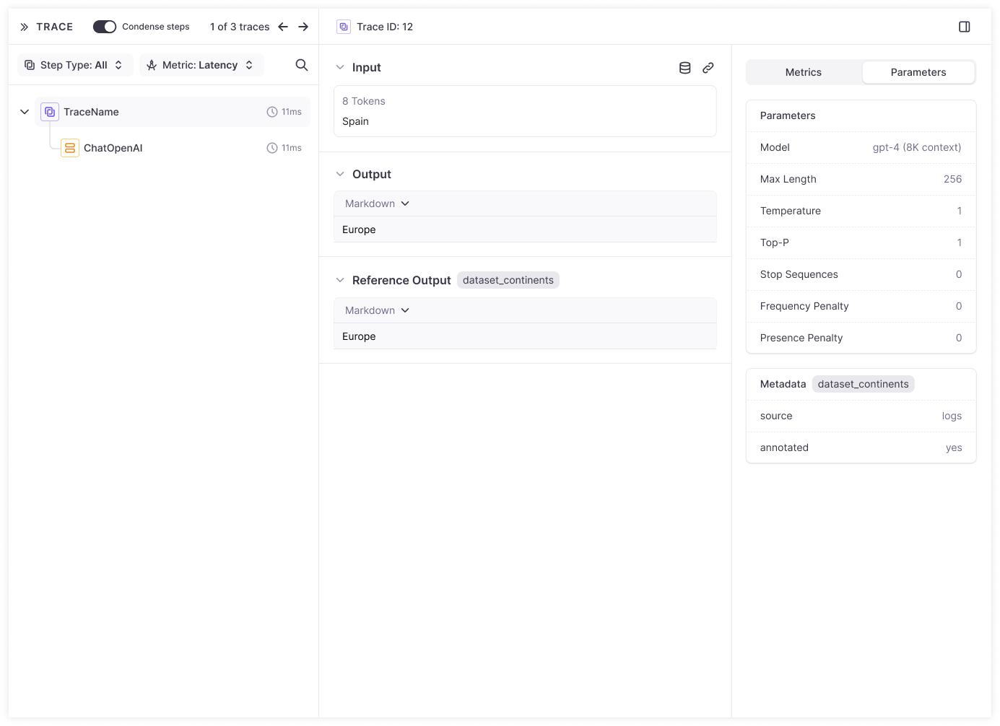

## Datasets and playground

### Enhanced playground inputs

to show complete dataset input rather than only variables so you can more flexibly define variable inputs.

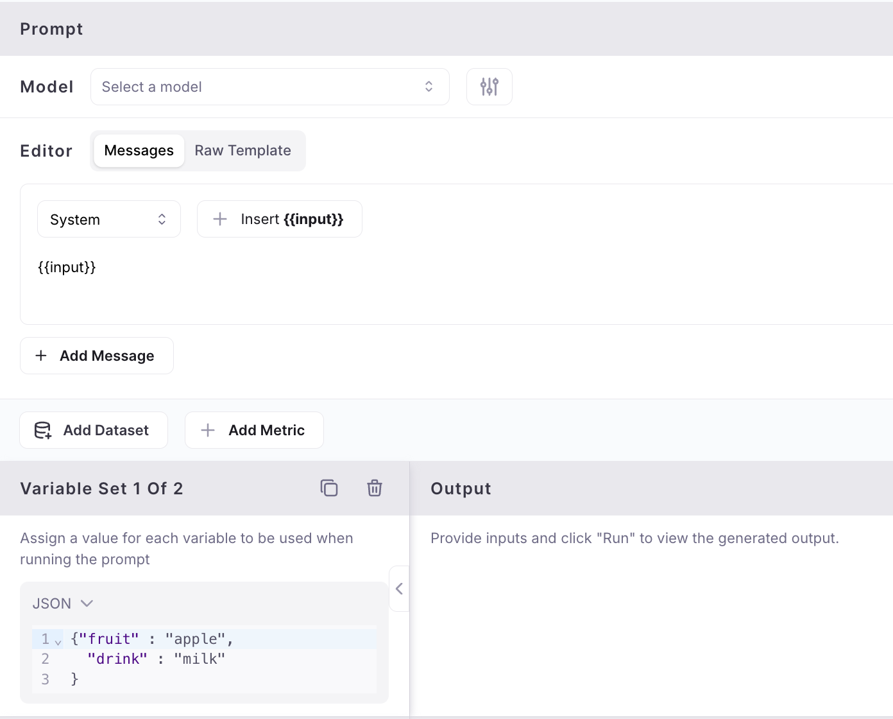

### Flatten to text in dataset upload

When uploading datasets from a CSV or JSON file, the contents of a column are automatically flattened to text instead of being stored as JSON when there's only one file column mapped to an input, output or dataset column.

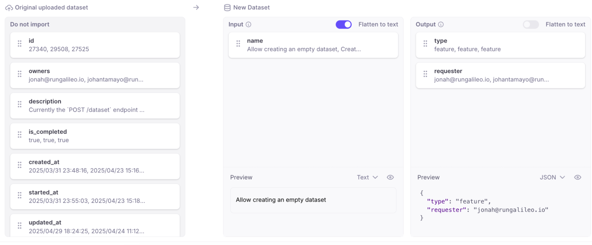

### New model in playground and metrics

Added Support for new GPT 4.1 model in playground and metrics.

## SDK

### G2.0 TypeScript SDK improvements

Supporting Export types at the top-level (`galileo/types`), added a method to access the singleton logger.

## General usability

### Performance optimization

Resolved performance issues causing occasional UI slowdowns, ensuring smoother and faster navigation.

### Extended session durations

Reduce repetitive Google sign-ins, improving user convenience.

### Support chat icon control

You now have the option to show or hide the support chat icon, customizing your interface according to your preferences. Previously, the support chat icon would overlap and cover key user interface elements. This change makes it easier to access the full user interface without the chat icon getting in the way.

</Update>
