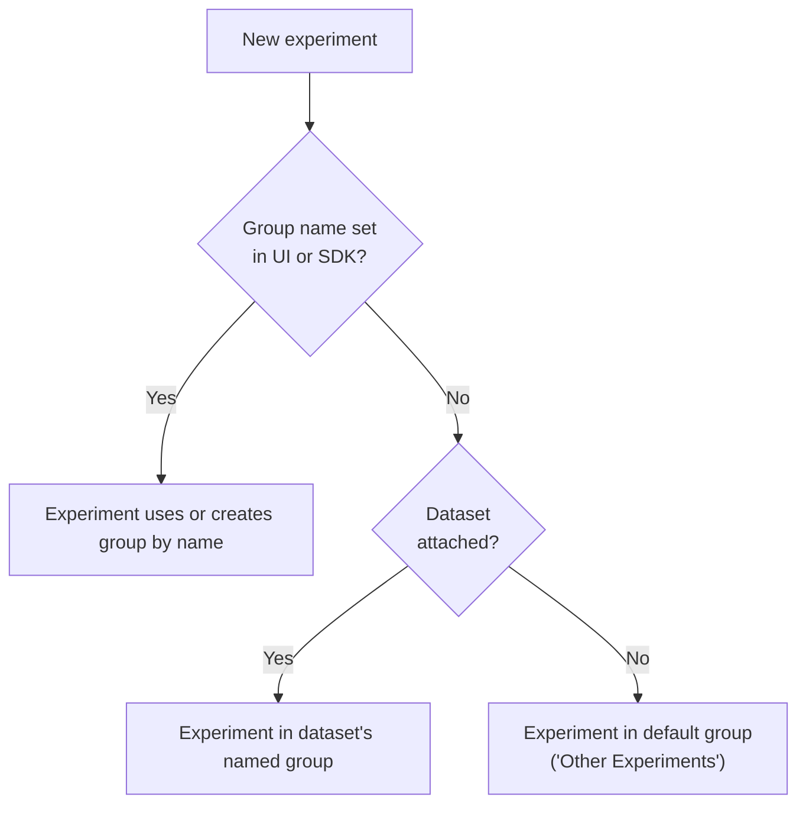

Experiment groups allow you to organize experiments within a project. Previously, all experiments in a project could only be shown in one list. With experiment groups, you can compare and rank experiments based on groups that you define.

## Experiment groups in the Galileo Console

To ease the transition to experiment groups, your experiments have been organized into dataset groups. By default, an "Other Experiments" group contains experiments that do not have associated datasets.


In addition, the "Group experiments" toggle gives you the choice to either show experiments all in one list, or in experiment groups.

### Move experiments to another group

You can move existing experiments to other groups, including to new experiment groups that you define.

To move an individual experiment: Go to the experiment page, open the context menu in the top right, and click on the menu option to "Move to experiment group".


To move multiple experiments at a time: Select all or some experiments in a group, then click on the **Move** button.


### Rank experiments in a group

Use the **Ranking** button in an experiment group to customize a leaderboard for that group. The ranking criteria is configurable based on a weighted average of metrics. With experiment groups, each group can now have its own leaderboard and ranking criteria.


## Experiment groups in the Galileo SDK

<Note>
Python SDK support for Experiment Groups is in [Galileo](https://pypi.org/project/galileo/) **≥ 2.2.0**
</Note>

<Note>
**Your existing experiment code keeps working.** The optional **`experiment_group`** parameter does not change behavior when omitted. Your current [`run_experiment`](/sdk-api/python/reference/experiments#run_experiment), [`create_experiment`](/sdk-api/python/reference/experiments#create_experiment), and [`get_experiments`](/sdk-api/python/reference/experiments#get_experiments) calls stay valid.
</Note>

For experiments you specify [in code](/sdk-api/experiments/running-experiments), you can choose to pass an experiment group name (the optional **`experiment_group`** parameter) to organize your experiments.


### Place an experiment into an experiment group

```python
from galileo import GalileoMetrics
from galileo.experiments import run_experiment

run_experiment(
    experiment_name="rag-baseline",
    dataset=my_dataset,
    function=my_app,
    metrics=[GalileoMetrics.correctness],
    experiment_group="RAG Benchmark",
)
```

### List experiment groups and their experiments

```python
from galileo.experiments import list_experiment_groups, get_experiments

experiment_groups = list_experiment_groups(project_name="my-project")

experiments = get_experiments(
    project_name="my-project",
    experiment_group="RAG Benchmark",
)
```

You can also use **`create_experiment(..., experiment_group="…")`** when you need an experiment shell (for example tagging or setup) before data rows are processed. For full parameters, see the [Experiments SDK reference](/sdk-api/python/reference/experiments).

## How an experiment gets into a group

Galileo applies rules in this order (first match wins):

1. **Experiment group name** — If you pass **`experiment_group`** (or choose a group in the UI), the experiments uses or creates that named group.
2. **Dataset** — Else if the experiment includes a dataset, the experiment can land in that dataset's group.
3. **Other Experiments** — Else the experiment goes to the built-in default group.



## Related resources

<CardGroup cols={2}>
  <Card title="Run experiments in playgrounds" icon="play" href="/concepts/experiments/running-experiments-in-console">
    Use the console for playgrounds, datasets, and experiment workflows.
  </Card>
  <Card title="Experiments basics" icon="book" href="/sdk-api/experiments/experiments">
    Metrics, datasets, and how experiments fit together.
  </Card>
  <Card title="Run experiments in code" icon="code" href="/sdk-api/experiments/running-experiments">
    Prompt templates, generated output, and custom functions.
  </Card>
  <Card title="Unit tests and CI" icon="flask" href="/sdk-api/experiments/running-experiments-in-unit-tests">
    Run experiments inside tests and pipelines.
  </Card>
</CardGroup>
