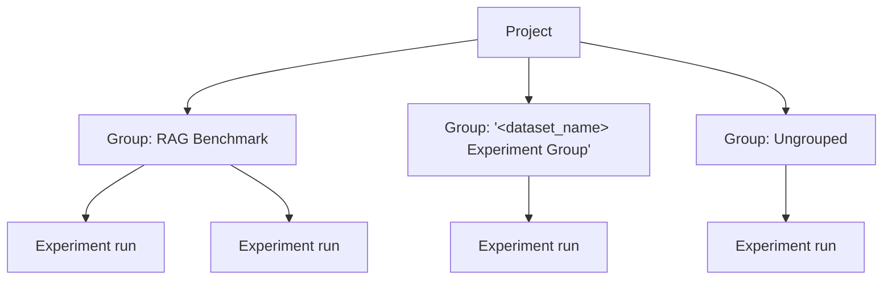
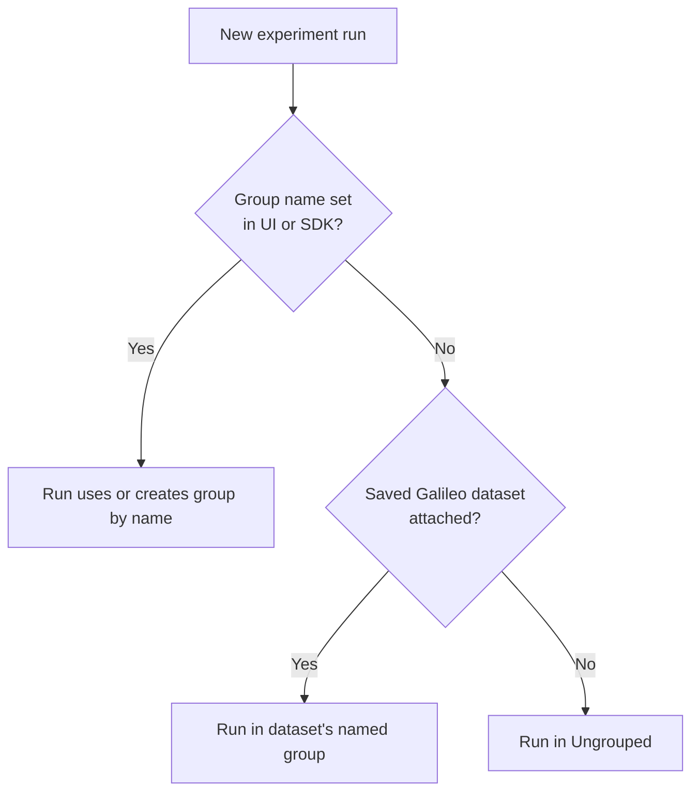

**Experiment groups** help you keep experiment runs tidy inside a **project**. Groups control **how runs are grouped, listed, and compared**.

Galileo supports experiment groups in **both** the **Galileo Console** and the **SDK**. You do not need to choose one or the other.

<Note>
**Python:** [galileo](https://pypi.org/project/galileo/) **≥ 2.2.0** for **`experiment_group`**, **`list_experiment_groups`**, and group filters on **`get_experiments`** — `pip install -U "galileo>=2.2.0"`.
</Note>

<Note>
**Your existing experiment code keeps working.** The optional **`experiment_group`** parameter does not change behavior when omitted—your current `run_experiment`, `create_experiment`, and `get_experiments` calls stay valid. Runs created earlier in a project may be **grouped automatically** as experiment groups roll out in your environment.
</Note>

## In the Galileo Console

Open your project in the [Galileo Console](https://app.galileo.ai) and go to **Experiment Groups**. There you can browse groups, open a group to see its runs, and manage how runs are organized (depending on your workspace layout).

When you run or log experiments from the playground or other console flows, you can tie those runs to a group using the options presented in the UI.

For a step-by-step walkthrough of playgrounds and datasets, see [Run experiments in playgrounds](/concepts/experiments/running-experiments-in-console).

## In the SDK

For experiments you run [in code](/sdk-api/experiments/running-experiments), pass a **group name** so runs roll up together—similar to how you pass a **project** or **dataset** by name. Galileo creates the group for you the first time it sees that name in the project.

Most teams only ever need the **`experiment_group`** parameter (a plain-text **name**). You do **not** need to create a group in advance.

### Put a run in a named group

```python
from galileo import GalileoMetrics
from galileo.experiments import run_experiment

run_experiment(
    experiment_name="rag-baseline",
    dataset=my_dataset,
    function=my_app,
    metrics=[GalileoMetrics.correctness],
    experiment_group="RAG Benchmark",
)
```

### List groups and list experiments in a group

```python
from galileo.experiments import list_experiment_groups, get_experiments

groups = list_experiment_groups(project_name="my-project")

runs = get_experiments(
    project_name="my-project",
    experiment_group="RAG Benchmark",
)
```

You can also **`create_experiment(..., experiment_group="…")`** when you need an experiment shell (for example tagging or setup) **before** rows run—see the SDK reference for full parameters.

<Tip>
Pass **`experiment_group`** with a short, stable label (for example `"CI regression"`).
</Tip>

## How your project is organized

Each project can contain several **groups**. Every **experiment run** lives in exactly one group.

The diagram below is a simple map—not a setting you configure. It shows how named groups, dataset-linked groups, and the system **Ungrouped** group can appear together. *&lt;dataset_name&gt;* stands for your saved dataset’s name.



## How a new run picks a group

Galileo applies rules in this **order** (first match wins):

1. **Group name** — If you pass **`experiment_group`** (or choose a group in the UI), the run uses or creates that named group.
2. **Saved Galileo dataset** — Else if the experiment create request includes a dataset version, the run can land in that dataset’s group (see the FAQ).
3. **`Ungrouped`** — Else the run goes to the built-in system group.



## Frequently asked questions

**Do experiment groups change metrics or rankings?**  
**Metrics** (the scores Galileo computes for each run) come from your **project** and **scorer** setup. **Experiment groups** organize which runs sit together; **ranking**—who ranks above whom on the leaderboard—is computed **within that group**, and you can **configure ranking and comparison at the group level** in the console so each group’s leaderboard reflects those settings.

**How do I refer to a group in code?**  
Pass **`experiment_group`** with the **group name**, the same way you identify a **project** or **dataset** by name in other SDK calls.

**Why do I see a group named after my saved dataset (the dataset branch in the flowchart above)?**  
When you run experiments against a **saved dataset** and do not specify your own group name, Galileo may place those runs in a single group named after that dataset so everything tied to that dataset stays together.  
Example: `run_experiment(..., experiment_group="My evaluation suite")` — the **`experiment_group`** argument is your **group name** in Galileo.

**What is `Ungrouped`?**  
It is the built-in group for runs that are not placed anywhere else by the rules above.

**Can I use groups only from code?**  
No. Use the **Galileo Console** and the **SDK** together if you like—the same project sees the same groups and runs.

## Next steps

<CardGroup cols={2}>
  <Card title="Run experiments in playgrounds" icon="play" href="/concepts/experiments/running-experiments-in-console">
    Use the console for playgrounds, datasets, and experiment workflows.
  </Card>
  <Card title="Experiments basics" icon="book" href="/sdk-api/experiments/experiments">
    Metrics, datasets, and how experiments fit together.
  </Card>
  <Card title="Run experiments in code" icon="code" href="/sdk-api/experiments/running-experiments">
    Prompt templates, generated output, and custom functions.
  </Card>
  <Card title="Unit tests and CI" icon="flask" href="/sdk-api/experiments/running-experiments-in-unit-tests">
    Run experiments inside tests and pipelines.
  </Card>
</CardGroup>
