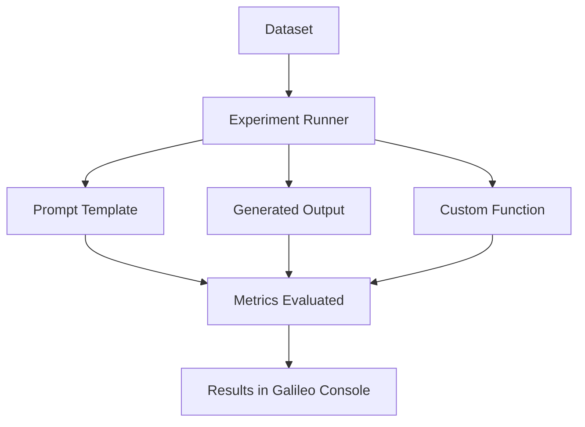

{/* <!-- markdownlint-disable MD044 MD037 --> */}

import SnippetExperimentsPromptPython from "/snippets/code/python/concepts/experiments/prompt.mdx";
import SnippetExperimentsPromptPythonBeta from "/snippets/code/python-beta/concepts/experiments/prompt.mdx";
import SnippetExperimentsExistingDatasetPython from "/snippets/code/python/concepts/experiments/existing-dataset.mdx";
import SnippetExperimentsExistingDatasetPythonBeta from "/snippets/code/python-beta/concepts/experiments/existing-dataset.mdx";
import SnippetExperimentsExistingDatasetLogDecoratorPython from "/snippets/code/python/concepts/experiments/existing-dataset-log.mdx";
import SnippetExperimentsExistingDatasetLogDecoratorPythonBeta from "/snippets/code/python-beta/concepts/experiments/existing-dataset-log.mdx";
import SnippetExperimentsGroundTruthPython from "/snippets/code/python/concepts/experiments/ground-truth.mdx";
import SnippetExperimentsCustomDatasetPython from "/snippets/code/python/concepts/experiments/custom-dataset.mdx";
import SnippetExperimentsCustomDatasetPythonBeta from "/snippets/code/python-beta/concepts/experiments/custom-dataset.mdx";
import SnippetExperimentsCustomMetricsPython from "/snippets/code/python/concepts/experiments/custom-metrics.mdx";
import SnippetExperimentsCustomMetricsPythonBeta from "/snippets/code/python-beta/concepts/experiments/custom-metrics.mdx";
import SnippetExperimentsGetLoggerPython from "/snippets/code/python/concepts/experiments/get-logger.mdx";
import SnippetExperimentsGetCurrentParentPython from "/snippets/code/python/concepts/experiments/get-current-parent.mdx";
import SnippetExperimentsLoggingWithParentCheckPython from "/snippets/code/python/concepts/experiments/logging-with-parent-check.mdx";
import SnippetExperimentCustomMetricNamePython from "/snippets/code/python/sdk/experiments/custom-metric.mdx";
import SnippetExperimentCustomMetricNamePythonBeta from "/snippets/code/python-beta/sdk/experiments/custom-metric.mdx";
import SnippetExperimentOOTBMetricNamePython from "/snippets/code/python/sdk/experiments/ootb-metric.mdx";
import SnippetExperimentOOTBMetricNamePythonBeta from "/snippets/code/python-beta/sdk/experiments/ootb-metric.mdx";

import SnippetExperimentsPromptTypeScript from "/snippets/code/typescript/concepts/experiments/prompt.mdx";
import SnippetExperimentsExistingDatasetTypeScript from "/snippets/code/typescript/concepts/experiments/existing-dataset.mdx";
import SnippetExperimentsExistingDatasetLogDecoratorTypeScript from "/snippets/code/typescript/concepts/experiments/existing-dataset-log.mdx";
import SnippetExperimentsGroundTruthTypeScript from "/snippets/code/typescript/concepts/experiments/ground-truth.mdx";
import SnippetExperimentsCustomDatasetTypeScript from "/snippets/code/typescript/concepts/experiments/custom-dataset.mdx";
import SnippetExperimentsCustomMetricsTypeScript from "/snippets/code/typescript/concepts/experiments/custom-metrics.mdx";
import SnippetExperimentsGetLoggerTypeScript from "/snippets/code/typescript/concepts/experiments/get-logger.mdx";
import SnippetExperimentsGetCurrentParentTypeScript from "/snippets/code/typescript/concepts/experiments/get-current-parent.mdx";
import SnippetExperimentsLoggingWithParentCheckTypeScript from "/snippets/code/typescript/concepts/experiments/logging-with-parent-check.mdx";
import SnippetExperimentCustomMetricNameTypeScript from "/snippets/code/typescript/sdk/experiments/custom-metric.mdx";
import SnippetExperimentOOTBMetricNameTypeScript from "/snippets/code/typescript/sdk/experiments/ootb-metric.mdx";
import SnippetExperimentsGeneratedOutputInlinePython from "/snippets/code/python/concepts/experiments/generated-output-inline.mdx";
import SnippetExperimentsGeneratedOutputInlinePythonBeta from "/snippets/code/python-beta/concepts/experiments/generated-output-inline.mdx";

{/* <!-- markdownlint-enable MD044 --> */}

You can run experiments to validate your application's performance and behavior. Experiments help with prompt engineering and model selection, and can fit into an evaluation-driven development process or a CI/CD pipeline.

Data scientists and engineers can use experiments in notebooks or simple applications. Engineers can also add experiments into production apps -- allowing experiments to be run against complex scenarios (including RAG and agentic flows).

## LLM integration prerequisite

To run an experiment using a [prompt](/sdk-api/experiments/prompts) and a [dataset](/sdk-api/experiments/datasets), you need to set up an LLM integration. An integration is also required for experiments using [out-of-the-box metrics](/concepts/metrics/metric-comparison) and [custom LLM metrics](/concepts/metrics/custom-metrics/custom-metrics-ui-llm).

More information on configuring an LLM integration is available in [this getting started guide](/getting-started/experiments/#prerequisite-configure-an-llm-integration). Enterprise customers also have the option of setting up [Luna](/concepts/luna/luna) small language models (SLMs) for experiments.

## Experiment flow

A primary entry point for running experiments is the function [`run_experiment` in the Python SDK](/sdk-api/python/reference/experiments#run-experiment) or [`runExperiment` in the TypeScript SDK](/sdk-api/typescript/reference/README/functions/runExperiment).

The flow diagram below illustrates what happens after calling this function.

The table below describes the different approaches (e.g. function parameters) that can be involved in setting up an experiment.

<Tip>
**Which approach should I use?**

| Approach | When to use | Output generation |
|---|---|---|
| [**Prompt template**](#run-experiments-with-prompt-template) | You want Galileo to generate output using a prompt and an LLM | LLM generates output |
| [**Generated output**](#run-experiments-with-generated-output) | You already have output from your AI system to evaluate | No LLM generation needed — output already exists in your dataset |
| [**Custom function**](#run-experiments-with-custom-function) | You need to run complex application logic (RAG, agents, multi-step) | Your application generates output |

</Tip>

You can choose evaluation metrics for your experiments. Metrics can be [out-of-the-box metrics](/sdk-api/metrics/metrics) (specified as constants in the Galileo SDK), or the names of custom metrics.

<Note>
**For advanced users** -- If you're calling your application code from an experiment, the experiment runner will start a new session and trace for every row in your dataset. To avoid conflicts, you will need to ensure your application code doesn't start a new session or trace manually, or conclude or flush the trace.

Visit the examples in [this section](/sdk-api/experiments/running-experiments#get-an-existing-logger-and-check-for-an-existing-trace) to check whether an experiment is in progress. This special handling is required for application code that uses manual logging (e.g. [`GalileoLogger`](/sdk-api/logging/galileo-logger)), it is not necessary for application code using the [`log`](/sdk-api/logging/log-decorator/log-decorator) wrapper.
</Note>

## Run experiments with prompt template

A simple way to get started with experimentation is by evaluating prompts against datasets. This is especially valuable during the initial prompt development and refinement phase, where you want to test different prompt variations. Assuming you've previously created a dataset, you can use the following code to run an experiment:

<CodeGroup>
  <SnippetExperimentsPromptPython />
  <SnippetExperimentsPromptPythonBeta />
  <SnippetExperimentsPromptTypeScript />
</CodeGroup>

## Run experiments with generated output

<Note>
**As of Galileo Python SDK [v1.50.1+](https://pypi.org/project/galileo/)** — Bring your own data from any system (production logs, external LLMs, or manual curation) and evaluate it directly.
</Note>

If you already have output from your AI system, you can evaluate it directly in Galileo without regenerating anything. Unlike the prompt-driven flow where Galileo calls an LLM to generate output, this flow uses the output that already exists in your dataset. You only pay for metric computation.

This is ideal for:

- **Evaluating production output**: Export traces from your live system, run quality metrics to find issues
- **Comparing model providers**: Collect output from OpenAI, Anthropic, and Gemini offline, then score them all in Galileo
- **Regression testing**: After improving your RAG pipeline, run the same metrics on new output to see if scores improved
- **A/B testing**: Run the same inputs through two different systems, put both outputs in datasets, compare metric scores

### How it works

1. Create a dataset with an `input` column and a `generated_output` column
2. Call `run_experiment` without a `prompt_template` — Galileo detects the `generated_output` column automatically
3. Metrics are computed directly on the existing output — no LLM calls needed for generation

### Example

<Note>This flow is currently supported in the Python SDK (v1.50.1+). TypeScript support uses the same API — omit `promptTemplate` to use this flow.</Note>

<CodeGroup>
  <SnippetExperimentsGeneratedOutputInlinePython />
  <SnippetExperimentsGeneratedOutputInlinePythonBeta />
</CodeGroup>

### Using this flow

You can use this flow in two ways:

1. **Already have a Galileo dataset?** Pass it directly to `run_experiment(...)`.
2. **Have local Python data** (e.g., a list of dictionaries)? First upload it with `create_dataset(...)`, then pass the returned dataset to `run_experiment(...)`.

#### Dataset columns

Your dataset needs at minimum an `input` column and a `generated_output` column.

| Column | Required | Description |
|---|---|---|
| `input` | Yes | The user query or prompt input |
| `generated_output` | Yes | The output from your AI system. Must have data in at least one of the first 100 rows. |
| `ground_truth` | No | Expected answer — used by the [Ground Truth Adherence](/concepts/metrics/response-quality/ground-truth-adherence) metric. The SDK also accepts `output` as an alias for backward compatibility. |
| `metadata` | No | Additional context for filtering or grouping |

<Note>
**Column naming** -- The SDK accepts both `ground_truth` and `output` for the reference/expected answer column. Internally they map to the same field. In the Galileo Console and CSV exports, this column is displayed as "Ground Truth". We recommend using `ground_truth` in new datasets for clarity.
</Note>

#### Flow determination

When you call `run_experiment`:

- If you provide a `prompt_template`, the prompt-driven flow is always used (even if the dataset has a `generated_output` column).
- If you omit `prompt_template` and the dataset has a `generated_output` column with at least one non-empty value in the first 100 rows, the generated output flow is used.
- If you omit `prompt_template` and the dataset has no `generated_output` column, or the column exists but has no non-empty values in the sampled rows, an error is returned.

## Run experiments with custom function

Once you're comfortable with basic prompt testing, you might want to evaluate more complex parts of your app using your datasets. This approach is particularly useful when you have a generation function in your app that takes a set of inputs, which you can model with a dataset.

If your experiment runs code that uses the `log` decorator, or a third-party SDK integration, then all the spans created by these will be logged to the experiment.

This example uses the [`log` decorator](/sdk-api/logging/log-decorator/log-decorator). The workflow span created by the log decorator will be logged to the experiment.

<CodeGroup>
  <SnippetExperimentsExistingDatasetLogDecoratorPython />
  <SnippetExperimentsExistingDatasetLogDecoratorPythonBeta />
  <SnippetExperimentsExistingDatasetLogDecoratorTypeScript />
</CodeGroup>

This example uses the [OpenAI SDK wrapper](/sdk-api/third-party-integrations/openai/openai). The LLM span created by the wrapper will be logged to the experiment.

<CodeGroup>
  <SnippetExperimentsExistingDatasetPython />
  <SnippetExperimentsExistingDatasetPythonBeta />
  <SnippetExperimentsExistingDatasetTypeScript />
</CodeGroup>

### Run experiments against complex code with custom functions

Custom functions can be as complex as required, including multiple steps, agents, RAG, and more. This means you can build experiments around an existing application, allowing you to run experiments against the full application you have built, using datasets to mimic user inputs.

For example, if you have a multi-agent LangGraph chatbot application, you can run an experiment against it using a dataset to define different user inputs, and log every stage in the agentic flow as part of that experiment.

To enable this, you will need to make some small changes to your application logic to handle the logging context from the experiment.

When functions in your application are run by the `run_experiment` call, a logger is created by the experiment runner, and a trace is started. This logger can be passed through the application, accessed using the `@log` decorator or by calling [`galileo_context.get_logger_instance()`](/sdk-api/python/reference/decorator#get-logger-instance) in Python, or [`getLogger`](/sdk-api/typescript/reference/README/functions/getLogger) in TypeScript.

You will need to change your code to use this instead of creating a new logger and starting a new trace.

#### Get an existing logger and check for an existing trace

The Galileo SDK maintains a context that tracks the current logger. You can get this logger with the following code:

<CodeGroup>
  <SnippetExperimentsGetLoggerPython />
  <SnippetExperimentsGetLoggerTypeScript />
</CodeGroup>

If there isn't a current logger, one will be created by this call, so this will always return a logger.

Once you have the logger, you can check for an existing trace by accessing the current parent trace from the logger. If this is not set, then there is no active trace.

<CodeGroup>
  <SnippetExperimentsGetCurrentParentPython />
  <SnippetExperimentsGetCurrentParentTypeScript />
</CodeGroup>

You can use this to decide if you need to create a new trace in your application. If there is no parent trace, you can safely create a new one.

<CodeGroup>
  <SnippetExperimentsLoggingWithParentCheckPython />
  <SnippetExperimentsLoggingWithParentCheckTypeScript />
</CodeGroup>

You can then safely call your code from the experiment runner as well as in your normal application logic. When called from the experiment runner, your traces will be logged to that experiment. When called from your application code, the traces will be logged as normal.

#### Using third-party integrations with experiments

If you are using third-party integrations, there may be some configuration you need to do to make the integrations work with experiments. See the following documentation for more details:

- [CrewAI](/sdk-api/third-party-integrations/crewai/experiments)
- [LangChain and LangGraph](/sdk-api/third-party-integrations/langchain/experiments)

### Custom function logging principles

There are a few important principles to understand when logging experiments in code.

- When running an experiment, a new logger is created for you and set in the Galileo context. If you create a new logger manually in the application code used in your experiment, this logger will not be used in the experiment.
- To access the logger to manually add traces inside the experiment code, you can call `galileo_context.get_logger_instance()` (Python) or `getLogger()` (TypeScript) to get the current logger.
- To detect if there is an active trace, use the `current_parent()` (Python) or `currentParent` (TypeScript) method on the logger. This will return `None`/`undefined` if there isn't an active trace.
- Be sure to handle cases in your application code where a logger is created or a trace is started, and make sure this doesn't happen in an experiment, and the experiment logger and trace is used instead.
- Every row in a dataset is a new trace. If you create new traces manually, they will not be used.
- Do not conclude or flush the logger in your experiment, the experiment will do this for you.

## Set metrics for your experiment

When you run an experiment, you need to define which metrics you want to evaluate for each row in the dataset.

For out-of-the-box metrics, use the [constants provided by the Galileo SDK](/sdk-api/metrics/metrics).

<CodeGroup>
  <SnippetExperimentOOTBMetricNamePython />
  <SnippetExperimentOOTBMetricNamePythonBeta />
  <SnippetExperimentOOTBMetricNameTypeScript />
</CodeGroup>

For custom metrics, use the name you set when you created the metric. For example, if you have a custom LLM-as-a-judge metric called `"Compliance - do not recommend any financial actions"`:

You would pass this to an experiment like this:

<CodeGroup>
  <SnippetExperimentCustomMetricNamePython />
  <SnippetExperimentCustomMetricNamePythonBeta />
  <SnippetExperimentCustomMetricNameTypeScript />
</CodeGroup>

### Ground truth

For [Ground Truth Adherence](/concepts/metrics/response-quality/ground-truth-adherence), you also need to set the ground truth in your dataset. This is set in the `ground_truth` column.

<CodeGroup>
  <SnippetExperimentsGroundTruthPython />
  <SnippetExperimentsGroundTruthTypeScript />
</CodeGroup>

<Note>If you set the `ground_truth` column when using other metrics, the value is not used in the calculation of the metric, but can be added to the Galileo console under the "Dataset Ground Truth" column. This can be helpful for manual review.</Note>

## Custom dataset evaluation

As your testing needs become more specific, you might need to work with custom or local datasets. This approach is perfect for focused testing of edge cases or when building up your test suite with specific scenarios:

<CodeGroup>
  <SnippetExperimentsCustomDatasetPython />
  <SnippetExperimentsCustomDatasetPythonBeta />
  <SnippetExperimentsCustomDatasetTypeScript />
</CodeGroup>

## Custom metrics for deep analysis

For the most sophisticated level of testing, you might need to track specific aspects of your application's behavior. Custom metrics provide the flexibility to define precisely what you want to measure, enabling deep analysis and targeted improvement:

<CodeGroup>
  <SnippetExperimentsCustomMetricsPython />
  <SnippetExperimentsCustomMetricsPythonBeta />
  <SnippetExperimentsCustomMetricsTypeScript />
</CodeGroup>

Each of these experimentation approaches fits into different stages of your development and testing workflow. As you progress from simple prompt testing to sophisticated custom metrics, Galileo's experimentation framework provides the tools you need to gather insights and improve your application's performance at every level of complexity.

## Experiments with agentic and RAG applications

The experimentation framework extends naturally to more complex applications like agentic AI systems and RAG (Retrieval-Augmented Generation) applications. When working with agents, you can evaluate various aspects of their behavior, from decision-making capabilities to tool usage patterns. This is particularly valuable when testing how agents handle complex workflows, multi-step reasoning, or tool selection.

For RAG applications, experimentation helps validate both the retrieval and generation components of your system. You can assess the quality of retrieved context, measure response relevance, and ensure that your RAG pipeline maintains high accuracy across different types of queries. This is especially important when fine-tuning retrieval parameters or testing different reranking strategies.

The same experimentation patterns shown above apply to these more complex systems. You can use predefined datasets to benchmark performance, create custom datasets for specific edge cases, and define specialized metrics that capture the unique aspects of agent behavior or RAG performance. This systematic approach to testing helps ensure that your advanced AI applications maintain high quality and reliability in production environments.

## Multi-turn conversations in experiments

The [Python SDK](/sdk-api/python/sdk-reference) supports evaluating multi-turn conversations in experiments. With this feature, you can use session metrics to test how multi-turn datasets perform on your agents before deploying changes to production.

Out-of-the-box session metrics include [Action Completion](/concepts/metrics/agentic/action-completion), [Agent Efficiency](/concepts/metrics/agentic/agent-efficiency), [Agent Flow](/concepts/metrics/agentic/agent-flow), [Conversation Quality](/concepts/metrics/agentic/conversation-quality), [Interruption Detection](/concepts/metrics/multimodal-quality/interruption-detection), and [User Intent Change](/concepts/metrics/agentic/intent-change). You can also [create your own custom metric](/concepts/metrics/custom-metrics/custom-metrics-ui-llm) to evaluate sessions.

Usage steps:

1. Define multi-turn datasets and experiments using the Python SDK.
2. Configure out-of-the-box or custom session metrics on these experiments.
3. View the sessions and metrics in the Experiments UI in a new "Sessions" tab -- or get the computed metric values through the SDK.

[View full multi-turn experiment example](https://github.com/rungalileo/sdk-examples/tree/main/python/experiments/multi-turn)

<Note>
Instead of [`run_experiment`](/sdk-api/python/reference/experiments#run_experiment), set up multi-turn experiments with  [`create_experiment`](/sdk-api/python/reference/experiments#create_experiment). This function creates an experiment object in which to provide your own sessions and traces using the Galileo context and logger.

See [this code example](https://github.com/rungalileo/sdk-examples/blob/main/python/experiments/multi-turn/basic-example.py) for more information.
</Note>

## Experiment groups

You can organize related experiments into experiment groups. In the Python SDK, provide an optional **`experiment_group`** parameter on [`run_experiment`](/sdk-api/python/reference/experiments#run_experiment), [`create_experiment`](/sdk-api/python/reference/experiments#create_experiment), or [`get_experiments`](/sdk-api/python/reference/experiments#get_experiments). Use [`list_experiment_groups`](/sdk-api/python/reference/experiments#list_experiment_groups) to show available experiment groups.

Learn more about grouping experiments in the Galileo console and SDK on [this page](/sdk-api/experiments/experiment-groups).

## Best practices

1. **Use consistent datasets**: Use the same dataset when comparing different prompts or models to ensure fair comparisons.
1. **Test multiple variations**: Run experiments with different prompt variations to find the best approach.
1. **Use appropriate metrics**: Choose metrics that are relevant to your specific use case.
1. **Start small**: Begin with a small dataset to quickly iterate and refine your approach before scaling up.
1. **Document your experiments**: Keep track of what you're testing and why to make it easier to interpret results.

## Next steps

### Experiments SDK

<CardGroup cols={2}>
  <Card title="Use Datasets in Code" icon="database" horizontal href="/sdk-api/experiments/datasets">
    Learn about more datasets, the data driving your experiments.
  </Card>
  <Card title="Prompt Templates" icon="message" horizontal href="/sdk-api/experiments/prompts">
    Learn how to create and use prompt templates in experiments
  </Card>
</CardGroup>

### Metrics

<CardGroup cols={2}>
  <Card title="Metrics Reference Guide" icon="brain" horizontal href="/sdk-api/metrics/metrics">
    A list of supported metrics and how to use them in experiments.
  </Card>
  <Card title="Local Metrics" icon="code" horizontal href="/concepts/metrics/custom-metrics/custom-metrics-ui-code#local-metrics">
    Create and run custom metrics directly in code.
  </Card>
  <Card title="Custom Code-Based Metrics" icon="code" horizontal href="/concepts/metrics/custom-metrics/custom-metrics-ui-code">
    Create reusable custom metrics right in the Galileo Console.
  </Card>
  <Card title="Custom LLM-as-a-Judge Metrics" icon="brain" horizontal href="/concepts/metrics/custom-metrics/custom-metrics-ui-llm">
    Create reusable custom metrics using LLMs to evaluate your response quality
  </Card>
</CardGroup>
