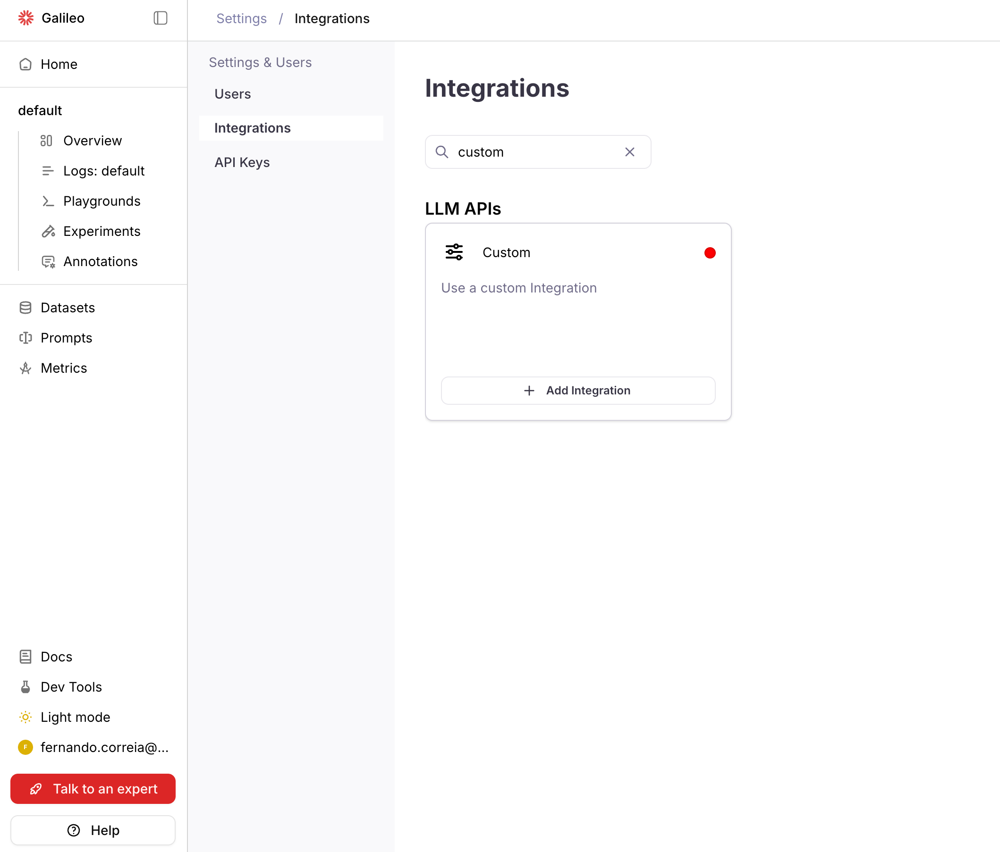
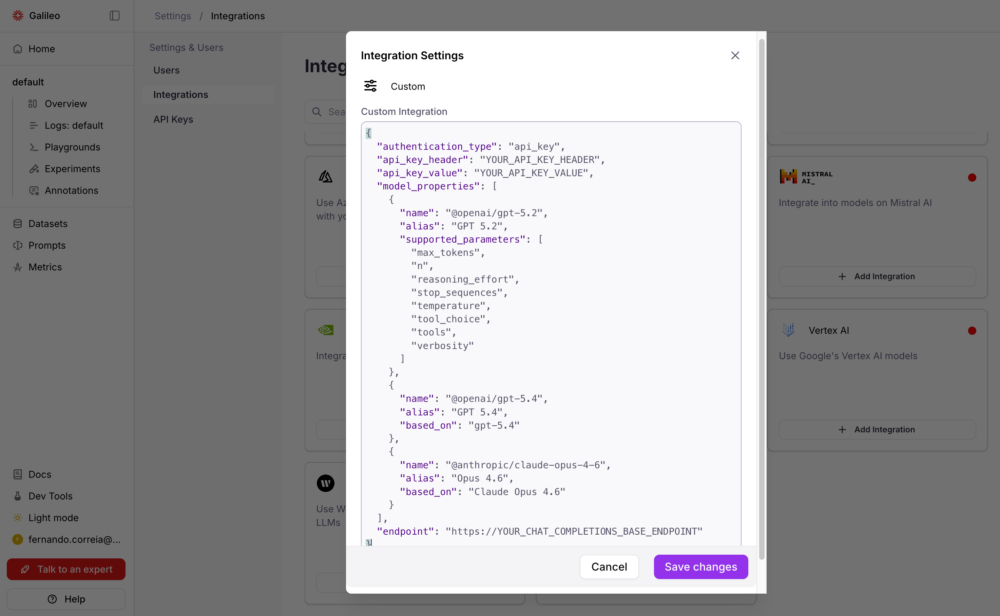
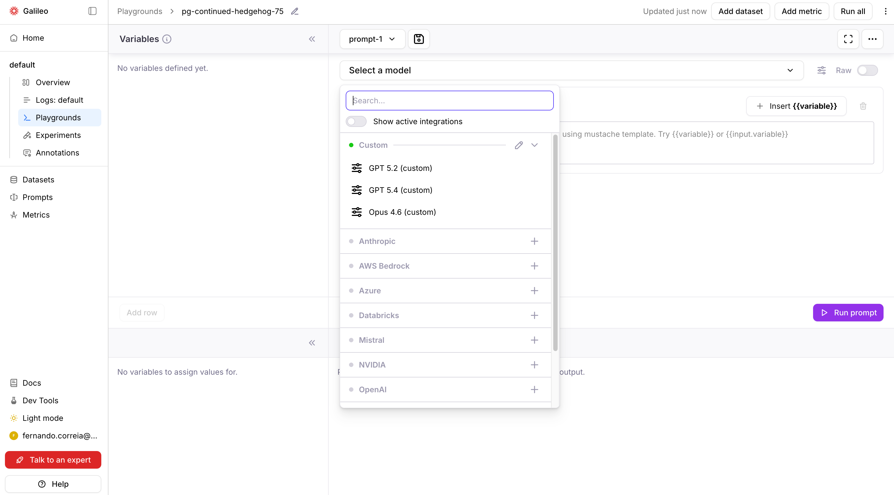
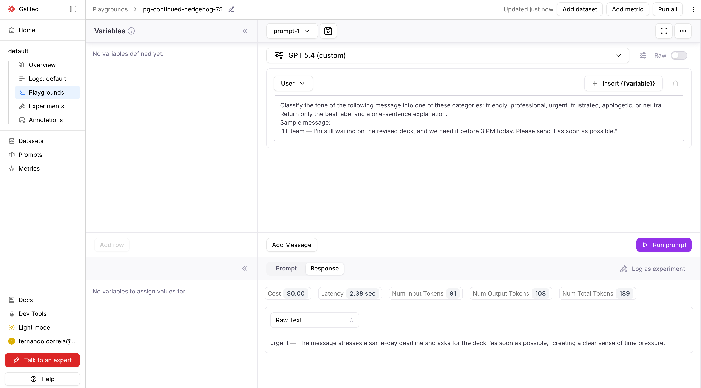

import SnippetOAuth2TokenFormat from "/snippets/code/multilingual/integrations/custom/oauth2-token-format.mdx";
import SnippetResponseIntegrationDb from "/snippets/code/multilingual/integrations/custom/response-integration-db.mdx";
import SnippetPayloadApiKey from "/snippets/code/multilingual/integrations/custom/payload-api-key.mdx";
import SnippetPayloadCustomLlm from "/snippets/code/multilingual/integrations/custom/payload-custom-llm.mdx";
import SnippetPayloadOAuth2CustomLlm from "/snippets/code/multilingual/integrations/custom/payload-oauth2-custom-llm.mdx";
import SnippetCurlCreateNoAuth from "/snippets/code/multilingual/integrations/custom/curl-create-no-auth.mdx";
import SnippetCurlCreateOAuth2 from "/snippets/code/multilingual/integrations/custom/curl-create-oauth2.mdx";
import SnippetCurlGetIntegration from "/snippets/code/multilingual/integrations/custom/curl-get-integration.mdx";
import SnippetOAuth2TokenSerialize from "/snippets/code/python/sdk/integrations/custom/oauth2-token-serialize.mdx";
import SnippetCustomLlmHandler from "/snippets/code/python/sdk/integrations/custom/custom-llm-handler.mdx";
import SnippetPayloadBearer from "/snippets/code/multilingual/integrations/custom/payload-bearer.mdx";
import SnippetPayloadOAuth2 from "/snippets/code/multilingual/integrations/custom/payload-oauth2.mdx";
import SnippetPayloadNoAuth from "/snippets/code/multilingual/integrations/custom/payload-no-auth.mdx";
import AliasesAnthropic from "/snippets/code/multilingual/integrations/custom/aliases/aliases-anthropic.mdx";
import AliasesAzure from "/snippets/code/multilingual/integrations/custom/aliases/aliases-azure.mdx";
import AliasesBedrock from "/snippets/code/multilingual/integrations/custom/aliases/aliases-bedrock.mdx";
import AliasesDatabricks from "/snippets/code/multilingual/integrations/custom/aliases/aliases-databricks.mdx";
import AliasesMistral from "/snippets/code/multilingual/integrations/custom/aliases/aliases-mistral.mdx";
import AliasesNvidia from "/snippets/code/multilingual/integrations/custom/aliases/aliases-nvidia.mdx";
import AliasesOpenAI from "/snippets/code/multilingual/integrations/custom/aliases/aliases-OpenAI.mdx";
import AliasesVertexAi from "/snippets/code/multilingual/integrations/custom/aliases/aliases-vertex-ai.mdx";
import AliasesWriter from "/snippets/code/multilingual/integrations/custom/aliases/aliases-writer.mdx";

## What are custom integrations?

Galileo's custom integrations provide a flexible way of setting up LLMs that aren't supported through other existing integrations.
For example, when there are non-standard proxies, proprietary authentications, or proprietary inference protocols.

This video demonstrates how to add a custom integration to Galileo:

<iframe width="560" height="315" src="https://www.youtube.com/embed/qeqIw0KWGns?si=OV8g6v61cg_0FXh5" title="YouTube video player" frameborder="0" allow="accelerometer; autoplay; clipboard-write; encrypted-media; gyroscope; picture-in-picture; web-share" referrerpolicy="strict-origin-when-cross-origin" allowfullscreen></iframe>

## Configuring custom integrations in the Galileo console

<Steps>
  <Step title="Navigate to Integrations">
    Navigate to **Settings** > **[Integrations](https://app.galileo.ai/settings/integrations)** in the Galileo console.
  </Step>
  <Step title="Add Custom Integration">
    Find the **Custom** integration card and click **Add Integration**
    
  </Step>
  <Step title="Configure Integration">
    Paste a valid JSON and **Save changes**.<br/><br/>
    This JSON example uses API key authentication. See [JSON properties](#json-properties) below for an explanation of these and other properties, and instructions for other authentication types.

  <CodeGroup>
    <SnippetPayloadApiKey/>
  </CodeGroup>


  
  </Step>
  <Step title="Test Integration">
    After saving, test the integration by selecting one of its models from a Playground.

  

  Run a prompt or evaluation that uses the custom integration's model.

  


  Note: The models will also be available for use with metrics in Galileo.

  </Step>
</Steps>


## JSON properties

### Authentication properties

#### API key authentication

For providers that use API key authentication (for example, [Portkey](https://portkey.ai/)), specify the following properties:

- `"authentication_type"`: `"api_key"`.
- `"api_key_header"`: The name of the header that the AI provider uses for API key authentication.
  For example, for Portkey the name is `"x-portkey-api-key"`.
  Consult your AI provider's documentation to find out what is the header name that it requires.
- `"api_key_value"`: The API key to be used.

<CodeGroup>
  <SnippetPayloadApiKey />
</CodeGroup>

#### Bearer token authentication

For providers that use a static, pre-defined token for authentication (for example, [Together AI](https://www.together.ai/)), specify the following properties:

- `"authentication_type"`: `"api_key"`.
- `"api_key_header"`: `"Authorization"`.
- `"api_key_value"`: `"Bearer YOUR_TOKEN"` where `YOUR_TOKEN` is a long text sequence representing the authentication token.

<CodeGroup>
  <SnippetPayloadBearer />
</CodeGroup>

#### OAuth2 authentication

For providers that require dynamically-generated bearer tokens:

- `"authentication_type"`: `"oauth2"`.
- `"oauth2_token_url"`: Endpoint URL of the OAuth2 server. This endpoint must be compatible with the [OAuth2 Client Credentials Grant](https://datatracker.ietf.org/doc/html/rfc6749#section-4.4).
- `"authentication_scope"`: `"YOUR_SCOPE"` (optional, passed to the OAuth2 endpoint as the `scope` property of the token request payload).
- `"token"`: `"{\"client_id\": \"YOUR_CLIENT_ID\", \"client_secret\": \"YOUR_CLIENT_SECRET\"}"` (an escaped JSON string containing the static client ID and secret that will be sent to the OAuth2 endpoint).

<Note>
The `access_token` field of the OAuth2 endpoint's JSON response will be used as a Bearer token for LLM inference requests.
</Note>

<CodeGroup>
  <SnippetPayloadOAuth2 />
</CodeGroup>

#### No authentication

For internal endpoints or providers that don't require authentication:

- `"authentication_type"`: `"none"`.

<CodeGroup>
  <SnippetPayloadNoAuth />
</CodeGroup>

<Tip>
The above examples cover the most common use cases. Most users won't need to read beyond this point. The sections below are for advanced scenarios like custom LLM handlers and single-tenant deployments.
</Tip>

### Model properties

The `model_properties` JSON property is used to configure the models that the AI provider supports.

For each model, the following properties are available:

- `"name"`: Name of the model on the AI provider. The value is passed verbatim to the AI provider on the inference request.
- `"alias"`: The unique identifier of the model in Galileo. The value is displayed in the user interface when selecting models. If not provided, `name` will be used as a default value.
- `"based_on"`: An optional alias of a built-in Galileo model.
  If provided, the `supported_parameters` of the built-in model will be used for this custom integration model.
- `"supported_parameters"`: A list of parameters that the custom model supports. Alternative to `based_on`,
  with the difference that instead of copying the parameter names from a built-in model, it directly provides the list.

If neither `based_on` or `supported_parameters` are provided, this parameter list will be used by default:
`["frequency_penalty", "max_tokens", "presence_penalty", "stop", "temperature", "top_p"]`.

List of built-in model aliases that can be used with `based_on`:

<Accordion title="Click to expand">
  <AccordionGroup>
    <Accordion title="Anthropic">
      <AliasesAnthropic />
    </Accordion>
    <Accordion title="Azure">
      <AliasesAzure />
    </Accordion>
    <Accordion title="Bedrock">
      <AliasesBedrock />
    </Accordion>
    <Accordion title="Databricks">
      <AliasesDatabricks />
    </Accordion>
    <Accordion title="Mistral">
      <AliasesMistral />
    </Accordion>
    <Accordion title="NVIDIA">
      <AliasesNvidia />
    </Accordion>
    <Accordion title="OpenAI">
      <AliasesOpenAI />
    </Accordion>
    <Accordion title="Vertex AI">
      <AliasesVertexAi />
    </Accordion>
    <Accordion title="Writer">
      <AliasesWriter />
    </Accordion>
  </AccordionGroup>
</Accordion>

### General properties

- `"default_model"`: `name` of the model to be used by default when a model is not selected. If not provided, defaults to the first model in `model_properties`.
- `"endpoint"`: URL of the AI provider's Chat Completions endpoint. Galileo will append `/chat/completions` to this base URL. The endpoint must be compatible with the OpenAI Chat Completions API.
- `"custom_header_mapping"`: A dictionary mapping internal fields (`job_id`, `user_id`, `project_id`, `run_id`)
  to custom header names that will be set on inference requests.
- `"headers"`: A dictionary of header names as keys, and their corresponding values.
  Will be set on the inference request, overriding any existing value.


## API schema

To configure custom integrations via Galileo's API instead of via the UI, refer to the [Custom Integrations API reference](/api-reference/integrations/create-or-update-integration-4).


## Troubleshooting

- Make sure you have valid authentication credentials (e.g. an API key).
- Make sure the model name is exactly as specified through the provider.
- Make sure that requests are being sent to the provider's endpoint.

As an example, use this `curl` command to verify that an API key and model for [Portkey](https://portkey.ai/) has been configured correctly.

```bash
curl https://api.portkey.ai/v1/chat/completions \
  -H "Content-Type: application/json" \
  -H "x-portkey-api-key: $PORTKEY_API_KEY" \
  -d '{
    "model": "YOUR_MODEL",
    "messages": [
      {"role": "system", "content": "You are a helpful assistant."},
      {"role": "user", "content": "What is Portkey"}
    ],
    "max_tokens": 512
  }'
```

## Advanced usage: custom LLM handlers

<Warning>
Custom LLM handlers are only available on single-tenant Galileo deployments. They require `api` v1.848.0+ and `runners` v2.239.0+.
</Warning>

The [JSON properties](#json-properties) example works when your LLM provider exposes a standard OpenAI-compatible `/chat/completions` endpoint.
However, some providers use proprietary request formats, non-standard response structures, or custom authentication flows that can't be handled by configuration alone.

For these cases, you can write a **custom LLM handler** — a Python class that gives you full control over how Galileo sends requests to your model and interprets the responses.

### When to use a custom handler

- Your provider's API **doesn't follow the OpenAI `/chat/completions` format**
- You need to **transform requests or responses** (e.g., different payload structure, custom headers)
- Your authentication flow **goes beyond OAuth2 or API keys** (e.g., signed requests, mTLS)
- You need **custom retry logic or error handling**

### Writing a handler

Create a Python file with a class that extends [`litellm.CustomLLM`](https://docs.litellm.ai/docs/providers/custom_llm_server). Your class must implement the `acompletion` method, which receives the standard LiteLLM inputs and must return a `ModelResponse`:

<CodeGroup>
  <SnippetCustomLlmHandler />
</CodeGroup>

### Configuring the handler in your integration payload

Reference your handler using the `custom_llm_config` field:

<ResponseField name="file_name" type="string" required>
  Python file containing the CustomLLM class (e.g., `"proprietary_handler.py"`).
</ResponseField>

<ResponseField name="class_name" type="string" required>
  Class name (must be a `litellm.CustomLLM` subclass).
</ResponseField>

<ResponseField name="init_kwargs" type="object">
  Keyword arguments passed to the handler's constructor.
</ResponseField>

**Example:**

<CodeGroup>
  <SnippetPayloadCustomLlm />
</CodeGroup>

<Note>
The [model properties](#model-properties) and [general properties](#general-properties) also apply to custom LLM handler JSON configuration.
</Note>

<Note>
The custom LLM handler receives the `endpoint` as the `api_base` parameter. It's up to the handler's implementation to use it or ignore it.
</Note>

### Deploying handler files

Handler files must be placed on the Galileo `runners` container filesystem.

<ResponseField name="GALILEO_CUSTOM_LLMS_ENABLED" type="boolean" default="false">
  Set to `true` to enable custom LLM support.
</ResponseField>

<ResponseField name="GALILEO_CUSTOM_LLMS_DIRECTORY" type="string" default="/opt/custom_llms">
  Directory where handler files are located.
</ResponseField>

Place your `.py` files directly in the configured directory (nested paths are not supported):

```text
/opt/custom_llms/proprietary_handler.py
/opt/custom_llms/enterprise_adapter.py
```

**Deployment options:**

1. **Volume mount** — Mount a volume containing your handler files at `/opt/custom_llms`
2. **Custom image** — Build a custom runner image with handler files copied in
3. **Custom directory** — Set `GALILEO_CUSTOM_LLMS_DIRECTORY` to a different path


## Security notes

- Tokens are encrypted before storage
- OAuth2 client credentials should be kept confidential and rotated regularly
- Custom LLM handler files should be reviewed for security before deployment
