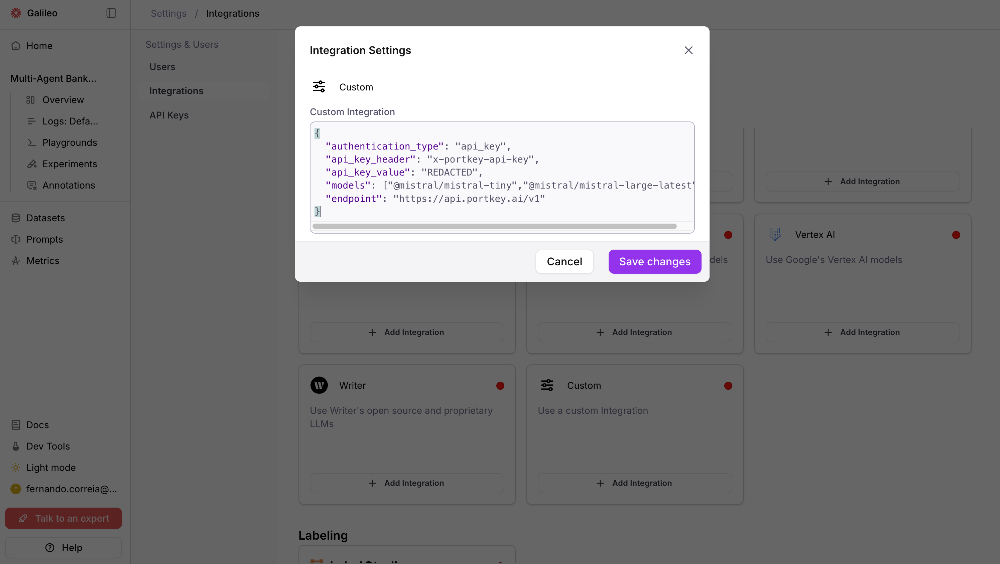
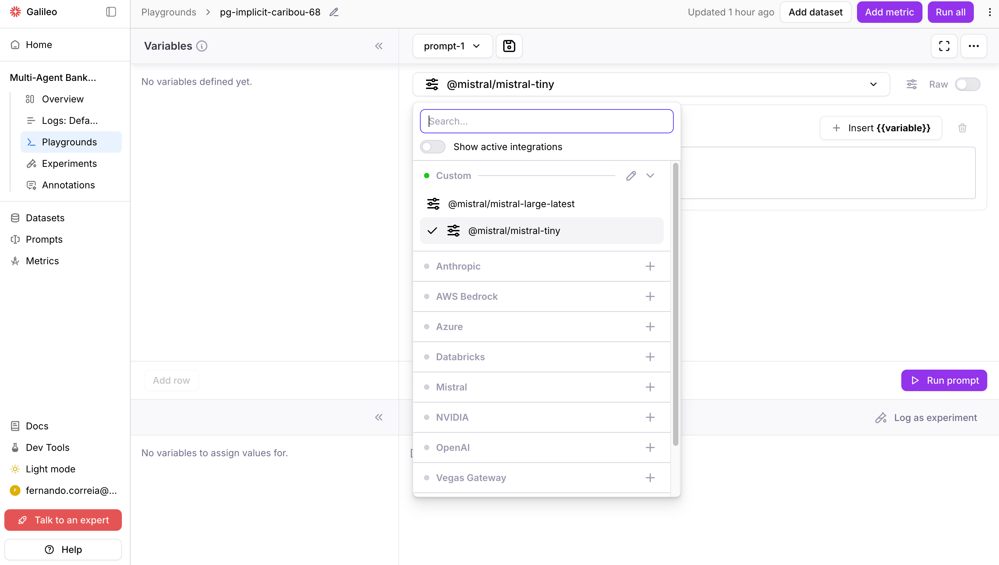
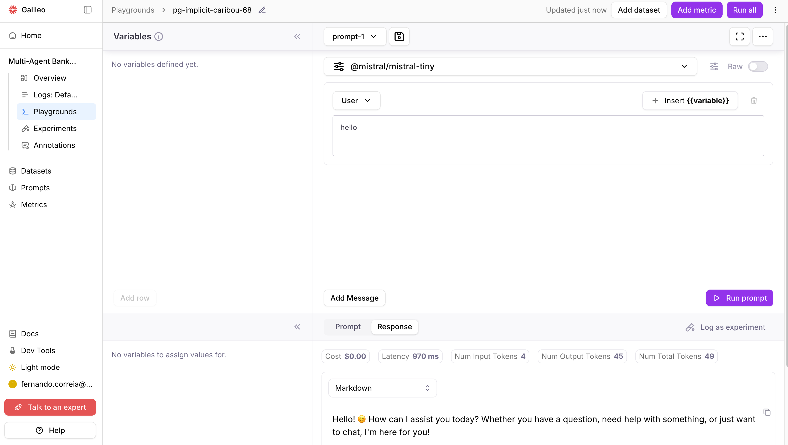

import SnippetOAuth2TokenFormat from "/snippets/code/multilingual/integrations/custom/oauth2-token-format.mdx";
import SnippetResponseIntegrationDb from "/snippets/code/multilingual/integrations/custom/response-integration-db.mdx";
import SnippetPayloadOAuth2Basic from "/snippets/code/multilingual/integrations/custom/payload-oauth2-basic.mdx";
import SnippetPayloadNoAuth from "/snippets/code/multilingual/integrations/custom/payload-no-auth.mdx";
import SnippetPayloadApiKeyTogether from "/snippets/code/multilingual/integrations/custom/payload-api-key-together.mdx";
import SnippetPayloadApiKeyMistral from "/snippets/code/multilingual/integrations/custom/payload-api-key-mistral.mdx";
import SnippetPayloadCustomLlm from "/snippets/code/multilingual/integrations/custom/payload-custom-llm.mdx";
import SnippetPayloadOAuth2CustomLlm from "/snippets/code/multilingual/integrations/custom/payload-oauth2-custom-llm.mdx";
import SnippetCurlCreateNoAuth from "/snippets/code/multilingual/integrations/custom/curl-create-no-auth.mdx";
import SnippetCurlCreateOAuth2 from "/snippets/code/multilingual/integrations/custom/curl-create-oauth2.mdx";
import SnippetCurlGetIntegration from "/snippets/code/multilingual/integrations/custom/curl-get-integration.mdx";
import SnippetOAuth2TokenSerialize from "/snippets/code/python/sdk/integrations/custom/oauth2-token-serialize.mdx";
import SnippetCustomLlmHandler from "/snippets/code/python/sdk/integrations/custom/custom-llm-handler.mdx";

## What are custom integrations?

Galileo's custom integrations provide a flexible way of setting up LLMs that aren't supported through other existing integrations.
For example, when there are non-standard proxies, proprietary authentications, or proprietary inference protocols.

This video demonstrates how to add a custom integration to Galileo:

<iframe width="560" height="315" src="https://www.youtube.com/embed/qeqIw0KWGns?si=OV8g6v61cg_0FXh5" title="YouTube video player" frameborder="0" allow="accelerometer; autoplay; clipboard-write; encrypted-media; gyroscope; picture-in-picture; web-share" referrerpolicy="strict-origin-when-cross-origin" allowfullscreen></iframe>

## Configuring custom integrations in the Galileo console

<Steps>
  <Step title="Navigate to Integrations">
    Navigate to **Settings** > **[Integrations](https://app.galileo.ai/settings/integrations)** in the Galileo console.
  </Step>
  <Step title="Add Custom Integration">
    Find the **Custom** integration card and click **Add Integration**
    
  </Step>
  <Step title="Configure Integration">
    Paste a valid JSON and **Save changes**.<br/><br/>
    This JSON example uses [PortKey](https://portkey.ai/) and [Mistral](https://mistral.ai/) with API key authentication.<br/>
    [See more JSON examples](#json-examples)

  <CodeGroup>
    <SnippetPayloadApiKeyMistral/>
  </CodeGroup>


  
  </Step>
  <Step title="Test Integration">
    After saving, test the integration by selecting one of its models from a Playground.

  

  Run a prompt or evaluation that uses the custom integration's model.

  


  Note: The models will also be available for use with metrics in Galileo.

  </Step>
</Steps>


## JSON examples

### API key authentication integration

For providers that use API key authentication (like [Together AI](https://www.together.ai/) or [Portkey](https://portkey.ai/)):

<CodeGroup>
  <SnippetPayloadApiKeyTogether />
</CodeGroup>

<CodeGroup>
  <SnippetPayloadApiKeyMistral/>
</CodeGroup>

- Many AI providers expect the `Bearer` prefix before API key value. However, some API providers do not require this prefix.  
- Refer to your AI provider documentation for more info about the expected format for the `api_key_header` and `api_key_value`.

### OAuth2 integration

For providers that uses OAuth2 client credentials authentication:

<CodeGroup>
  <SnippetPayloadOAuth2Basic />
</CodeGroup>


<Note>
Your `oauth2_token_url` must support the [OAuth2 Client Credentials Grant](https://datatracker.ietf.org/doc/html/rfc6749#section-4.4) (RFC 6749 §4.4). Galileo exchanges the provided `client_id` and `client_secret` for an access token, which is then used as a Bearer token for LLM inference requests.
</Note>


### No authentication integration

For internal endpoints or providers that don't require authentication:

<CodeGroup>
  <SnippetPayloadNoAuth />
</CodeGroup>


<Tip>
The above examples cover the most common use cases. Most users won't need to go beyond this point. The sections below are for advanced scenarios like custom LLM handlers and single-tenant deployments.
</Tip>


<Note>
The schema used in above examples comes from the [Custom Integrations API](/api-reference/integrations/create-or-update-integration-4). Refer to the API reference for the full list of available fields and options.
</Note>


## Troubleshooting ideas

- Make sure you have valid authentication credentials (e.g. an API key).
- Make sure the model name is exactly as specified through the provider.
- Make sure that requests are being sent to the provider's endpoint.

As an example, use this `curl` command to verify that an API key and model for [Portkey](https://portkey.ai/) has been configured correctly.

```
curl https://api.portkey.ai/v1/chat/completions \
  -H "Content-Type: application/json" \
  -H "x-portkey-api-key: $PORTKEY_API_KEY" \
  -d '{
    "model": "YOUR_MODEL",
    "messages": [
      {"role": "system", "content": "You are a helpful assistant."},
      {"role": "user", "content": "What is Portkey"}
    ],
    "max_tokens": 512
  }'
```

## Advanced usage: custom LLM handlers

<Warning>
Custom LLM handlers are only available on single-tenant Galileo deployments. They require `api` v1.848.0+ and `runners` v2.239.0+.
</Warning>

The [JSON examples](#json-examples) work when your LLM provider exposes a standard OpenAI-compatible `/chat/completions` endpoint. However, some providers use proprietary request formats, non-standard response structures, or custom authentication flows that can't be handled by configuration alone.

For these cases, you can write a **custom LLM handler** — a Python class that gives you full control over how Galileo sends requests to your model and interprets the responses.

### When to use a custom handler

- Your provider's API **doesn't follow the OpenAI `/chat/completions` format**
- You need to **transform requests or responses** (e.g., different payload structure, custom headers)
- Your authentication flow **goes beyond OAuth2 or API keys** (e.g., signed requests, mTLS)
- You need **custom retry logic or error handling**

### Writing a handler

Create a Python file with a class that extends [`litellm.CustomLLM`](https://docs.litellm.ai/docs/providers/custom_llm_server). Your class must implement the `acompletion` method, which receives the standard LiteLLM inputs and must return a `ModelResponse`:

<CodeGroup>
  <SnippetCustomLlmHandler />
</CodeGroup>

### Configuring the handler in your integration payload

Reference your handler using the `custom_llm_config` field:

<ResponseField name="file_name" type="string" required>
  Python file containing the CustomLLM class (e.g., `"proprietary_handler.py"`).
</ResponseField>

<ResponseField name="class_name" type="string" required>
  Class name (must be a `litellm.CustomLLM` subclass).
</ResponseField>

<ResponseField name="init_kwargs" type="object">
  Keyword arguments passed to the handler's constructor.
</ResponseField>

**Example payload — custom handler without authentication:**

<CodeGroup>
  <SnippetPayloadCustomLlm />
</CodeGroup>

**Example payload — custom handler with OAuth2:**

<CodeGroup>
  <SnippetPayloadOAuth2CustomLlm />
</CodeGroup>

### Deploying handler files

Handler files must be placed on the Galileo `runners` container filesystem.

<ResponseField name="GALILEO_CUSTOM_LLMS_ENABLED" type="boolean" default="false">
  Set to `true` to enable custom LLM support.
</ResponseField>

<ResponseField name="GALILEO_CUSTOM_LLMS_DIRECTORY" type="string" default="/opt/custom_llms">
  Directory where handler files are located.
</ResponseField>

Place your `.py` files directly in the configured directory (nested paths are not supported):

```text
/opt/custom_llms/proprietary_handler.py
/opt/custom_llms/enterprise_adapter.py
```

**Deployment options:**

1. **Volume mount** — Mount a volume containing your handler files at `/opt/custom_llms`
2. **Custom image** — Build a custom runner image with handler files copied in
3. **Custom directory** — Set `GALILEO_CUSTOM_LLMS_DIRECTORY` to a different path


## Security notes

- Tokens are encrypted before storage
- OAuth2 client credentials should be kept confidential and rotated regularly
- Custom LLM handler files should be reviewed for security before deployment
