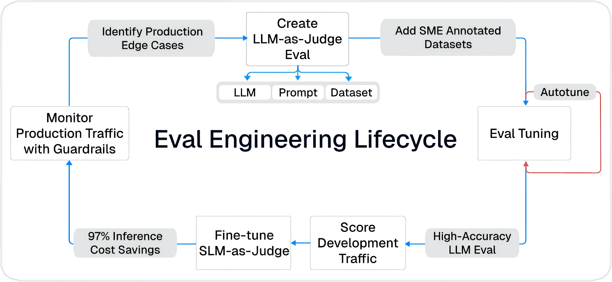

import { DefinitionCard } from "/snippets/components/definition-card.mdx";

Galileo is a cutting-edge evaluation and observability platform designed to empower developers, AI engineers, and eval engineers to improve your AI apps. Use our [Python](/sdk-api/python/sdk-reference) or [TypeScript](/sdk-api/typescript/sdk-reference) SDK, or [integrate with your favorite AI framework](/sdk-api/third-party-integrations/overview) to add evals directly into your code.

Galileo works with all major LLM providers.

## Get started

Start your journey here with four key learning steps.

<CardGroup cols={2}>
  <Card title="Log your first trace" icon="circle-1" horizontal href="/getting-started/quickstart">
      Create and run your first trace in less than 5 minutes.
  </Card>
  <Card title="Evaluate your traces" icon="circle-2" horizontal href="/getting-started/evaluate-and-improve/evaluate-and-improve">
      Learn how to evaluate metrics and improve your prompts.
  </Card>
  <Card title="Run an experiment" icon="circle-3" horizontal href="/getting-started/experiments">
      Use Experiments to move from spot testing to systematic evaluation
  </Card>
  <Card title="Sample projects" icon="circle-4" horizontal href="/getting-started/sample-projects/sample-projects">
      Best practice sample projects to help you learn
  </Card>
</CardGroup>

## Integrate your app with Galileo

Lean how to integrate Galileo into your applications with our code-ready guides.

<CardGroup cols={2}>
<Card title="Log your application to Galileo" icon="code" horizontal href="/sdk-api/logging/logging-basics">
Learn how to log your application to Galileo using our SDKs.
</Card>
<Card title="Run experiments in code" icon="flask" horizontal href="/sdk-api/experiments/running-experiments">
Learn how to log your application to Galileo using our SDKs.
</Card>
<Card title="Integrate with popular LLMs and agent frameworks" icon="code" horizontal href="/sdk-api/third-party-integrations/overview">
Learn about the Galileo integrations with third-party SDKs to automatically log your applications.
</Card>
</CardGroup>

## Learn about eval engineering

<CardGroup cols={2}>
  <Card title="Eval engineering for AI developers" icon="graduation-cap" horizontal href="/learn/eval-engineering">
      Learn about eval engineering with our free 5-part course.
  </Card>
  <Card title="Mastering Gen-AI e-books" icon="book" horizontal href="/learn/mastering-gen-ai-series">
      Get our free e-books on mastering Gen-AI.
  </Card>
  <Card title="Cookbooks" icon="book" horizontal href="/cookbooks/overview">
      Code examples on how to integrate Galileo with popular tools and platforms.
  </Card>
</CardGroup>

## Stay up to date

Be the first to know the latest features.

<CardGroup cols={2}>
  <Card title="Release notes" icon="newspaper" horizontal href="/release-notes">
      Latest information on news features and improvements to the platform.
  </Card>

  <Card title="Community" icon="discourse" horizontal href="https://community.galileo.ai">
    Join the Galileo community on Discourse.
  </Card>
</CardGroup>
